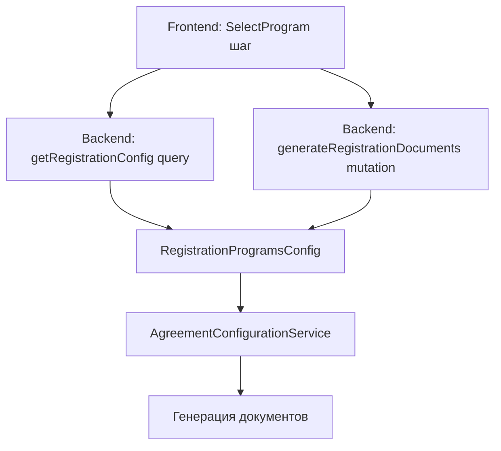

# План реализации конструктора программ регистрации

## Архитектура решения

Система будет состоять из трёх уровней:



## 1. Backend: Расширение конфигурации соглашений

### 1.1 Новые интерфейсы конфигурации

**Файл:** [`components/controller/src/domain/registration/config/agreement-config.interface.ts`](components/controller/src/domain/registration/config/agreement-config.interface.ts)

Добавить новые интерфейсы для программ регистрации:

```typescript
/**
 * Описание программы регистрации с её соглашениями
 */
export interface IRegistrationProgram {
  /** Уникальный ключ программы (например, "generation", "capitalization") */
  key: string;

  /** Название программы для отображения */
  title: string;

  /** Описание программы */
  description: string;

  /** URL изображения (опционально) */
  image_url?: string;

  /** Минимальные требования для участия */
  requirements?: string;

  /** Для каких типов аккаунтов доступна эта программа */
  applicable_account_types: AccountType[];

  /** Список ID соглашений, которые требуются для этой программы */
  agreement_ids: string[];

  /** Порядок отображения */
  order: number;
}

/**
 * Конфигурация программ регистрации для кооператива
 */
export interface ICooperativeRegistrationPrograms {
  /** Название кооператива */
  coopname: string;

  /** Доступные программы */
  programs: IRegistrationProgram[];

  /** Нужен ли выбор программы (если false - используется первая подходящая) */
  requires_selection: boolean;
}
```

### 1.2 Создание конфигурации программ

**Файл:** `components/controller/src/domain/registration/config/registration-programs.config.ts` (новый)

```typescript
export const REGISTRATION_PROGRAMS_CONFIG: ICooperativeRegistrationPrograms[] = [
  {
    coopname: 'voskhod',
    requires_selection: true,
    programs: [
      {
        key: 'generation',
        title: 'Программа Генерация',
        description: 'Участвовать в производстве Кооперативной Экономики через вклад временем, имуществом или деньгами в конкретные проекты. Минимальный взнос 10 часов в месяц.',
        applicable_account_types: [AccountType.individual, AccountType.entrepreneur],
        agreement_ids: ['generator_offer'], // новое соглашение
        order: 1,
      },
      {
        key: 'capitalization',
        title: 'Программа Капитализация',
        description: 'Участвовать в производстве Кооперативной Экономики через вклад имуществом или денег в систему. Минимальный взнос 100 000 руб в течение 14 дней.',
        applicable_account_types: [AccountType.individual, AccountType.entrepreneur],
        agreement_ids: ['blagorost_offer'],
        order: 2,
      },
    ],
  },
];
```

### 1.3 Добавление нового соглашения generator_offer

**Файл:** [`components/controller/src/domain/registration/config/registration-agreements.config.ts`](components/controller/src/domain/registration/config/registration-agreements.config.ts)

Добавить новое соглашение:

```typescript
{
  id: 'generator_offer',
  registry_id: Cooperative.Registry.GeneratorOffer.registry_id, // 996
  agreement_type: 'generator',
  title: 'Оферта по целевой потребительской программе "Генератор"',
  checkbox_text: 'Я прочитал и принимаю',
  link_text: 'оферту по целевой потребительской программе "Генератор"',
  is_blockchain_agreement: true,
  link_to_statement: true,
  applicable_account_types: [], // не используется напрямую, только через программы
  order: 6,
}
```

### 1.4 Обновление AgreementConfigurationService

**Файл:** [`components/controller/src/domain/registration/services/agreement-configuration.service.ts`](components/controller/src/domain/registration/services/agreement-configuration.service.ts)

Добавить методы для работы с программами:

```typescript
/**
 * Получить доступные программы регистрации для кооператива и типа аккаунта
 */
getAvailablePrograms(coopname: string, accountType: AccountType): IRegistrationProgram[] {
  const config = REGISTRATION_PROGRAMS_CONFIG.find(c => c.coopname === coopname);
  if (!config) return [];

  return config.programs
    .filter(p => p.applicable_account_types.includes(accountType))
    .sort((a, b) => a.order - b.order);
}

/**
 * Получить конфигурацию программ для кооператива
 */
getCooperativeProgramsConfig(coopname: string): ICooperativeRegistrationPrograms | null {
  return REGISTRATION_PROGRAMS_CONFIG.find(c => c.coopname === coopname) || null;
}

/**
 * Получить соглашения для программы
 */
getAgreementsForProgram(programKey: string, coopname: string): IAgreementConfigItem[] {
  const config = REGISTRATION_PROGRAMS_CONFIG.find(c => c.coopname === coopname);
  if (!config) return [];

  const program = config.programs.find(p => p.key === programKey);
  if (!program) return [];

  return program.agreement_ids
    .map(id => this.getAgreementById(id))
    .filter((a): a is IAgreementConfigItem => a !== null);
}
```

Обновить метод `getAgreementsForAccountType`:

```typescript
getAgreementsForAccountType(
  accountType: AccountType,
  coopname?: string,
  programKey?: string
): IAgreementConfigItem[] {
  // Базовые соглашения (всегда включаются)
  const baseAgreements = REGISTRATION_AGREEMENTS_CONFIG.agreements
    .filter(a => a.applicable_account_types.includes(accountType))
    .filter(a => a.id !== 'blagorost_offer' && a.id !== 'generator_offer');

  // Если указана программа - добавляем её соглашения
  if (programKey && coopname) {
    const programAgreements = this.getAgreementsForProgram(programKey, coopname);
    return [...baseAgreements, ...programAgreements].sort((a, b) => a.order - b.order);
  }

  // Старая логика для обратной совместимости (voskhod без program_key)
  if (coopname === 'voskhod' && accountType === AccountType.individual) {
    const capitalization = this.getAgreementById('blagorost_offer');
    if (capitalization) {
      return [...baseAgreements, capitalization].sort((a, b) => a.order - b.order);
    }
  }

  return baseAgreements.sort((a, b) => a.order - b.order);
}
```

### 1.5 Обновление RegistrationDocumentsService

**Файл:** [`components/controller/src/domain/registration/services/registration-documents.service.ts`](components/controller/src/domain/registration/services/registration-documents.service.ts)

Добавить `program_key` в интерфейс:

```typescript
// В интерфейсе IGenerateRegistrationDocumentsInput
program_key?: string;
```

Обновить метод `generateRegistrationDocuments`:

```typescript
const agreementsConfig = this.agreementConfigService.getAgreementsForAccountType(
  account_type,
  coopname,
  input.program_key
);
```

### 1.6 Обновление DTO

**Файл:** [`components/controller/src/application/user/dto/generate-registration-documents-input.dto.ts`](components/controller/src/application/user/dto/generate-registration-documents-input.dto.ts)

```typescript
@Field({ nullable: true, description: 'Ключ выбранной программы регистрации (опционально)' })
@IsString()
@IsOptional()
program_key?: string;
```

### 1.7 Новый Query для получения конфигурации

**Файл:** [`components/controller/src/application/system/resolvers/system.resolver.ts`](components/controller/src/application/system/resolvers/system.resolver.ts)

Добавить новый query:

```typescript
@Query(() => RegistrationConfigDTO, {
  name: 'getRegistrationConfig',
  description: 'Получить конфигурацию программ регистрации для кооператива',
})
async getRegistrationConfig(
  @Args('coopname') coopname: string,
  @Args('account_type', { type: () => AccountType }) accountType: AccountType,
): Promise<RegistrationConfigDTO> {
  return this.systemService.getRegistrationConfig(coopname, accountType);
}
```

**Файл:** `components/controller/src/application/system/dto/registration-config.dto.ts` (новый)

```typescript
@ObjectType('RegistrationProgram')
export class RegistrationProgramDTO {
  @Field() key!: string;
  @Field() title!: string;
  @Field() description!: string;
  @Field({ nullable: true }) image_url?: string;
  @Field({ nullable: true }) requirements?: string;
  @Field(() => [AccountType]) applicable_account_types!: AccountType[];
  @Field(() => Int) order!: number;
}

@ObjectType('RegistrationConfig')
export class RegistrationConfigDTO {
  @Field() requires_selection!: boolean;
  @Field(() => [RegistrationProgramDTO]) programs!: RegistrationProgramDTO[];
}
```

**Файл:** [`components/controller/src/application/system/services/system.service.ts`](components/controller/src/application/system/services/system.service.ts)

```typescript
async getRegistrationConfig(
  coopname: string,
  accountType: AccountType
): Promise<RegistrationConfigDTO> {
  const config = this.agreementConfigService.getCooperativeProgramsConfig(coopname);

  if (!config) {
    return new RegistrationConfigDTO({
      requires_selection: false,
      programs: [],
    });
  }

  const programs = this.agreementConfigService.getAvailablePrograms(coopname, accountType);

  return new RegistrationConfigDTO({
    requires_selection: config.requires_selection && programs.length > 1,
    programs,
  });
}
```

## 2. Frontend: Новый шаг выбора программы

### 2.1 Обновление Registrator Store

**Файл:** [`components/desktop/src/entities/Registrator/model/store.ts`](components/desktop/src/entities/Registrator/model/store.ts)

Добавить в state:

```typescript
const state = reactive({
  // ... существующие поля
  selectedProgramKey: '', // выбранный ключ программы
});
```

Добавить шаг `SelectProgram` в массив stepNames (между `SetUserData` и `GenerateAccount`).

### 2.2 Создание компонента SelectProgram

**Файл:** `components/desktop/src/pages/Registrator/SignUp/SelectProgram.vue` (новый)

```vue
<template lang="pug">
div
  q-step(
    :name='registratorStore.steps.SelectProgram',
    title='Выберите программу участия',
    :done='registratorStore.isStepDone("SelectProgram")'
  )
    div(v-if='isLoading').full-width.text-center.q-mt-lg
      Loader(text='Загружаем доступные программы...')

    div(v-else-if='programs.length > 0')
      p.text-body1 Выберите программу, в которой вы хотите участвовать:

      q-list.q-mt-md
        q-item(
          v-for='program in programs',
          :key='program.key',
          clickable,
          v-ripple,
          :active='registratorStore.state.selectedProgramKey === program.key',
          @click='selectProgram(program.key)'
        )
          q-item-section
            q-item-label.text-h6 {{ program.title }}
            q-item-label(caption).q-mt-sm {{ program.description }}
            q-item-label(v-if='program.requirements', caption).q-mt-xs.text-weight-bold
              | {{ program.requirements }}
          q-item-section(side)
            q-radio(
              :model-value='registratorStore.state.selectedProgramKey',
              :val='program.key',
              @update:model-value='selectProgram(program.key)'
            )

    div.q-mt-lg
      q-btn.col-md-6.col-xs-12(flat @click='registratorStore.prev()')
        i.fa.fa-arrow-left
        span.q-ml-md назад

      q-btn.q-mt-lg.q-mb-lg(
        color='primary',
        label='Продолжить',
        :disabled='!registratorStore.state.selectedProgramKey',
        @click='registratorStore.next()'
      )
</template>

<script lang="ts" setup>
import { ref, onMounted } from 'vue';
import { useRegistratorStore } from 'src/entities/Registrator';
import { useSystemStore } from 'src/entities/System/model';
import { Loader } from 'src/shared/ui/Loader';
import { FailAlert } from 'src/shared/api';
// TODO: добавить API метод для получения конфигурации

const registratorStore = useRegistratorStore();
const systemStore = useSystemStore();

const isLoading = ref(false);
const programs = ref<any[]>([]);

const loadPrograms = async () => {
  try {
    isLoading.value = true;
    // TODO: вызов API getRegistrationConfig
    const config = await getRegistrationConfig(
      systemStore.info.coopname,
      registratorStore.state.userData.type
    );
    programs.value = config.programs;
  } catch (e: any) {
    FailAlert(e);
  } finally {
    isLoading.value = false;
  }
};

const selectProgram = (key: string) => {
  registratorStore.state.selectedProgramKey = key;
};

onMounted(() => {
  if (registratorStore.state.step === registratorStore.steps.SelectProgram) {
    loadPrograms();
  }
});
</script>
```

### 2.3 Условный рендеринг шага

**Файл:** [`components/desktop/src/pages/Registrator/SignUp/SignUp.vue`](components/desktop/src/pages/Registrator/SignUp/SignUp.vue)

Добавить условный рендеринг:

```pug
SelectProgram(v-if='shouldShowProgramSelection')
```

Добавить computed для определения необходимости показа:

```typescript
const shouldShowProgramSelection = computed(() => {
  // Показываем только если есть конфигурация программ для данного кооператива
  // и тип аккаунта выбран
  return (
    registratorStore.state.userData.type &&
    // TODO: проверка наличия программ из конфигурации
  );
});
```

### 2.4 Обновление вызова generateRegistrationDocuments

**Файл:** `components/desktop/src/features/User/CreateUser` (или где происходит вызов)

Передавать `program_key` при генерации документов:

```typescript
await generateAllRegistrationDocuments(
  coopname,
  username,
  accountType,
  registratorStore.state.selectedProgramKey // новый параметр
);
```

## 3. SDK: Обновление мутации

**Файл:** [`components/sdk/src/mutations/registration/generateRegistrationDocuments.ts`](components/sdk/src/mutations/registration/generateRegistrationDocuments.ts) (если существует, иначе найти где определена)

Добавить опциональное поле `program_key` в input мутации.

**Файл:** Где определен query `getRegistrationConfig` (создать новый)

```typescript
export const getRegistrationConfig = {
  name: 'getRegistrationConfig',
  query: (coopname: string, account_type: string) => ({
    getRegistrationConfig: [
      { coopname, account_type },
      {
        requires_selection: true,
        programs: {
          key: true,
          title: true,
          description: true,
          image_url: true,
          requirements: true,
          order: true,
        },
      },
    ],
  }),
};
```

## 4. Обновление логики перехода между шагами

В [`components/desktop/src/pages/Registrator/SignUp/SetUserData.vue`](components/desktop/src/pages/Registrator/SignUp/SetUserData.vue) при клике "Продолжить" нужно:

1. Проверить, нужен ли шаг SelectProgram
2. Если да - перейти на него
3. Если нет - перейти на GenerateAccount (как сейчас)

## Итоговая последовательность шагов регистрации

1. **EmailInput** - ввод email
2. **SetUserData** - выбор типа аккаунта и заполнение данных
3. **SelectProgram** *(условный)* - выбор программы (только для voskhod, физики/ИП)
4. **GenerateAccount** - генерация аккаунта
5. **SelectBranch** *(условный)* - выбор филиала
6. **ReadStatement** - чтение и принятие соглашений (уже учитывают program_key)
7. **SignStatement** - подпись
8. **PayInitial** - оплата
9. **WaitingRegistration** - ожидание

## Миграция и обратная совместимость

- Для всех кооперативов кроме voskhod ничего не меняется
- Для voskhod: если не передан `program_key`, используется старая логика (blagorost_offer для физиков)
- После развертывания можно убрать хардкод для voskhod из `AgreementConfigurationService`
