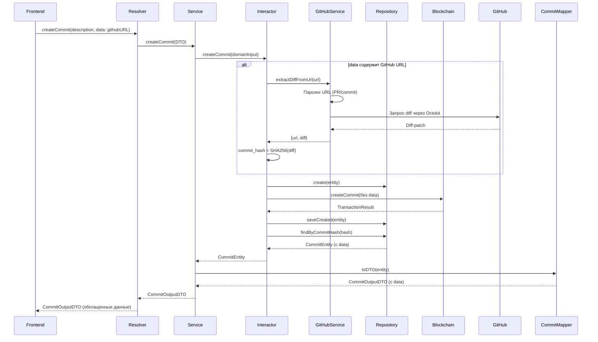

# План реализации интеграции GitHub с коммитами

## Архитектура решения




## 1. Бэкенд - GitHub Service

### 1.1 Создать сервис для работы с GitHub API

**Файл:** `[components/controller/src/extensions/capital/application/services/github.service.ts](components/controller/src/extensions/capital/application/services/github.service.ts)`

Сервис будет:

- Принимать URL на GitHub (PR или commit)
- Парсить URL для извлечения `owner`, `repo`, и номера PR или SHA commit
- Использовать `@octokit/rest` для получения diff
- Возвращать структурированные данные: `{ url, diff, type }`

Поддержка форматов URL:

- `https://github.com/owner/repo/pull/123`
- `https://github.com/owner/repo/commit/abc123`

```typescript
interface IGitHubDiffData {
  url: string;
  type: 'pull_request' | 'commit';
  diff: string;
  owner: string;
  repo: string;
  ref: string; // PR number или commit SHA
}
```

### 1.2 Конфигурация GitHub токена

Добавить переменную окружения `GITHUB_TOKEN` (опционально, для приватных репозиториев).

## 2. Бэкенд - Обновление структуры данных

### 2.1 Обновить доменный интерфейс

**Файл:** `[components/controller/src/extensions/capital/domain/actions/create-commit-domain-input.interface.ts](components/controller/src/extensions/capital/domain/actions/create-commit-domain-input.interface.ts)`

Добавить опциональное поле:

```typescript
/** Данные коммита (GitHub URL или файл) */
data?: string;
```

### 2.2 Обновить CreateCommitInputDTO

**Файл:** `[components/controller/src/extensions/capital/application/dto/generation/create-commit-input.dto.ts](components/controller/src/extensions/capital/application/dto/generation/create-commit-input.dto.ts)`

- Добавить опциональное поле `data`
- Сделать `commit_hash` опциональным (генерируется на бэке)
- Валидация: если `data` указана, то это должна быть строка (URL или путь к файлу)

### 2.3 Обновить TypeORM Entity

**Файл:** `[components/controller/src/extensions/capital/infrastructure/entities/commit.typeorm-entity.ts](components/controller/src/extensions/capital/infrastructure/entities/commit.typeorm-entity.ts)`

Добавить поле для хранения обогащенных данных:

```typescript
@Column({ type: 'jsonb', nullable: true })
data!: any; // JSON с diff, url и т.д.
```

### 2.4 Обновить ICommitDatabaseData

**Файл:** `[components/controller/src/extensions/capital/domain/interfaces/commit-database.interface.ts](components/controller/src/extensions/capital/domain/interfaces/commit-database.interface.ts)`

Добавить поле `data?`.

### 2.5 Обновить CommitDomainEntity

**Файл:** `[components/controller/src/extensions/capital/domain/entities/commit.entity.ts](components/controller/src/extensions/capital/domain/entities/commit.entity.ts)`

Добавить поле `data?` в доменную сущность.

### 2.6 Обновить CommitOutputDTO

**Файл:** `[components/controller/src/extensions/capital/application/dto/generation/commit.dto.ts](components/controller/src/extensions/capital/application/dto/generation/commit.dto.ts)`

Добавить поле для возврата обогащенных данных клиенту:

```typescript
@Field(() => GraphQLJSON, {
  nullable: true,
  description: 'Обогащенные данные коммита (diff-патч, исходная ссылка)',
})
data?: any;
```

## 3. Бэкенд - Бизнес-логика

### 3.1 Обновить GenerationInteractor

**Файл:** `[components/controller/src/extensions/capital/application/use-cases/generation.interactor.ts](components/controller/src/extensions/capital/application/use-cases/generation.interactor.ts)`

**Основные изменения в методе `createCommit`:**

1. **Обработка поля `data`:**
  - Если `data` содержит GitHub URL:
    - Извлечь diff через `GitHubService`
    - Сгенерировать `commit_hash = SHA256(diff)`
    - Сохранить в поле `data` объект: `{ source: 'github', url, diff }`
  - Если `data` пустое:
    - Требовать `commit_hash` от клиента (текущее поведение)
2. **Обновление meta:**
  - Если GitHub URL, добавить ссылку в `meta` (JSON):

```json
     { "github_url": "original-url" }
     

```

1. **Сохранение данных:**
  - В блокчейн отправляется `description`, `meta` (БЕЗ `data`)
  - В БД сохраняется полный объект с `data`
2. **Возврат результата:**
  - После успешной транзакции получить созданный коммит из БД
  - Вернуть `CommitDomainEntity` (вместо `TransactResult`)

### 3.2 Обновить GenerationService

**Файл:** `[components/controller/src/extensions/capital/application/services/generation.service.ts](components/controller/src/extensions/capital/application/services/generation.service.ts)`

Изменить возвращаемый тип метода `createCommit`:

- Было: `Promise<TransactResult>`
- Стало: `Promise<CommitOutputDTO>`

Добавить маппинг через `CommitMapperService`:

```typescript
const commitEntity = await this.generationInteractor.createCommit(data, currentUser);
return await this.commitMapperService.toDTO(commitEntity, currentUser);
```

### 3.3 Обновить GenerationResolver

**Файл:** `[components/controller/src/extensions/capital/application/resolvers/generation.resolver.ts](components/controller/src/extensions/capital/application/resolvers/generation.resolver.ts)`

Изменить возвращаемый тип мутации `capitalCreateCommit`:

- Было: `@Mutation(() => TransactionDTO)`
- Стало: `@Mutation(() => CommitOutputDTO)`

## 4. Фронтенд - Форма создания коммита

### 4.1 Обновить CreateCommitButton.vue

**Файл:** `[components/desktop/extensions/capital/features/Commit/CreateCommit/ui/CreateCommitButton.vue](components/desktop/extensions/capital/features/Commit/CreateCommit/ui/CreateCommitButton.vue)`

**Изменения в шаблоне:**

- Добавить второе поле `q-input` для `data` (ссылка на GitHub)
- Убрать генерацию `commit_hash` на фронте

**Изменения в скрипте:**

```typescript
const formData = ref({
  creator_hours: 0,
  description: '',
  data: '', // новое поле
});

const handleCreateCommit = async () => {
  const commitData = {
    // commit_hash - НЕ передаем, генерируется на бэке
    coopname: system.info.coopname,
    commit_hours: formData.value.creator_hours,
    project_hash: props.projectHash,
    username: session.username,
    description: formData.value.description,
    data: formData.value.data || undefined, // опционально
    meta: JSON.stringify({}),
  };

  const result = await createCommit(commitData);
  
  // result теперь содержит обогащенные данные коммита
  console.log('Созданный коммит:', result);
  SuccessAlert('Коммит успешно создан');
  clear();
};
```

### 4.2 Обновить типы

**Файл:** `[components/desktop/extensions/capital/entities/Commit/model/types.ts](components/desktop/extensions/capital/entities/Commit/model/types.ts)`

Типы будут автоматически обновлены после регенерации SDK.

## 5. Последовательность выполнения

1. **Создать GitHub Service** - независимый сервис
2. **Обновить domain interfaces** - добавить поле `data`
3. **Обновить TypeORM entity** - добавить колонку `data`
4. **Обновить DTOs** - входные и выходные
5. **Обновить CommitDomainEntity** - добавить поле `data`
6. **Обновить GenerationInteractor** - основная бизнес-логика
7. **Обновить GenerationService** - изменить возвращаемый тип
8. **Обновить GenerationResolver** - изменить сигнатуру мутации
9. **Обновить CommitOutputDTO** - добавить поле `data`
10. **Обновить фронтенд** - форма и модель

## 6. Технические детали

### Формат сохранения data в БД:

```json
{
  "source": "github",
  "url": "https://github.com/owner/repo/pull/123",
  "type": "pull_request",
  "owner": "owner",
  "repo": "repo",
  "ref": "123",
  "diff": "полный diff-патч...",
  "extracted_at": "2026-01-20T12:00:00Z"
}
```

### Генерация commit_hash:

```typescript
import { sha256 } from '~/utils/sha256';

const commitHash = sha256(enrichedData.diff);
```

### Формат meta для блокчейна:

```json
{
  "github_url": "https://github.com/owner/repo/pull/123"
}
```

## 7. Обработка ошибок

- Некорректный URL GitHub - вернуть ошибку валидации
- Ошибка доступа к GitHub API - вернуть понятное сообщение
- Отсутствие токена для приватного репо - сообщить об ограничении
- Если `data` не указана, требовать `commit_hash` от клиента

## 8. Расширяемость

Архитектура позволит в будущем:

- Добавить поддержку загрузки файлов (вместо GitHub URL)
- Поддержать другие источники (GitLab, Bitbucket)
- Сохранять дополнительные метаданные

## 9. После реализации

После завершения бэкенда и фронтенда необходимо:

1. Пересобрать GraphQL схему
2. Регенерировать SDK типы
3. Исправить возможные ошибки типов после регенерации

