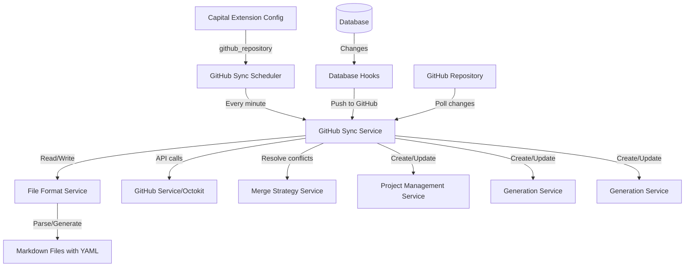

# План реализации системы синхронизации с GitHub

## Обзор решения

Система будет состоять из следующих компонентов:

1. **Конфигурация расширения** - добавление опционального параметра `github_repository` в конфиг Capital
2. **GitHub Service** - сервис для работы с GitHub API через Octokit
3. **File Index Repository** - репозиторий для хранения маппинга hash → filename (индексация файлов)
4. **Sync Service** - основной сервис синхронизации (DB → GitHub и GitHub → DB)
5. **Scheduler Service** - планировщик для периодической синхронизации из GitHub
6. **File Format Service** - сервис для работы с markdown файлами, YAML frontmatter и slug-генерации
7. **Merge Strategy Service** - сервис для разрешения конфликтов при синхронизации

## Архитектура



## Структура файлов в GitHub

```
/
├── {project-title-slug}/
│   ├── project.md          # Проект
│   ├── components/
│   │   └── {component-title-slug}/
│   │       ├── component.md  # Компонент (проект с parent_hash)
│   │       ├── requirements/
│   │       │   └── {story-title-slug}.md
│   │       └── issues/
│   │           └── {issue-title-slug}.md
│   ├── requirements/        # Требования проекта
│   │   └── {story-title-slug}.md
│   └── issues/              # Задачи проекта
│       └── {issue-title-slug}.md
```

**Важно:** Имена файлов и папок формируются из title сущности с помощью slug-генерации:

- Все символы переводятся в нижний регистр
- Пробелы заменяются на дефисы
- Удаляются все специальные символы кроме букв, цифр и дефисов
- Примеры: "Create User Interface" → "create-user-interface.md", "Bug Fix #123" → "bug-fix-123.md"

### Формат файлов

Все файлы используют единый формат: **title в YAML frontmatter, description в markdown body**

**project.md / component.md:**

```yaml
---
type: project
title: Название проекта
hash: abc123def456
parent_hash: xyz789  # только для компонентов
coopname: voskhod
created_at: 2024-01-15T10:30:00Z
updated_at: 2024-01-20T14:45:00Z
---

Подробное описание проекта в формате markdown.

Может содержать несколько абзацев, списки:
- Пункт 1
- Пункт 2

И любое другое markdown форматирование.
```

**{story-title-slug}.md (требование):**

```yaml
---
type: story
title: Название требования
hash: story123abc
project_hash: abc123def456
issue_hash: issue789xyz  # опционально
status: pending
created_by: username
created_at: 2024-01-15T10:30:00Z
updated_at: 2024-01-20T14:45:00Z
sort_order: 1
---

Подробное описание требования в формате markdown.
```

**{issue-title-slug}.md (задача):**

```yaml
---
type: issue
title: Название задачи
id: ABC-123
hash: issue789xyz
project_hash: abc123def456
cycle_id: cycle001  # опционально
status: backlog
priority: medium
estimate: 5
created_by: username
submaster: dev1  # опционально
creators: [dev1, dev2]
labels: [bug, frontend]
created_at: 2024-01-15T10:30:00Z
updated_at: 2024-01-20T14:45:00Z
sort_order: 10
---

Подробное описание задачи в формате markdown.

## Критерии выполнения
- [ ] Критерий 1
- [ ] Критерий 2
```

## Основные компоненты

### 1. Конфигурация Capital Extension

Добавить в [`capital-extension.module.ts`](/Users/darksun/dacom-code/foundation/monocoop/components/controller/src/extensions/capital/capital-extension.module.ts):

```typescript
export const Schema = z.object({
  // ... существующие поля
  github_repository: z.string().optional().describe(
    describeField({
      label: 'GitHub репозиторий для синхронизации',
      note: 'Формат: owner/repo (например: myorg/myproject). Если указан, будет включена двухсторонняя синхронизация проектов.',
      placeholder: 'owner/repo'
    })
  ),
});
```

### 2. GitHub Service

**Путь:** `src/extensions/capital/infrastructure/services/github.service.ts`

Основные методы:

- `getLatestCommit(owner, repo, branch)` - получить последний коммит
- `getFileContent(owner, repo, path, ref)` - получить содержимое файла
- `getChangedFiles(owner, repo, sha1, sha2)` - получить список изменённых файлов
- `createOrUpdateFile(owner, repo, path, content, message, sha?)` - создать/обновить файл
- `deleteFile(owner, repo, path, message, sha)` - удалить файл
- `getTree(owner, repo, sha)` - получить дерево файлов

### 3. File Index Repository

**Путь:** `src/extensions/capital/infrastructure/repositories/github-file-index.typeorm-repository.ts`

**Сущность:** `GitHubFileIndexEntity` с полями:

- `id` (primary key)
- `coopname` - имя кооператива
- `entity_type` - тип сущности ('project', 'issue', 'story')
- `entity_hash` - хэш сущности
- `file_path` - относительный путь к файлу в репозитории
- `last_synced_at` - дата последней синхронизации
- `github_sha` - SHA коммита GitHub при последней синхронизации

**Индексы:**

- Уникальный индекс на (`coopname`, `entity_type`, `entity_hash`)
- Индекс на (`coopname`, `file_path`)

**Методы репозитория:**

- `findByHash(type, hash): GitHubFileIndexEntity` - найти файл по хэшу
- `findByPath(path): GitHubFileIndexEntity` - найти сущность по пути файла
- `upsert(data): GitHubFileIndexEntity` - создать или обновить индекс
- `deleteByHash(type, hash): void` - удалить индекс при удалении сущности
- `getAllIndexes(): GitHubFileIndexEntity[]` - получить все индексы для полной синхронизации

### 4. File Format Service

**Путь:** `src/extensions/capital/domain/services/file-format.service.ts`

Основные методы:

**Парсинг и генерация:**

- `parseMarkdownFile(content): { frontmatter, body }` - парсинг MD с YAML (использовать библиотеку `gray-matter`)
- `generateMarkdownFile(frontmatter, body): string` - генерация MD файла

**Slug генерация:**

- `generateSlug(title): string` - генерация slug из title (lowercase, дефисы, без спецсимволов)
- `sanitizeSlug(slug): string` - очистка slug от недопустимых символов

**Конвертация сущностей:**

- `projectToMarkdown(project): { content, slug }` - проект → MD + slug
- `markdownToProject(content): ProjectData` - MD → данные проекта
- `issueToMarkdown(issue): { content, slug }` - задача → MD + slug
- `markdownToIssue(content): IssueData` - MD → данные задачи
- `storyToMarkdown(story): { content, slug }` - требование → MD + slug
- `markdownToStory(content): StoryData` - MD → данные требования

**Генерация путей:**

- `generateProjectPath(project): string` - генерация пути к файлу проекта
- `generateIssuePath(issue, project): string` - генерация пути к файлу задачи
- `generateStoryPath(story, project, issue?): string` - генерация пути к файлу требования

### 5. GitHub Sync Service

**Путь:** `src/extensions/capital/application/services/github-sync.service.ts`

Основные методы:

**Синхронизация DB → GitHub:**

- `syncProjectToGitHub(project)` - синхронизировать проект
  - Генерирует slug из title
  - Проверяет индекс: если title изменился → удаляет старый файл, создаёт новый
  - Создаёт/обновляет файл в GitHub
  - Обновляет индекс в GitHubFileIndexRepository

- `syncIssueToGitHub(issue)` - синхронизировать задачу
  - Аналогично проекту с учётом переименования при изменении title

- `syncStoryToGitHub(story)` - синхронизировать требование
  - Аналогично проекту с учётом переименования при изменении title

- `handleTitleChange(type, hash, oldPath, newPath)` - обработать переименование
  - Удаляет старый файл из GitHub
  - Создаёт новый файл с новым именем
  - Обновляет индекс

**Синхронизация GitHub → DB:**

- `syncFromGitHub()` - основной метод синхронизации из GitHub
  - Получает последний коммит из GitHub
  - Сравнивает с сохранённым SHA в индексе
  - Получает список изменённых файлов
  - Обрабатывает каждый файл

- `processChangedFile(path, content, action)` - обработать изменённый файл
  - Парсит markdown файл
  - Определяет тип сущности по frontmatter.type
  - Проверяет индекс: ищет по пути или по hash
  - Если найден другой путь для этого hash → переименование, обновляем индекс
  - Вызывает соответствующий метод создания/обновления

- `createOrUpdateProject(data, username)` - создать/обновить проект
  - Ищет проект по hash из frontmatter
  - Если не найден → создаёт новый
  - Если найден → обновляет (с проверкой updated_at)

- `createOrUpdateIssue(data, username)` - создать/обновить задачу
- `createOrUpdateStory(data, username)` - создать/обновить требование

**Разрешение конфликтов:**

- `mergeChanges(dbEntity, githubData)` - объединить изменения
- Стратегия: используем `updated_at` timestamps для определения более свежей версии
- Если GitHub версия новее (updated_at больше) - применяем изменения из GitHub
- Если DB версия новее - пропускаем (уже синхронизировано в GitHub)
- При одинаковых updated_at (конфликт) - приоритет у версии из GitHub

### 6. GitHub Sync Scheduler Service

**Путь:** `src/extensions/capital/infrastructure/services/github-sync-scheduler.service.ts`

Аналогично [`time-tracking-scheduler.service.ts`](/Users/darksun/dacom-code/foundation/monocoop/components/controller/src/extensions/capital/infrastructure/services/time-tracking-scheduler.service.ts):

```typescript
@Injectable()
export class GitHubSyncSchedulerService implements OnModuleInit, OnModuleDestroy {
  private cronJob: cron.ScheduledTask | null = null;
  
  async onModuleInit(): Promise<void> {
    // Проверяем наличие конфигурации GitHub
    if (!this.plugin.config.github_repository || !config.github.token) {
      return; // Синхронизация отключена
    }
    
    // Запускаем синхронизацию каждую минуту
    this.cronJob = cron.schedule('* * * * *', async () => {
      await this.githubSyncService.syncFromGitHub();
    });
  }
}
```

### 7. Database Hooks для синхронизации DB → GitHub

При изменении данных в БД (через репозитории) вызываем синхронизацию:

**В репозиториях (после create/update):**

```typescript
// В ProjectTypeormRepository
async update(project: ProjectDomainEntity): Promise<ProjectDomainEntity> {
  const result = await super.save(project);
  
  // Асинхронно синхронизируем с GitHub (не блокируем операцию)
  this.eventEmitter.emit('project.updated', result);
  
  return result;
}
```

**Event Listener в GitHub Sync Service:**

```typescript
@OnEvent('project.updated')
async handleProjectUpdate(project: ProjectDomainEntity) {
  if (this.isGitHubSyncEnabled()) {
    await this.syncProjectToGitHub(project);
  }
}
```

## Получение председателя

Для операций создания сущностей от имени председателя используем:

```typescript
// В сервисе
@Inject(USER_REPOSITORY) private readonly userRepository: UserRepository

async getChairman(): Promise<MonoAccountDomainInterface> {
  const chairmen = await this.userRepository.findByRoles(['chairman']);
  if (chairmen.length === 0) {
    throw new Error('Chairman not found');
  }
  return chairmen[0];
}
```

## Методы создания/обновления сущностей

**Проекты:**

- Создание: [`ProjectManagementService.createProject()`](/Users/darksun/dacom-code/foundation/monocoop/components/controller/src/extensions/capital/application/services/project-management.service.ts)
- Обновление: [`ProjectManagementService.editProject()`](/Users/darksun/dacom-code/foundation/monocoop/components/controller/src/extensions/capital/application/services/project-management.service.ts)

**Задачи (Issues):**

- Создание: [`GenerationService.createIssue()`](/Users/darksun/dacom-code/foundation/monocoop/components/controller/src/extensions/capital/application/services/generation.service.ts)
- Обновление: [`GenerationService.updateIssue()`](/Users/darksun/dacom-code/foundation/monocoop/components/controller/src/extensions/capital/application/services/generation.service.ts)

**Требования (Stories):**

- Создание: [`GenerationService.createStory()`](/Users/darksun/dacom-code/foundation/monocoop/components/controller/src/extensions/capital/application/services/generation.service.ts)
- Обновление: [`GenerationService.updateStory()`](/Users/darksun/dacom-code/foundation/monocoop/components/controller/src/extensions/capital/application/services/generation.service.ts)

## Обработка прав доступа

Все операции выполняются от имени председателя:

```typescript
const chairman = await this.getChairman();

// При создании/обновлении передаём председателя как currentUser
await this.generationService.createIssue(issueData, chairman.username, chairman);
```

## Необходимые зависимости

Библиотека Octokit уже установлена согласно требованиям. Проверить версию в `package.json`.

## Регистрация компонентов в Capital Extension Module

Добавить в providers секцию [`capital-extension.module.ts`](/Users/darksun/dacom-code/foundation/monocoop/components/controller/src/extensions/capital/capital-extension.module.ts):

```typescript
// Services
GitHubService,
FileFormatService,
GitHubSyncService,
GitHubSyncSchedulerService,

// Repository
{
  provide: GITHUB_FILE_INDEX_REPOSITORY,
  useClass: GitHubFileIndexTypeormRepository,
},

// Event Emitter (если ещё не добавлен)
EventEmitterModule
```

## Инициализация в Capital Plugin

В методе `initialize()` класса `CapitalPlugin`:

```typescript
async initialize(config?: IConfig): Promise<void> {
  // ... существующий код
  
  // Инициализируем GitHub синхронизацию, если настроена
  if (this.plugin.config.github_repository && configEnv.github.token) {
    try {
      await this.githubSyncScheduler.initialize();
      this.logger.log('GitHub синхронизация инициализирована');
    } catch (error) {
      this.logger.error('Не удалось инициализировать GitHub синхронизацию', error);
    }
  }
}
```

## Обработка ошибок и логирование

- Все ошибки синхронизации логируются через `WinstonLoggerService`
- Ошибки синхронизации не должны прерывать работу приложения
- При конфликтах слияния создаются записи в логе с детальной информацией
- Используем транзакции для атомарности операций обновления

## Тестирование

1. **Unit тесты** для каждого сервиса
2. **Integration тесты** для полного цикла синхронизации
3. **Тестовый репозиторий** в GitHub для проверки работы
4. **Ручное тестирование:**

   - Создание проекта в UI → проверка в GitHub
   - Изменение файла в GitHub → проверка в UI
   - Конфликтная ситуация → проверка корректного слияния

## Обработка переименования файлов

При изменении title сущности:

1. **DB → GitHub синхронизация:**

   - Вызывается `syncProjectToGitHub(project)` (или issue/story)
   - Сервис генерирует новый slug из нового title
   - Проверяет индекс: получает старый путь файла
   - Если пути различаются (title изменился):
     - Удаляет старый файл из GitHub
     - Создаёт новый файл с новым именем и обновлённым содержимым
     - Обновляет запись в индексе с новым путём
   - Если пути совпадают (title не изменился):
     - Просто обновляет содержимое файла

2. **GitHub → DB синхронизация:**

   - При сканировании изменений GitHub API может показать:
     - Удаление старого файла + Создание нового файла (переименование)
   - Система проверяет:
     - Если в frontmatter нового файла есть hash, который уже есть в индексе
     - Значит это переименование
   - Обновляет сущность в БД с новым title
   - Обновляет индекс с новым путём

## Ограничения и особенности

1. Синхронизация работает только для одного репозитория на кооператив
2. Все операции из GitHub выполняются от имени председателя
3. Удаление сущностей не синхронизируется автоматически (требует отдельной реализации)
4. Используется только main ветка репозитория
5. Конфликты разрешаются по принципу "последний пишущий побеждает" на основе timestamps
6. Имена файлов генерируются из title, при изменении title файл переименовывается
7. Индекс файлов хранится в БД для быстрого поиска и отслеживания переименований
8. Slug должен быть уникальным в рамках папки (проект/компонент/requirements/issues)