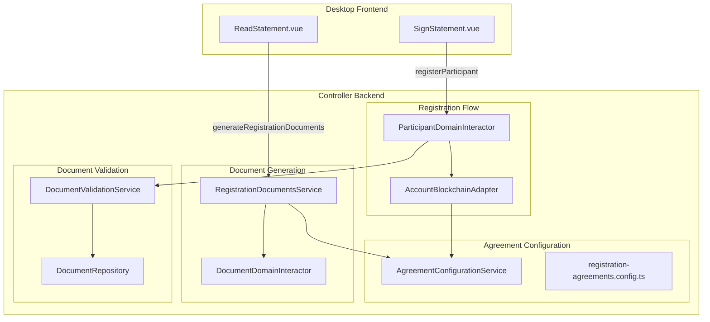

# План реализации конфигуратора соглашений при регистрации

## Архитектура решения



## Часть 1: Конфигуратор соглашений (Backend)

### 1.1. Создать интерфейс конфигурации

Файл: `controller/src/domain/registration/config/agreement-config.interface.ts`

```typescript
export interface IAgreementConfigItem {
  // Уникальный идентификатор типа соглашения
  id: string;
  
  // registry_id для генерации документа на фабрике
  registry_id: number;
  
  // Тип соглашения для блокчейна (wallet, signature, privacy, user, capitalization)
  agreement_type: string;
  
  // Человекочитаемое название
  title: string;
  
  // Текст для галочки на фронте
  checkbox_text: string;
  
  // Нужно ли отправлять в блокчейн как agreement (sendAgreement)
  is_blockchain_agreement: boolean;
  
  // Нужно ли линковать в заявление
  link_to_statement: boolean;
  
  // Условия применения - для каких типов аккаунтов требуется
  applicable_account_types: ('individual' | 'organization' | 'entrepreneur')[];
  
  // Порядок отображения
  order: number;
}

export interface IRegistrationAgreementsConfig {
  agreements: IAgreementConfigItem[];
}
```

### 1.2. Создать конфигурационный файл

Файл: `controller/src/domain/registration/config/registration-agreements.config.ts`

Конфигурация будет содержать:

- `wallet` (registry_id: 1) - для всех типов, blockchain agreement
- `signature` (registry_id: 2) - для всех типов, только линкуется
- `privacy` (registry_id: 3) - для всех типов, только линкуется  
- `user` (registry_id: 4) - для всех типов, blockchain agreement
- `capitalization` (registry_id: 1000) - только для individual, blockchain agreement

### 1.3. Создать сервис конфигурации

Файл: `controller/src/domain/registration/services/agreement-configuration.service.ts`

Методы:

- `getAgreementsForAccountType(type: string): IAgreementConfigItem[]`
- `getBlockchainAgreements(type: string): IAgreementConfigItem[]`
- `getLinkedAgreements(type: string): IAgreementConfigItem[]`
- `getAgreementById(id: string): IAgreementConfigItem | null`

## Часть 2: Сервис генерации документов (Backend)

### 2.1. Создать интерфейс для генерации

Файл: `controller/src/domain/registration/interfaces/registration-documents.interface.ts`

```typescript
export interface IGenerateRegistrationDocumentsInput {
  coopname: string;
  username: string;
  account_type: 'individual' | 'organization' | 'entrepreneur';
}

export interface IGeneratedRegistrationDocument {
  id: string;  // wallet, signature, privacy, user, capitalization
  agreement_type: string;
  title: string;
  checkbox_text: string;
  document: IGeneratedDocument;  // сгенерированный документ
  is_blockchain_agreement: boolean;
  link_to_statement: boolean;
}

export interface IGenerateRegistrationDocumentsOutput {
  documents: IGeneratedRegistrationDocument[];
}
```

### 2.2. Создать сервис генерации документов

Файл: `controller/src/domain/registration/services/registration-documents.service.ts`

Метод `generateRegistrationDocuments`:

1. Получает конфигурацию для типа аккаунта
2. Параллельно генерирует все документы через `DocumentDomainInteractor`
3. Сохраняет документы в базу
4. Возвращает структуру с документами и метаданными

### 2.3. Создать резолвер для генерации

Файл: `controller/src/application/registration/resolvers/registration.resolver.ts`

Мутация `generateRegistrationDocuments`:

- Вход: `coopname`, `username`, `account_type`
- Выход: список документов с метаданными для отображения на фронте

## Часть 3: Сервис валидации документов (Backend)

### 3.1. Создать сервис валидации

Файл: `controller/src/domain/document/services/document-validation.service.ts`

Методы:

- `validateSignedDocument(signedDoc): Promise<ValidationResult>` - полная проверка
- `verifyDocumentHash(signedDoc): Promise<boolean>` - сверка hash с оригиналом в БД
- `verifySignatures(signedDoc): boolean` - проверка подписей
- `validateRegistrationDocuments(docs[]): Promise<ValidationResult[]>` - пакетная проверка

Логика `verifyDocumentHash`:

1. Извлекает `doc_hash` из подписанного документа
2. Ищет оригинал в `DocumentRepository` по hash
3. Сравнивает хеши и метаданные
4. Возвращает результат валидации

### 3.2. Интегрировать в `ParticipantDomainInteractor.registerParticipant`

Файл: `controller/src/domain/participant/interactors/participant-domain.interactor.ts`

Заменить текущую валидацию на:

```typescript
// Сверка документов с оригиналами в базе
await this.documentValidationService.validateRegistrationDocuments([
  { id: 'statement', document: data.statement },
  { id: 'wallet', document: data.wallet_agreement },
  // ... остальные документы по конфигурации
]);
```

## Часть 4: Расширение интерфейсов

### 4.1. Расширить `CandidateDomainInterface`

Файл: `controller/src/domain/account/interfaces/candidate-domain.interface.ts`

Добавить:

```typescript
documents?: {
  // ... существующие
  capitalization_agreement?: ISignedDocumentDomainInterface;
  // Динамическое хранение дополнительных соглашений
  additional_agreements?: Record<string, ISignedDocumentDomainInterface>;
};
```

### 4.2. Расширить `RegisterParticipantDomainInterface`

Файл: `controller/src/domain/participant/interfaces/register-participant-domain.interface.ts`

Добавить опциональное поле:

```typescript
capitalization_agreement?: ISignedDocumentDomainInterface;
```

### 4.3. Расширить `CandidateRepository`

Файл: `controller/src/domain/account/repository/candidate.repository.ts`

Добавить `capitalization_agreement` в `saveDocument`.

### 4.4. Обновить TypeORM репозиторий

Файл: `controller/src/infrastructure/database/typeorm/repositories/typeorm-candidate.repository.ts`

Добавить поддержку нового типа документа.

### 4.5. Обновить entity кандидата (если используется колонка)

Возможно потребуется добавить колонку `capitalization_agreement` в entity.

## Часть 5: Обновление регистрации в блокчейне

### 5.1. Обновить `AccountBlockchainAdapter.registerBlockchainAccount`

Файл: `controller/src/infrastructure/blockchain/adapters/account.adapter.ts`

Изменить логику:

1. Получить конфигурацию соглашений для типа аккаунта кандидата
2. Для каждого соглашения с `is_blockchain_agreement: true` сформировать action `sendAgreement`
3. Использовать `agreement_type` из конфигурации
```typescript
// Получаем конфигурацию для типа аккаунта
const agreements = this.agreementConfigService.getBlockchainAgreements(candidate.type);

for (const agreementConfig of agreements) {
  const document = candidate.documents?.[agreementConfig.id];
  if (document) {
    actions.push(this.createSendAgreementAction(
      candidate.username,
      agreementConfig.agreement_type,
      document
    ));
  }
}
```


## Часть 6: Обновление DTO и GraphQL схемы

### 6.1. Создать DTO для генерации

Файл: `controller/src/application/registration/dto/generate-registration-documents.dto.ts`

### 6.2. Создать DTO для результата

Файл: `controller/src/application/registration/dto/registration-document.dto.ts`

### 6.3. Обновить `RegisterParticipantInputDTO`

Файл: `controller/src/application/participant/dto/register-participant-input.dto.ts`

Добавить опциональное поле `capitalization_agreement`.

## Часть 7: Модуль регистрации

### 7.1. Создать модуль

Файл: `controller/src/domain/registration/registration.module.ts`

Экспорты:

- `AgreementConfigurationService`
- `RegistrationDocumentsService`

### 7.2. Создать application-модуль

Файл: `controller/src/application/registration/registration.module.ts`

## Часть 8: Обновление фронтенда

### 8.1. Создать новую мутацию в SDK

Добавить в SDK мутацию `generateRegistrationDocuments` (если SDK не auto-generated).

### 8.2. Обновить `useCreateUser`

Файл: `desktop/src/features/User/CreateUser/model/index.ts`

Добавить метод:

```typescript
async function generateAllAgreements() {
  const result = await client.Mutation(
    Mutations.Registration.GenerateRegistrationDocuments.mutation,
    { variables: { data: { coopname, username, account_type } } }
  );
  // Сохранить результат для подписи
  store.registrationDocuments = result.documents;
}
```

### 8.3. Обновить `ReadStatement.vue`

Файл: `desktop/src/pages/Registrator/SignUp/ReadStatement.vue`

- Загружать документы через новый endpoint
- Динамически рендерить галочки на основе полученных данных
- Убрать hardcoded соглашения

### 8.4. Обновить `SignStatement.vue`

Файл: `desktop/src/pages/Registrator/SignUp/SignStatement.vue`

- Подписывать все документы из `store.registrationDocuments`
- Отправлять все документы в `sendStatementAndAgreements`

### 8.5. Обновить `useRegistratorStore`

Файл: `desktop/src/entities/Registrator/model/store.ts`

Добавить хранение динамического списка документов.

## Порядок реализации

1. Backend: Конфигуратор и интерфейсы (Часть 1)
2. Backend: Расширение интерфейсов и репозиториев (Часть 4)
3. Backend: Сервис генерации документов (Часть 2)
4. Backend: Сервис валидации документов (Часть 3)
5. Backend: DTO и резолверы (Часть 6, 7)
6. Backend: Обновление регистрации в блокчейне (Часть 5)
7. Frontend: Обновление компонентов (Часть 8)

## Ключевые файлы для изменения

**Новые файлы (Backend):**

- `controller/src/domain/registration/config/agreement-config.interface.ts`
- `controller/src/domain/registration/config/registration-agreements.config.ts`
- `controller/src/domain/registration/services/agreement-configuration.service.ts`
- `controller/src/domain/registration/services/registration-documents.service.ts`
- `controller/src/domain/registration/interfaces/registration-documents.interface.ts`
- `controller/src/domain/document/services/document-validation.service.ts`
- `controller/src/application/registration/resolvers/registration.resolver.ts`
- `controller/src/application/registration/dto/*.ts`
- `controller/src/domain/registration/registration.module.ts`
- `controller/src/application/registration/registration.module.ts`

**Изменяемые файлы (Backend):**

- `controller/src/domain/account/interfaces/candidate-domain.interface.ts`
- `controller/src/domain/participant/interfaces/register-participant-domain.interface.ts`
- `controller/src/domain/account/repository/candidate.repository.ts`
- `controller/src/infrastructure/database/typeorm/repositories/typeorm-candidate.repository.ts`
- `controller/src/domain/participant/interactors/participant-domain.interactor.ts`
- `controller/src/infrastructure/blockchain/adapters/account.adapter.ts`
- `controller/src/application/participant/dto/register-participant-input.dto.ts`

**Изменяемые файлы (Frontend):**

- `desktop/src/features/User/CreateUser/model/index.ts`
- `desktop/src/pages/Registrator/SignUp/ReadStatement.vue`
- `desktop/src/pages/Registrator/SignUp/SignStatement.vue`
- `desktop/src/entities/Registrator/model/store.ts`