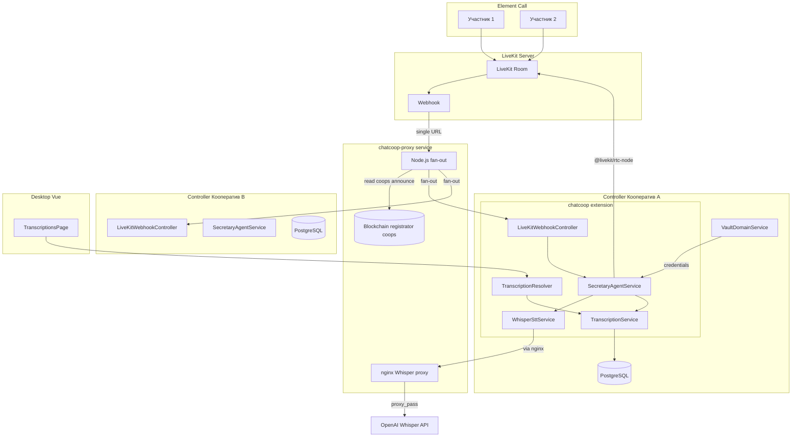
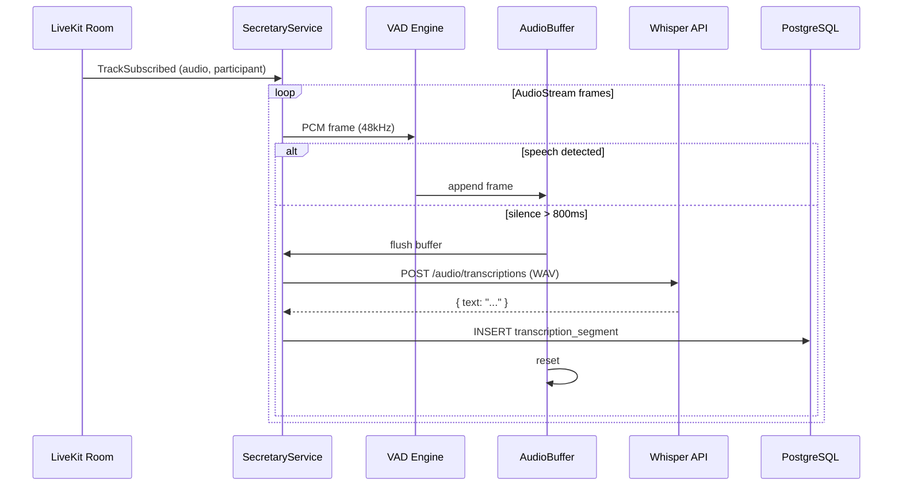

# Агент-секретарь для транскрипции звонков в ChatCoop

## Общая архитектура




## Ключевые технические решения

- **Fan-out webhook**: Один LiveKit -> chatcoop-proxy -> множество контроллеров кооперативов. Proxy читает таблицу `coops` из блокчейна (`registrator` контракт), берет поле `announce` (URL сайта кооператива) для конструирования адреса webhook каждого контроллера.
- **Whisper API proxy**: nginx в chatcoop-proxy проксирует запросы к OpenAI API, решая проблему сетевых ограничений. Контроллеры обращаются к `https://chatcoop-proxy-host/v1/audio/transcriptions`.
- **Подключение к комнатам**: `@livekit/rtc-node` (Node.js SDK) -- подключается к комнате как скрытый участник, подписывается на все аудио-треки.
- **VAD (определение речи)**: Энергетический порог на PCM-фреймах (RMS > threshold) -- отсекаем тишину, буферизуем только речь.
- **STT**: OpenAI Whisper API через chatcoop-proxy nginx (пакет `openai` с custom `baseURL`).
- **Токены LiveKit**: `livekit-server-sdk` -- генерация JWT для секретаря прямо в контроллере.
- **Хранение credentials**: Vault (AES-256-CBC, как WIF-ключи) -- Matrix логин/пароль секретаря per кооператив.

## Фаза 0: chatcoop-proxy -- Fan-out webhook + Whisper proxy

Отдельный репозиторий: `/Users/darksun/dacom-code/foundation/chatcoop-proxy/`

### 0.1 Назначение

Один LiveKit сервер обслуживает множество кооперативов (каждый со своим контроллером). LiveKit отправляет webhook на единственный статический URL. chatcoop-proxy:

1. Принимает webhook от LiveKit (единственный подписчик)
2. Читает список активных кооперативов из блокчейна (таблица `coops` контракта `registrator`)
3. Из поля `announce` каждого кооператива конструирует URL контроллера: `https://{announce}/api/chatcoop/livekit-webhook`
4. Пересылает (fan-out) webhook всем зарегистрированным контроллерам
5. nginx на том же сервере проксирует Whisper API запросы к OpenAI

### 0.2 Структура проекта

```
chatcoop-proxy/
  src/
    index.ts              # Express/Fastify HTTP server
    webhook-handler.ts    # Прием webhook от LiveKit, валидация подписи
    coop-registry.ts      # Чтение таблицы coops из блокчейна, кеширование
    fan-out.ts            # Пересылка webhook на контроллеры кооперативов
    config.ts             # Переменные окружения
  nginx/
    chatcoop-proxy.conf   # nginx конфиг для Whisper API proxy
  Dockerfile
  package.json
  tsconfig.json
```

### 0.3 Ключевая логика

**webhook-handler.ts** -- прием и валидация:

```typescript
import { WebhookReceiver } from 'livekit-server-sdk';

const receiver = new WebhookReceiver(LIVEKIT_API_KEY, LIVEKIT_API_SECRET);

app.post('/livekit/webhook', async (req, res) => {
  const event = await receiver.receive(req.body, req.get('Authorization'));
  // event.event: 'room_started' | 'room_finished' | 'participant_joined' | ...
  await fanOut(event);
  res.sendStatus(200);
});
```

**coop-registry.ts** -- реестр кооперативов из блокчейна:

```typescript
// Периодический опрос (каждые 5 минут) таблицы coops из контракта registrator
// Используем @wharfkit/session для чтения get_table_rows

interface CoopEntry {
  username: string;     // имя кооператива
  announce: string;     // URL сайта -> для конструирования webhook URL
  is_cooperative: boolean;
  is_enrolled: boolean; // активен ли
}

// GET /v1/chain/get_table_rows
// { code: 'registrator', scope: 'registrator', table: 'coops', limit: 1000 }

// Кеш: Map<string, CoopEntry> -- обновляется по таймеру
// Фильтр: только is_cooperative=true && is_enrolled=true && announce !== ''
```

**fan-out.ts** -- пересылка:

```typescript
async function fanOut(event: WebhookEvent): Promise<void> {
  const coops = coopRegistry.getActiveCoops();
  
  await Promise.allSettled(
    coops.map(coop => {
      const url = `https://${coop.announce}/backend/v1/extensions/chatcoop/livekit-webhook`;
      return axios.post(url, event, {
        headers: { 'X-Livekit-Signature': computeSignature(event) },
        timeout: 5000,
      });
    })
  );
}
```

### 0.4 nginx конфигурация для Whisper API proxy

Файл `nginx/chatcoop-proxy.conf`:

```nginx
# Whisper API proxy
server {
    listen 443 ssl;
    server_name chatcoop-proxy.example.com;

    # SSL certs...

    # Whisper API proxy
    location /v1/audio/ {
        proxy_pass https://api.openai.com/v1/audio/;
        proxy_set_header Host api.openai.com;
        proxy_set_header Authorization $http_authorization;
        proxy_ssl_server_name on;
        client_max_body_size 25m;  # Whisper limit
    }

    # LiveKit webhook endpoint
    location /livekit/webhook {
        proxy_pass http://127.0.0.1:3100/livekit/webhook;
    }
}
```

### 0.5 Переменные окружения chatcoop-proxy

```
LIVEKIT_API_KEY=...
LIVEKIT_API_SECRET=...
BLOCKCHAIN_API_URL=https://blockchain-node/v1/chain  # для get_table_rows
REGISTRATOR_CONTRACT=registrator
COOP_REFRESH_INTERVAL_MS=300000  # 5 минут
PORT=3100
OPENAI_API_KEY=...  # для nginx proxy (опционально, если proxy_pass прозрачный)
```

### 0.6 Dockerfile

```dockerfile
FROM node:20-alpine
WORKDIR /app
COPY package.json pnpm-lock.yaml ./
RUN npm install -g pnpm && pnpm install --frozen-lockfile
COPY . .
RUN pnpm build
EXPOSE 3100
CMD ["node", "dist/index.js"]
```

### 0.7 Ansible playbook

Файл `playbooks/chatcoop-proxy/setup.yaml` (или встроить в `playbooks/chatcoop/`):

- Установить и запустить Docker-контейнер chatcoop-proxy
- Настроить nginx на хост-машине (или в контейнере) для Whisper proxy
- Интегрировать в существующий стек chatcoop (docker-compose)

Вариант: добавить сервис в `playbooks/chatcoop/templates/docker-compose.yaml`:

```yaml
  chatcoop-proxy:
    build: /path/to/chatcoop-proxy
    restart: unless-stopped
    environment:
      - LIVEKIT_API_KEY=${LIVEKIT_KEY}
      - LIVEKIT_API_SECRET=${LIVEKIT_SECRET}
      - BLOCKCHAIN_API_URL=${BLOCKCHAIN_API_URL}
      - PORT=3100
    ports:
      - "127.0.0.1:3100:3100"
    networks:
      - matrix-network
```

### 0.8 Обновление livekit.yaml.j2

```yaml
webhook:
  urls:
    - "http://chatcoop-proxy:3100/livekit/webhook"
  api_key: "{{ LIVEKIT_KEY }}"
```

LiveKit отправляет webhook на единственный адрес -- chatcoop-proxy. Прокси сам разбирается кому переслать.

### 0.9 npm-пакеты chatcoop-proxy

- `livekit-server-sdk` -- WebhookReceiver для валидации подписи
- `axios` -- HTTP-клиент для fan-out
- `express` или `fastify` -- HTTP-сервер
- `node-cron` или `setInterval` -- периодический опрос блокчейна

---

## Фаза 1: Домен и инфраструктура транскрипций (Backend)

### 1.1 Новые доменные сущности

Файл `extensions/chatcoop/domain/entities/call-transcription.entity.ts`:

```typescript
export interface CallTranscriptionDomainEntity {
  id: string;
  roomId: string;          // LiveKit room name
  matrixRoomId: string;    // Matrix room ID (для сопоставления)
  roomName: string;        // Человекочитаемое имя комнаты
  startedAt: Date;
  endedAt: Date | null;
  participants: string[];  // JSON массив identity участников
  status: TranscriptionStatus;
  createdAt: Date;
  updatedAt: Date;
}

export enum TranscriptionStatus {
  ACTIVE = 'active',
  COMPLETED = 'completed',
  FAILED = 'failed',
}
```

Файл `extensions/chatcoop/domain/entities/transcription-segment.entity.ts`:

```typescript
export interface TranscriptionSegmentDomainEntity {
  id: string;
  transcriptionId: string; // FK
  speakerIdentity: string; // LiveKit participant identity
  speakerName: string;     // Display name говорящего
  text: string;            // Распознанный текст
  startOffset: number;     // Секунды от начала звонка
  endOffset: number;       // Секунды от начала звонка
  createdAt: Date;
}
```

### 1.2 Репозитории (порты + адаптеры)

- `domain/repositories/call-transcription.repository.ts` -- интерфейс
- `domain/repositories/transcription-segment.repository.ts` -- интерфейс  
- `infrastructure/entities/call-transcription.typeorm-entity.ts` -- TypeORM entity
- `infrastructure/entities/transcription-segment.typeorm-entity.ts` -- TypeORM entity
- `infrastructure/repositories/call-transcription.typeorm-repository.ts`
- `infrastructure/repositories/transcription-segment.typeorm-repository.ts`
- `infrastructure/mappers/call-transcription.mapper.ts`
- `infrastructure/mappers/transcription-segment.mapper.ts`

Регистрация в `ChatCoopDatabaseModule` -- добавить новые TypeORM entities.

### 1.3 Доменный сервис транскрипций

Файл `domain/services/transcription-management.service.ts`:

- `createTranscription(data)` -- создать запись о начале звонка
- `addSegment(transcriptionId, segment)` -- добавить сегмент транскрипции  
- `completeTranscription(id)` -- завершить транскрипцию
- `getTranscriptionsByRoom(matrixRoomId)` -- список по комнате
- `getTranscriptionWithSegments(id)` -- полная транскрипция с сегментами

## Фаза 2: Секретарь -- аккаунт и подключение к LiveKit

### 2.1 Создание сервисного аккаунта секретаря

При инициализации chatcoop (`ChatCoopPlugin.initialize()`):

1. Генерировать уникальные credentials: `secretary-{coopname}` / random password
2. Регистрировать Matrix аккаунт через `MatrixApiService.registerUser()`
3. Шифровать credentials через `encrypt()` из `~/utils/aes.ts`
4. Сохранить в Vault: `VaultDomainService.setWif()` с username=`secretary-{coopname}`, permission=`secretary`
5. Добавить секретаря в Matrix-комнаты (`membersRoomId`, `councilRoomId`) с power level 0
6. Сохранить `secretaryMatrixUserId` в конфигурации расширения

Расширить Zod-схему конфигурации:

```typescript
secretaryMatrixUserId: z.string().optional().describe(...)
secretaryInitialized: z.boolean().default(false).describe(...)
```

### 2.2 LiveKit Webhook endpoint (прием forwarded webhook от chatcoop-proxy)

Новый REST-контроллер (NestJS `@Controller`):

Файл `application/controllers/livekit-webhook.controller.ts`:

```typescript
@Controller('api/chatcoop')
export class LiveKitWebhookController {
  @Post('livekit-webhook')
  async handleWebhook(@Req() req, @Body() body) {
    // Валидация подписи (X-Livekit-Signature от chatcoop-proxy)
    // Обработка событий: room_started, room_finished, participant_joined
    // При room_started: проверить матч с membersRoomId/councilRoomId -> запустить секретаря
    // При room_finished: завершить транскрипцию
  }
}
```

Webhook приходит от chatcoop-proxy (не напрямую от LiveKit). Конфигурация LiveKit (webhook URL на chatcoop-proxy) описана в Фазе 0.8.

### 2.4 SecretaryAgentService -- ядро агента

Файл `application/services/secretary-agent.service.ts`:

```typescript
@Injectable()
export class SecretaryAgentService implements OnModuleDestroy {
  private activeRooms = new Map<string, Room>();

  // Вызывается по webhook room_started
  async joinRoom(livekitRoomName: string, matrixRoomId: string): Promise<void> {
    // 1. Генерировать LiveKit token через livekit-server-sdk
    // 2. Подключиться к комнате через @livekit/rtc-node Room
    // 3. Создать CallTranscription запись
    // 4. Подписаться на все аудио-треки
    // 5. Запустить per-participant транскрипцию
  }

  // Обработка аудио-трека участника
  private async processParticipantAudio(
    track: RemoteAudioTrack,
    participant: RemoteParticipant,
    transcriptionId: string
  ): Promise<void> {
    // AudioStream -> VAD -> Buffer -> Whisper -> Store segment
  }

  // По webhook room_finished
  async leaveRoom(livekitRoomName: string): Promise<void> {
    // Отключиться, завершить транскрипцию
  }
}
```

Поток обработки per-participant:




### 2.4 WhisperSttService

Файл `application/services/whisper-stt.service.ts`:

```typescript
@Injectable()
export class WhisperSttService {
  private client: OpenAI;

  constructor() {
    this.client = new OpenAI({
      apiKey: config.openai.apiKey,
      // baseURL указывает на chatcoop-proxy nginx, который проксирует к OpenAI
      baseURL: config.openai.baseUrl, // https://chatcoop-proxy-host/v1
    });
  }

  async transcribe(audioBuffer: Buffer, language?: string): Promise<string> {
    // Добавить WAV-заголовок к PCM данным
    // Отправить в Whisper API через chatcoop-proxy nginx
    // Вернуть текст
  }
}
```

### 2.5 Маппинг LiveKit room -> Matrix room

При получении forwarded webhook `room_started` от chatcoop-proxy:

1. LiveKit room name = Matrix room ID (так создает lk-jwt-service)
2. Сравнить с `chatcoopConfig.membersRoomId` и `councilRoomId`
3. Если совпадение -- секретарь подключается
4. Если не совпадает -- игнорировать (webhook пришел не для этого кооператива)

## Фаза 3: GraphQL API и ролевой доступ

### 3.1 DTOs

Файл `application/dto/transcription.dto.ts`:

- `CallTranscriptionResponseDTO` (id, roomName, startedAt, endedAt, participants, status)
- `TranscriptionSegmentResponseDTO` (speakerName, text, startOffset, endOffset)
- `GetTranscriptionsInputDTO` (пагинация, фильтры)

### 3.2 Resolver

Файл `application/resolvers/transcription.resolver.ts`:

```typescript
@Resolver()
export class TranscriptionResolver {
  // Все транскрипции (chairman, member видят все; user -- только свои)
  @Query()
  @AuthRoles(['chairman', 'member', 'user'])
  async getTranscriptions(ctx, data): Promise<CallTranscriptionResponseDTO[]> { ... }

  // Детальная транскрипция с сегментами
  @Query()
  @AuthRoles(['chairman', 'member', 'user'])
  async getTranscription(ctx, data): Promise<CallTranscriptionWithSegmentsDTO> { ... }
}
```

Логика доступа:

- `chairman` / `member` (совет) -- видят все транскрипции кооператива
- `user` (пайщик) -- видит только транскрипции комнат, в которых участвовал

## Фаза 4: SDK

### 4.1 GraphQL codegen

После добавления резолверов:

1. Сгенерировать схему: `pnpm run generate-client` (в controller)
2. Обновить Zeus-типы в SDK

### 4.2 Новые файлы SDK

- `sdk/src/selectors/chatcoop/transcription.ts` -- селекторы полей
- `sdk/src/queries/chatcoop/getTranscriptions.ts` -- запрос списка
- `sdk/src/queries/chatcoop/getTranscription.ts` -- запрос деталей
- Экспорт из `sdk/src/queries/chatcoop/index.ts`

## Фаза 5: Desktop Frontend (FSD)

### 5.1 Новая сущность

`extensions/chatcoop/entities/Transcription/`:

- `api/index.ts` -- API-запросы через SDK
- `model/store.ts` -- Pinia store (список, детали, загрузка)
- `model/types.ts` -- типы
- `index.ts`

### 5.2 Новые страницы

`extensions/chatcoop/pages/TranscriptionsPage/`:

- `ui/TranscriptionsPage.vue` -- список транскрипций (таблица с фильтрами)
- `ui/TranscriptionDetailPage.vue` -- детальный просмотр (timeline: время | спикер | текст)
- `index.ts`

### 5.3 Маршрут

В `extensions/chatcoop/install.ts` добавить:

```typescript
{
  path: '/chatcoop/transcriptions',
  name: 'chatcoop-transcriptions',
  component: () => import('./pages/TranscriptionsPage'),
  meta: { title: 'Транскрипции', requiresAuth: true, ... }
},
{
  path: '/chatcoop/transcriptions/:id',
  name: 'chatcoop-transcription-detail',
  component: () => import('./pages/TranscriptionDetailPage'),
  meta: { ... }
}
```

## Фаза 6: Конфигурация и деплой

### 6.1 Новые переменные окружения контроллера

```
LIVEKIT_URL=ws://livekit:7880
LIVEKIT_API_KEY=...
LIVEKIT_API_SECRET=...
OPENAI_API_KEY=...
OPENAI_BASE_URL=https://chatcoop-proxy-host/v1  # через chatcoop-proxy nginx
WHISPER_MODEL=whisper-1
WHISPER_LANGUAGE=ru  # опционально
```

### 6.2 Обновление livekit.yaml.j2

Уже описано в Фазе 0.8 -- добавить секцию webhook с URL chatcoop-proxy.

### 6.3 Обновление docker-compose.yaml (chatcoop playbook)

Добавить сервис `chatcoop-proxy` в docker-compose (описано в Фазе 0.7).

### 6.4 Новые npm-пакеты

**controller (через --filter controller):**

- `livekit-server-sdk` -- генерация токенов LiveKit
- `@livekit/rtc-node` -- подключение к комнатам, аудио-захват
- `openai` -- клиент Whisper API

**chatcoop-proxy (отдельный package.json):**

- `livekit-server-sdk` -- WebhookReceiver
- `express` -- HTTP-сервер
- `axios` -- HTTP-клиент для fan-out

### 6.5 Ansible playbook для chatcoop-proxy

Файл `playbooks/chatcoop-proxy/setup.yaml`:

- Клонировать/обновить репозиторий chatcoop-proxy
- Собрать Docker образ
- Запустить через docker-compose
- Настроить nginx для SSL + Whisper proxy

Интеграция: вызывается из `playbooks/stacks/chatcoop-setup.yaml` после основного стека chatcoop.

## Риски и замечания

- `**@livekit/rtc-node` в Developer Preview** -- SDK функционален, но API может измениться. Для текущей нагрузки (до 10 комнат, 20 участников) достаточно.
- **Whisper API -- batch, не streaming** -- транскрипция появляется после паузы в речи (800ms-1.5s). Приемлемо для записи, но не для real-time субтитров.
- **Расширяемость** -- архитектура позволяет добавлять новых агентов (модератор и др.) через тот же механизм webhook + rtc-node.
- **WAV encoding** -- утилитарная функция для создания WAV-заголовка из PCM-буфера (тривиально, без внешних зависимостей).
- **Fan-out отказоустойчивость** -- `Promise.allSettled` в chatcoop-proxy гарантирует, что недоступность одного контроллера не блокирует остальных.
- **Кеширование coops** -- chatcoop-proxy кеширует список кооперативов с обновлением каждые 5 минут. Новый кооператив будет получать webhook с задержкой до 5 минут после регистрации.
- **announce как URL** -- подразумевается, что поле `announce` в таблице `coops` содержит домен сайта кооператива (например, `coop.example.com`). Если формат отличается, нужна нормализация.

