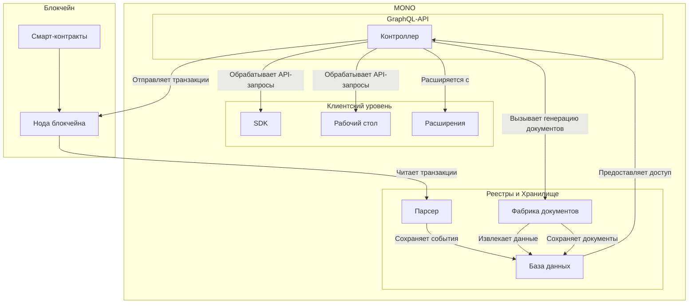
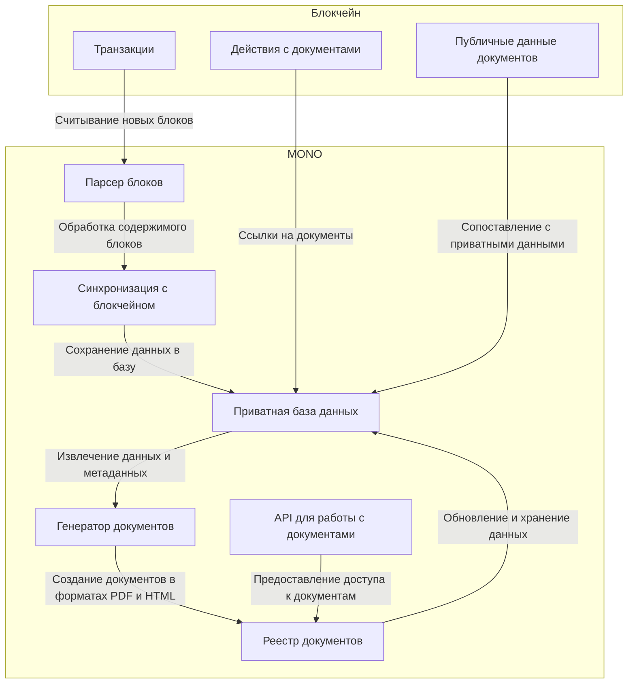

Блокчейн [Кооперативной Экономики](https://coopenomics.world) содержит кооперативные смарт-контракты целевых потребительских программ и шаблоны документов, которые стандартизируют процессы в кооперативе: от регистрации пайщика и до его выхода из кооператива. 

`MONO` применяет стандарты [Кооперативной Экономики](https://coopenomics.world) и реализует их в универсальном приложении, которое предоставляет API и пользовательский интерфейс для учёта взаимодействия пайщиков с кооперативом. `MONO` предоставляет сервис подключения к кооперативной экономике, а "ПК ВОСХОД" - провайдером. 

`MONO` может быть запущен на выделенном сервере любым кооперативом, который подключен к кооперативной экономике, т.к. `MONO` - это открытый исходный код. Однако, поскольку этот процесс требует технических ресурсов и навыков, "ПК ВОСХОД" предоставляет сервис хостинга `MONO` на своих серверах. 

Каждый экземпляр `MONO` - это приложение кооператива, способное работать полностью автономно, когда хранение документов, их генерация, а также контроль доступа к ним осуществляется самим кооперативом, и при этом, он продолжает находиться в общем контуре [Кооперативной Экономики](https://coopenomics.world) и иметь возможность взаимодействовать с другими кооперативами по общим стандартам. 

Такая архитектура является `федеративной`, поскольку каждый экземпляр MONO представляет собой автономный узел, управляемый отдельным кооперативом, но продолжающий работать в общей экосистеме, используя единые стандарты взаимодействия и блокчейн как общий реестр данных. И при этом, любой кооператив (и даже пайщик) могут просмотреть анонимизированную историю всех действий в [Кооперативной Экономике](https://coopenomics.world). 

Анонимизированная история действий в блокчейне является стержнем, вокруг которого формируется информация в каждом экземпляре `MONO` только для одного кооператива. `MONO` создан быть выделенным, автономным, работающим независимо, но с общей для всех кооперативов информацией блокчейна.  

Для этого, `MONO` дважды в секунду с помощью `парсера` считывает информацию о новом блоке из блокчейна, обрабатывает его содержимое, и сохраняет его в свою приватную базу данных. Эта операция синхронизации приватной базы данных `MONO` с блокчейном позволяет в случае необходимости провести полное восстановление всех реестров кооператива во внутренней базе данных, произведя синхронизацию с блокчейном заново. 

`MONO` можно рассматривать как ноду, которая обслуживает один кооператив и не содержит в себе блокчейна, а только подключается к нему. При подключении к блочейну, `MONO` поблочно синхронизирует публичную историческую информацию кооператива и предоставляет её для использования по API с возможностью извлечь состояние реестров кооператива в любой конкретный момент времени. 

Каждый раз, когда `MONO` при сканировании блокчейна получает [действие](https://coopenomics.world/documentation/blockchain/transactions/), в котором есть ссылка на документ и его мета-данные, `MONO` использует его для построения реестра. Т.е. основанием реестра является публичные данные, зафиксированные в блокчейне с помощью транзакций, и содержащихся в них действиях. 

Публичные данные документов содержат информацию, которая позволяет идентифицировать пайщика, кооператив, тип документа, который был создан, и эффект, который был получен. Используя информацию о имени аккаунта пайщика, `MONO` находит приватные данные пайщика, которые хранит в своей базе, и не публикует в блокчейне. Таким образом, `MONO` сопоставляет публичные части документы с пайщиками, которые их создали. 

А используя публичный хэш документа, `MONO` извлекает весь документ из своей приватной базы данных, который хранится в PDF и HTML форматах. Собирая всё это вместе, `MONO` формирует реестр пакетов документов, которые формируются на основе информации в блокчейне и дополняется приватной информации из базы данных `MONO`. 

При регистрации новых пайщиков, `MONO` сохраняет приватную информацию в своей `фабрике` документов с привязкой к текущему номеру блока в цепочке (блокчейна). Это позволяет извлекать из фабрики не только ранее сгенерированные и сохраненные документы, но и иметь возможность сверить их, произведя повторную регенерацию документов на основании сохраненной ранее в `MONO` персональной информации. 

При генерации документов `MONO` извлекает шаблон документа и подставляет в него переменные, которые хранит в своей базе данных. Затем, он хэширует документы, подписывает хэши цифровой подписью пайщика, отправляет эти уже анонимизированные документы в блокчейн, параллельно, сохраняя полную версию у себя в базе. 

После считывания информации из блокчейна о том, что совершенная транзакция принята успешно, документ попадает в реестр `MONO`, который использует ранее сохраненный документ в приватной базе данных для отображения членам совета и пайщику кооператива. Таким образом, `MONO` может генерировать любое количество любых документов, но принимать в реестр для отображения членам совета и пайщикам только те из них, которые опубликованы в блокчейне. 

`MONO` применяет `GraphQL` в качестве API. Поверх `GraphQL-API` создан `SDK`, который обеспечивает упрощенный и чрезвычайно гибкий доступ к функционалу `MONO` для разработчиков. 

В основе своей, `MONO` предоставляет систему управления реестрами пайщиков, взносов и документов на основе стандартов [Кооперативной Экономики](https://coopenomic.world). Базовый функционал реестров пайщиков, взносов и документов расширяется с помощью `Расширений`, которые дополняют API и интерфейсы рабочих столов.

Рабочий стол - это универсальное веб-приложение, обеспечивающее пользовательский интерфейс `MONO` на сайтах, мобильных и десктопных приложениях. Рабочий стол `MONO` реализует подключение контроллеру `MONO` для доступа к реестрам, а через него - к блочейну [Кооперативной Экономики](https://coopenomics.world). 

Рабочий стол `MONO` предоставляет функционал для управления отношениями с пайщиками кооператива. Он включает в себя все доступные возможности кооперативной экономики через `Расширения`. Каждое расширение увеличивает функциональные возможности `MONO`. 

Однако, использование `MONO` не принуждает к использованию рабочих столов `MONO`. Контроллер `MONO`, предоставляющий мутации, запрос и подписки GraphQL-API, может использоваться отдельно от рабочих столов при сохранении полной его функциональности. 

## Компоненты
MONO состоит из следующих компонентов и построен на следующем технологическом стеке, что обеспечивает его функциональность и гибкость для кооперативов.

### Блокчейн COOPOS

Блокчейн COOPOS является основой Кооперативной Экономики. Он содержит кооперативные смарт-контракты, шаблоны документов и стандарты взаимодействия. COOPOS обеспечивает хранение публичных данных о транзакциях, позволяя кооперативам вести прозрачный учёт действий, связанных с пайщиками. Анонимизированные данные блокчейна используются для синхронизации с реестрами MONO.

### Смарт-контракты

Смарт-контракты, работающие на COOPOS, реализуют целевые потребительские программы, регламентируют процессы кооперации и стандартизируют взаимодействие между участниками. Они позволяют автоматизировать такие операции, как регистрация пайщиков, учёт взносов, создание и обработка документов. Смарт-контракты обеспечивают юридическую прозрачность и устойчивость системы.

### Парсер

Парсер обрабатывает данные из блокчейна COOPOS, извлекая действия и транзакции для дальнейшего использования в системе. Он обеспечивает синхронизацию приватной базы данных MONO с блокчейном, фиксируя все действия, связанные с пайщиками и документами. Используется Express для реализации производительной обработки данных, а строгая типизация через TypeScript обеспечивает устойчивость к ошибкам и надёжность.

### Фабрика документов

Фабрика документов — это компонент, отвечающий за создание и управление документами. На основе данных из блокчейна и приватной базы данных она формирует документы в форматах PDF и HTML. Документы можно регенерировать, сверяя их с сохранённой информацией. Фабрика поддерживает шаблоны, которые стандартизируют форматы документов согласно стандартам [Кооперативной Экономики](https://coopenomics.world).

### Контроллер

Контроллер предоставляет централизованный доступ ко всем функциям MONO через GraphQL API. Он управляет запросами, мутациями и подписками, а также обеспечивает авторизацию пользователей. Благодаря архитектуре NestJS, контроллер легко расширяется и поддерживает подключение новых модулей или интеграцию с внешними системами.

### База данных

MONO использует PostgreSQL в качестве основного хранилища данных. Эта база данных обеспечивает надёжное хранение приватных данных кооператива, включая реестры пайщиков, документы и метаданные транзакций. MongoDB поддерживается для legacy-систем, но постепенно заменяется PostgreSQL для унификации инфраструктуры.

### SDK

SDK разработан для упрощения интеграции с MONO. Он предоставляет разработчикам удобный инструмент для работы с API, подключения к блокчейну COOPOS, управления фабрикой документов и доступа к данным кооператива. SDK построен на TypeScript и поддерживает гибкую настройку для различных платформ.

### Рабочий стол

Рабочий стол — это универсальное веб-приложение, созданное с использованием Quasar, VueJS и TypeScript. Он обеспечивает удобные интерфейсы для пайщиков и администрации кооператива. Рабочий стол интегрируется с контроллером MONO для управления реестрами, документами и взаимодействия с блокчейном. Он поддерживает модульное подключение расширений, добавляющих новые функции для конкретных нужд.

### Расширения

Расширения позволяют адаптировать MONO под специфические нужды каждого кооператива. Они расширяют API и интерфейсы рабочих столов, добавляя новые функции. Расширения интегрируются через контроллер, поддерживая модульность системы.

### Документация

Полный набор технической документации к MONO, SDK и GraphQL API. Документация включает описание схем данных, примеры запросов, инструкции по интеграции и рекомендации для разработчиков, позволяя быстро и эффективно настроить систему.
