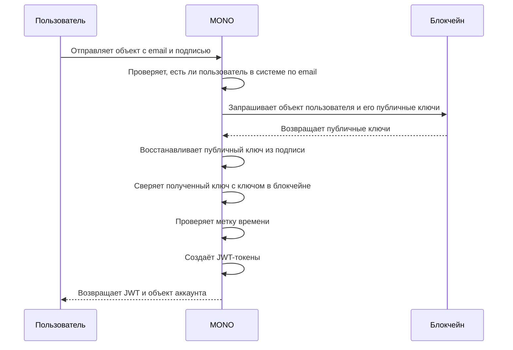

Аудентификация в системе производится посредством проверки цифровой подписи пайщика на метке времени в часов поясе UTC. Метка времени представляет собой текущую дату в формате ISO 8601, которая переведена в строку. Полученная строка подписывается приватным ключом доступа пайщика. Подпись, вместе с меткой времени и электронной почтой пайщика отправляется на бэкенд MONO для проверки. 

Проверка осуществляется путём восстановления из цифровой подписи метки времени - публичного ключа от аккаунта пайщика, с дальнейшей его сверкой с тем ключом, который достоверно принадлежит пайщику и хранится в блокчейне. Если сверка ключей проходит успешно, то бэкенд возвращает JWT для дальнейшего быстрого доступа пайщика к системе. Приватный ключ пайщика, при этом, в MONO никогда не передаётся. 

## Контроль ролей
Контроль прав доступа производится с помощью ролей (RBAC - role based access controll). В системе используются три роли: председатель (chairman), член совета (member) и пайщик (user). Все роли хранятся в блокчейне в таблице совета. MONO не управляет ролями напрямую, а только проверяет их с помощью публичной информации, которая содержится в таблицах смарт-контрактов блокчейна. 


## Простой вход
Для упрощения работы с MONO, в SDK-клиенте есть метод login, который обеспечивает простой вход:

```typescript
 const client = createClient({
    baseUrl: "http://127.0.0.1:2998/v1/graphql",
    blockchainUrl: "http://127.0.0.1:8888",
    chainId: "f50256680336ee6daaeee93915b945c1166b5dfc98977adcb717403ae225c559",
  });

 const wif = 'приватный_ключ'

 const result = await client.login(wif)

```
В результате будет получена пара ключей доступа и объект аккаунта. Токен доступа будет установлен в клиенте автоматически, и теперь клиент может использоваться для вызова запросов, мутаций или подписок в MONO, которые требуют аудентификации. 

!!!note ""
    При использовании метода login из sdk, произойдет вычисление цифровой подписи на метке времени, вызов мутации Login, установка полученных JWT-токенов и приватного ключа `wif` в SDK-клиенте для дальнейшего использования. 

!!!warning "ВАЖНО"
    SDK-клиент __НЕ__ обеспечивает постоянное хранение JWT-токенов и приватного ключа в себе. Организация постоянного хранения реализуется сторонними средствами. 


<a id="about-auth"></a>
## Подробно о входе
{{ get_sdk_doc("Mutations", "Auth", "Login") }} | {{ get_graphql_doc("Mutation.login") }}

Под капотом метода login в sdk-client выполняется серия операций, которая обеспечивает вход в систему на основании цифровой подписи метки времени без передачи ключа на сервер. 

Для входа необходимо воспользоваться методом Login в GraphQL, предварительно подготовив подпись на метке времени с помощью пакета @wharfkit/session или любого аналогичного. 

Устанавливаем пакет @wharfkit, если требуется:

```bash
pnpm install @wharfkit/session
```

Готовим метку времени и подпись:
```typescript
import { Bytes, Checksum256, PrivateKey } from '@wharfkit/session';

//извлекаем текущую метку времени
const now = new Date().toISOString();
//создаём объект приватного ключа из строки с ключом
const privateKey = PrivateKey.fromString(wif)
//преобразуем строку с меткой времени в байты
const bytes = Bytes.fromString(now, 'utf8')
//хэшируем байты
const checksum = Checksum256.hash(bytes)
//подписываем байты
const signature = privateKey.signDigest(checksum)
```

После подготовки метки времени now и подписи signature, мы можем воспользоваться мутацией Login в SDK для получения JWT-токенов в MONO:

```typescript
import { Mutations } from "@coopenomics/sdk";

const variables: Mutations.Auth.Login.IInput = {
  data: {
    "email": "email_пайщика",
    now,
    signature
  }
}

const { [Mutations.Auth.Login.name]: result } = await client.Mutation(
  Mutations.Auth.Login.mutation,
  {
    variables,
  }
);

```
В результате успешного выполнения мутации мы получим объект с информацией о пользователе и парой JWT-ключей. Для аудентификации вызовов методов необходимо установить access-ключ в SDK-клиент, воспользовававшись методом setToken на клиенте. 

```typescript
client.setToken(result.auth.tokens.access.token)
```

После установки токена все запросы через SDK-клиент будут аудентифицированы с ролью пользователя. Фактически аудентификация производится путём установки заголовка authorization: Bearer <access_token> во все последующие запросы к MONO.


Кроме того, для осуществления подписей документов, необходимо установить приватный ключ `wif` в sdk-клиент: 

```typescript 
const wif = <приватный_ключ>
client.setWif(wif)
```

Таким образом, для аудентификации пользователя в системе используется JWT, а для подписей документов приватный ключ `wif`, управление которыми осуществляет SDK. 


### Сверка ключей
MONO, получая объект с электронной почтой, проверяет - а есть ли в его внутренней системе учёта пользователь, который зарегистрирован под этой почтой. Если пользователь найден, то найдено и его имя аккаунта, под которым он зарегистрирован в блокчейне. По имени аккаунта извлекается объект пользователя из блокчейна со всеми наборами его публичных ключей. 

Далее, происходит восстановление публичного ключа из подписи, которая оставлена на метке времени и передана в MONO. Если восстановление публичного ключа удалось успешно произвести, то производится сверка полученного публичного ключа с тем, который сохранён в блокчейне. 

После успешной сверки ключей проверяется метка времени. Если метка старше, чем 10 секунд, запрос на вход будет отклонён. Если же все проверки пройдены, то MONO создаёт JWT-токены и возвращает их вместе с объектом аккаунта. Вход - успешен!



### Сверка ролей
Для проведения сверки ролей используется таблица __boards__ контракта __soviet__ кооператива, в которой представлены все члены совета с именами их аккаунтов и ролей. При изменении содержания таблицы в блокчейне, MONO изменяет роль пользователя в своей базе данных. Напрямую методов для изменения ролей пользователей MONO не предоставляет. Роли пользователей изменяются только таблицей __boards__ в контракте __soviet__ на основании состояния состава совета. 

В процессе сверки JWT токена MONO извлекает из базы данных объект аккаунта пользователя, в котором указана роль. Если эта роль присутствует в списке разрешенных ролей для выполнения запроса, мутации или подписки, то действие будет разрешено. Если роль отсутствует, то MONO вернёт ошибку с 401 кодом - Unauthorized. 

Исключением для этого правила проверки ролей является наличие поля username в параметрах запроса, которое совпадает с именем пользователя, которое будет извлечено из JWT. Это означает, что зарегистрированный пользователь, у которого есть JWT-токен, может использовать его для запросов, подписок или мутаций, связанных с его собственным аккаунтом. 

Например, если запрос getAccount требует роли члена совета или председателя для выполнения, то только они и могут извлечь объект аккаунта любого пользователя в системе. Однако, каждый пользователь может извлечь свой собственный объект аккаунта в обход проверки ролей, т.к. это его собственные данные, и для этого, ему необходимо передать username, который совпадает с тем, под которым он авторизован в системе. 


## Обновление токенов
{{ get_sdk_doc("Mutations", "Auth", "Refresh") }} | {{ get_graphql_doc("Mutation.refresh") }}

У JWT-токена типа access ограниченное время жизни, которое необходимо продлевать с помощью вызова метода Refresh и передачи токена для обновления. 

{{ get_typedoc_input("Mutations.Auth.Refresh") }}

## Выход из системы
{{ get_sdk_doc("Mutations", "Auth", "Logout") }} | {{ get_graphql_doc("Mutation.logout") }}

{{ get_typedoc_input("Mutations.Auth.Logout") }}

