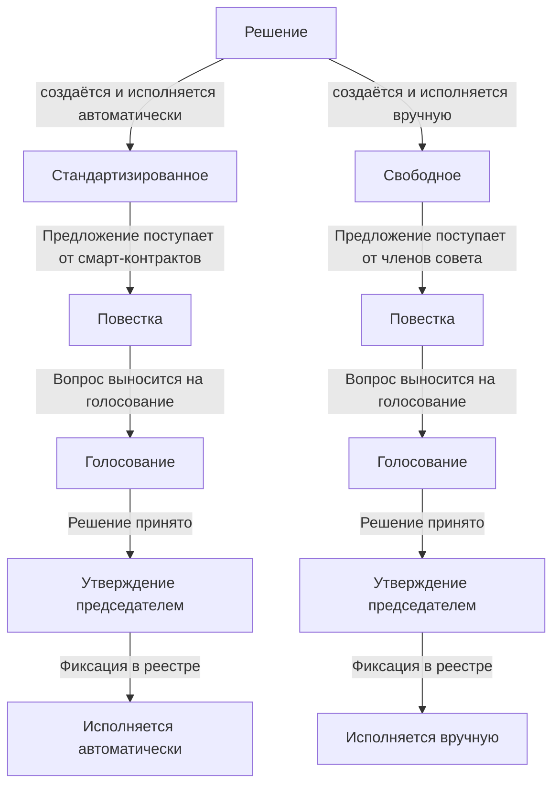
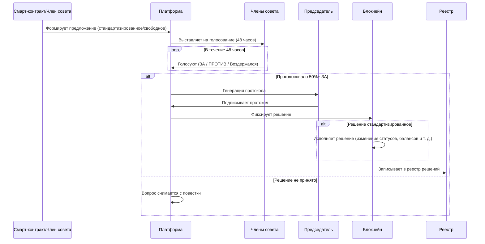

`Решение` - это утвержденное протоколом собрания совета юридическое действие в кооперативе. 

Все решения принимаются онлайн-голосованием членов совета на платформе. После успешного голосования председатель утверждает автоматически-сформированный протокол собрания совета, а блокчейн - исполняет его. 

Решения бывают: `стандартизированные` и `свободные`. 



`Стандартизированные` решения принимаются по типичным вопросам, такие как: приём пайщика, приём паевого взноса финансовыми средствами, приём паевого взноса имуществом, возврат паевого взноса финансовыми средствами, возврат паевого взноса имуществом, выход пайщика из кооператива, и т.д. и т.п.

`Стандартизированные` решения полностью автоматизированы, предложения на вопросы для голосование в них формируются автоматически и фиксируются в повестке для дальнейшего голосования совета. После проведения голосования и утверждения председателем совета, решение будет исполнено автоматически - например, пайщик будет добавлен в реестр, взносы зафиксируются в фондах, и т.д. и т.п.. 

Таким образом, `стандартизированные` решения полностью автоматизированы в том плане, что входящие данные по ним формируются системой автоматически на основе действий пайщика и не требуют участия администрации кооператива в подготовке документов - документы по стандартазированным решениям готовятся и исполняются автоматически. 

`Свободные` решения свободны в том плане, что вопрос на повестку и проект решения по этому вопросу предлагается членом совета на голосование всему совету. Если голосование прошло успешно и решение принято, то оно фиксируется в реестре документов и не приводит к автоматическому исполнению содержимого. Исполнение свободного решения производится советом `вручную`, 

`Свободные` и `стандартизированные` решения предоставляют совету возможность легко и просто принимать решения по любым вопросам удаленно, на основе простой электронной подписи. 

__Общий порядок принятия решений__



__I. В смарт-контракт совета поступает `стандартизированное` или `свободное` предложение на повестку дня для голосования совета.__

`Стандартизированные` предложения поступают от кооперативных смарт-контрактов, которые каждый согласно своей бизнес-логике подразумевают необходимость решения совета на каком-либо этапе своего исполнения. Например, `стандартизированное` предложение на повестку о приёме пайщика возникает сразу после получения оплаты вступительного взноса, и никак иначе. 

Исполнение `стандартизированных` решений приводит к появлению эффектов, например, таких как "изменение баланса лицевого счёта", или "изменение статуса пайщика", которые фиксируются в блокчейне согласно бизнес-логике смарт-контрактов [Кооперативной Экономики](https://coopenomics.world). 

`Свободные` предложения и проекты решения по ним формируются членами совета вручную. Они не предлагаются автоматически и решения по ним не приводят к эффектам в блокчейне. 

__II. Члены совета голосуют ЗА, ПРОТИВ, или воздерживаются от голосования по вопросу.__

Каждый вопрос на повестке - это отдельное собрание совета, решение которого фиксируется отдельным протоколом. Один вопрос - один протокол. За один день может быть проведено неограниченное количество собраний совета и получено неограниченное количество протоколов решений. 

Решение по вопросу необходимо принять за 48 часов. Решение считается принятым, если ЗА него проголосовало 50% членов совета. По истечению 48 часов, если решение не принято, вопрос с повестки снимается автоматически.

__III. Принятое решение утверждается председателем совета.__

Если совет кооператива принял положительное решение, то оно должно быть утверждено простой электронной подписью председателя совета на протоколе. 

Протоколы формируются полностью автоматически на основе информации о пайщике, совершаемом им `стандартизированном` действии (если такое есть), о членах совета, и информации о их голосовании по вопросу. На основе всей этой информации система автоматически генерирует по запросу председателя протокол собрания совета.

Председатель подписывает сгенерированный протокол собрания совета своей электронной подписью, и отправляет его в блокчейн, тем самым, утверждая и исполняя принятое решение. 

`Свободные` решения принимаются идентично `стандартизированным`, однако вопрос на голосование и предлагаемое решение формируется членом совета через заполнение двух полей: `предлагаемый вопрос на повестку` и `предлагаемое решение`. На основе этих данных формируется цифровой документ предложения повестки дня, которая используется при формировании протокола принятого решения. 

__IV. Все принятые решения фиксируются в реестре.__

Все принятые решения фиксируются в реестре. Подробнее о реестре документов смотри раздел [Документы](/documentation/documents).


## Просмотреть повестку
{{ get_sdk_doc("Queries", "Agenda", "GetAgenda") }} | {{ get_graphql_doc("Mutation.getAgenda") }}

{{ get_typedoc_desc("Queries.Agenda.GetAgenda") }}

{{ get_typedoc_input("Queries.Agenda.GetAgenda") }}

В результате исполнения запроса будет возвращён массив пакетов документов, каждый из которых содержит информацию о состоянии голосования по вопросу, о членах совета, их персональных данных и подписах, которые они оставили, а также о пайщике, который является участником юридического действия, и его личных данных. 

Выполнение запроса доступно только для членов совета. Подробнее о содержании пакета документов смотри раздел [Документы](/documentation/documents).

## Проголосовать за решение
{{ get_class_doc("Vote") }}

Для голосования "ЗА" используется метод `voteFor()` класса `Classes.Vote`. Данный метод создает цифровую подпись голоса члена совета.

```ts
import { Classes } from '@coopenomics/sdk'

const wifKey = "your-wif-private-key"
const voteSigner = new Classes.Vote(wifKey)

// Голосование за решение
const voteForResult = await voteSigner.voteFor("coopname", "username", 123)
console.log(voteForResult)
```


## Проголосовать против решения
{{ get_class_doc("Vote") }}

Для голосования "ПРОТИВ" используется метод `voteAgainst()` класса `Classes.Vote`. Данный метод создает цифровую подпись голоса члена совета.

```ts
import { Classes } from '@coopenomics/sdk'

const wifKey = "your-wif-private-key"
const voteSigner = new Classes.Vote(wifKey)

// Голосование против решения
const voteAgainstResult = await voteSigner.voteAgainst("coopname", "username", 123)
console.log(voteAgainstResult)
```


## Воздержаться от голосования
Для того, чтобы члену совета воздержаться от голосования, достаточно не голосовать ЗА или ПРОТИВ решения в течение 48 часов. Специального действия для воздержания не предусмотрено. 

<a id="authorize-decision"></a>
## Утвердить решение
{{ get_graphql_doc("Mutation.authorize") }}

Утверждение решения производится председателем совета путем отправки транзакции `authorize` напрямую в блокчейн с подписанным протоколом решения.

**Примечание:** В настоящее время в SDK нет готовой мутации для утверждения решений. Операция выполняется через прямое взаимодействие с блокчейном при помощи класса `Classes.Blockchain`.


## Исполнить решение
{{ get_graphql_doc("Mutation.exec") }}

Исполнение решения производится путем отправки транзакции `exec` напрямую в блокчейн для фиксации принятого решения в реестре.

**Примечание:** В настоящее время в SDK нет готовой мутации для исполнения решений. Операция выполняется через прямое взаимодействие с блокчейном при помощи класса `Classes.Blockchain`.


## Стандартизированные решения 

### Решение о приёме пайщика
{{ get_sdk_doc("Mutations", "Participants", "GenerateParticipantApplicationDecision") }} | {{ get_graphql_doc("Mutation.generateParticipantApplicationDecision") }}

Предложение на повестку формируется автоматически при [регистрации пайщика](/documentation/participants) на основании заполненного и подписанного заявления о вступлении в кооператив. Решение по вопросу приёма пайщика принимается советом на голосовании. После принятия положительного решения, председатель должен сформировать протокол решения собрания совета с помощью мутации:

{{ get_typedoc_input("Mutations.Participants.GenerateParticipantApplicationDecision") }}

Полученный с помощью этой мутации цифровой документ необходимо использовать при [Утверждении решения](/documentation/decisions#authorize-decision). Не обязательные параметры в мутации выше устанавливаются автоматически и передаются только для повторной регенации документа на основе ранее полученных мета-данных. 


## Свободные решения
Процесс предложения решения на повестку состоит из трех этапов:

1. Создать предложение и сохранить его в базе MONO для дальнейшей генерации документа. 

2. Сгенерировать документ повестки собрания совета.

3. Опубликовать вопрос в повестке собрания совета.

После голосования совета и принятия решения председатель вызывает метод генерации протокола свободного решения и использует его для [утверждения](/documentation/decisions/#authorize-decision). 


### Создать предложение решения
{{ get_sdk_doc("Mutations", "FreeDecisions", "CreateProjectOfFreeDecision") }} | {{ get_graphql_doc("Mutation.createProjectOfFreeDecision") }}

Предложение вопроса и его решения создаётся с помощью мутации `CreateProjectOfFreeDecision`, которая получает информацию о вопросе и его решении, и сохраняет для дальнейшего использования при генерации документа. 

{{ get_typedoc_input("Mutations.FreeDecisions.CreateProjectOfFreeDecision") }}


### Сгенерировать документ предложения решения
{{ get_sdk_doc("Mutations", "FreeDecisions", "GenerateProjectOfFreeDecision") }} | {{ get_graphql_doc("Mutation.generateProjectOfFreeDecision") }}

{{ get_typedoc_input("Mutations.FreeDecisions.GenerateProjectOfFreeDecision") }}


### Опубликовать документ повестки с предложением
{{ get_sdk_doc("Mutations", "FreeDecisions", "PublishProjectOfFreeDecision") }} | {{ get_graphql_doc("Mutation.publishProjectOfFreeDecision") }}

Предложение повестки дня публикуется в смарт-контракте с помощью мутации `PublishProjectOfFreeDecision`. Сразу после публикации повестки совет может приступать к голосованию. 

{{ get_typedoc_input("Mutations.FreeDecisions.PublishProjectOfFreeDecision") }}


### Сгенерировать протокол свободного решения по предложению
{{ get_sdk_doc("Mutations", "FreeDecisions", "GenerateFreeDecision") }} | {{ get_graphql_doc("Mutation.generateFreeDecision") }}

Протокол свободного решения генерируется на основании принятого решения, а также документа с предложением, которое было опубликовано членом совета. После генерации протокола свободного решения председатель должен [утвердить](/documentation/decisions/#authorize-decision) его для фиксации в реестре [Документов](/documentation/documents).

{{ get_typedoc_input("Mutations.FreeDecisions.GenerateFreeDecision") }}

Результат исполнения: 

{{ get_typedoc_definition("Mutations.FreeDecisions.GenerateFreeDecision", "IOutput") }}
