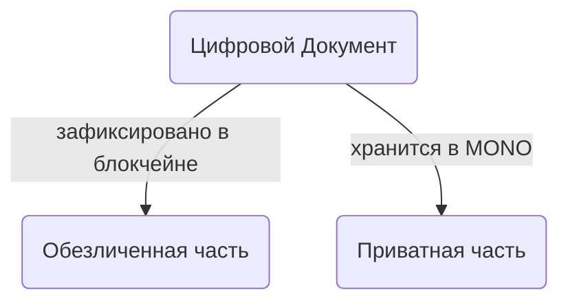
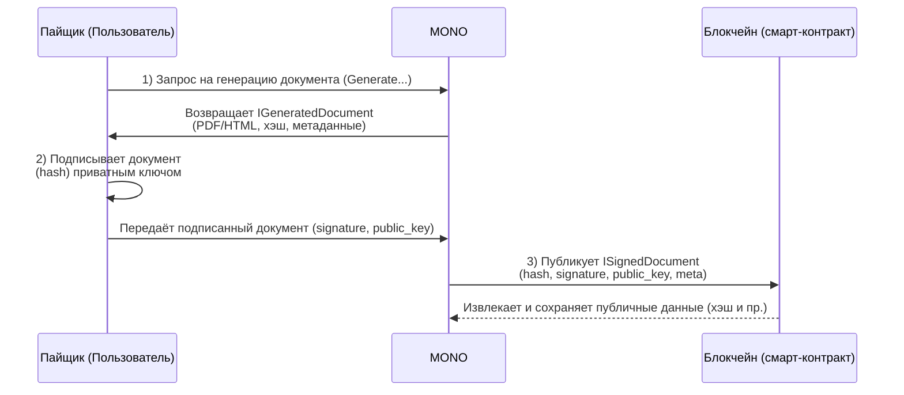
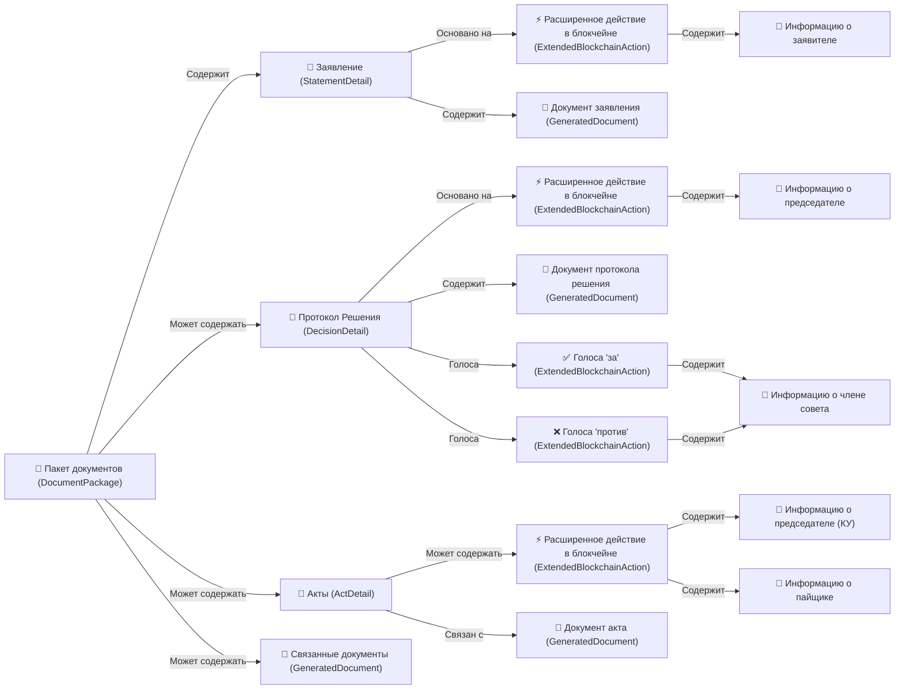
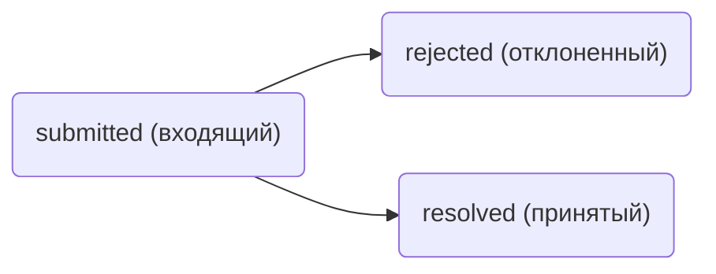
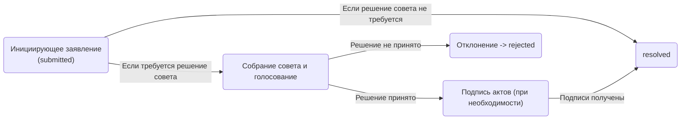

Документ — это объект, несущий юридически-значимую информацию, необходимую для работы кооператива и подтверждения прав пайщиков или других участников. Взаимодействие с документом включает в себя его подготовку, подписание и публикацию в блокчейне. При этом документ всегда состоит из двух частей:

`Публичная часть` — хранится в блокчейне в анонимизированном виде, не раскрывает конфиденциальных данных пайщика и включает минимальный набор сведений, достаточный для проверки подлинности документа. При наличии приватных данных, хранящихся вне блокчейна, этот документ может быть полностью восстановлен.

`Приватная часть` — хранится во внутренней базе данных платформы MONO. Эта часть содержит личные или иные конфиденциальные данные пайщика, информацию о содержании документа, подписи, дополнительные детали и всё то, что не должно публиковаться публично. Из неё же берётся необходимая информация для генерации, регенерации и сверки документа с его публичной частью, которая была зафиксирована в блокчейне.

При этом все документы, публикуемые в блокчейне, анонимизированно фиксируются через соответствующие смарт-контракты, что обеспечивает прозрачный и неизменяемый учёт без раскрытия приватных сведений.



## Получение документов

### Получить список документов
{{ get_sdk_doc("Queries", "Documents", "GetDocuments") }} | {{ get_graphql_doc("Query.getDocuments") }}

Получение списка документов пайщика с фильтрацией по статусу, типу и другим параметрам. Возвращает как публичную информацию из блокчейна, так и приватные данные из внутренней базы MONO.

{{ get_typedoc_input("Queries.Documents.GetDocuments") }}

Результат:

{{ get_typedoc_definition("Queries.Documents.GetDocuments", "IOutput") }}

## Фиксация документов

Каждый раз, когда пользователь (пайщик) формирует документ, он генерируется платформой MONO на основании данных, которые уже есть во внутренней базе кооператива. При генерации создаётся как PDF-версия (бинарное представление), так и HTML-версия (для удобного отображения в интерфейсе). Параллельно формируется hash PDF-файла и метаданные, необходимые для будущей регенерации.

Когда пользователь подписывает сформированный документ (PDF-хэш), подпись вместе с публичным ключом и мета-данными отправляется обратно на платформу MONO, и уже MONO публикует эту информацию в блокчейн через вызов соответствующих мутаций смарт-контрактов.

Таким образом, пайщик напрямую не отправляет документ в блокчейн: за него это делает MONO, храня всю детальную информацию у себя, но публикуя в блокчейне лишь зашифрованные или анонимизированные данные, достаточные для удостоверения подлинности документа.

## Структура данных в блокчейне

Смарт-контракты в блокчейне фиксируют документ в обезличенном виде. Вызов мутации, отвечающей за публикацию документа, сохраняет в блокчейне следующую структуру:

```ts
interface ISignedDocument {
  hash: <string>         // Хэш-сумма подписанного PDF-документа
  signature: <string>    // Подпись хэш-суммы
  public_key: <string>   // Публичный ключ, которым подписан документ
  meta: <object>         // Строка с JSON-объектом мета-информации о документе
}
```

Где `hash` - позволяет однозначно идентифицировать документ, `signature` и `public_key` обеспечивают криптографическую верификацию подлинности подписи, а `meta` содержит дополнительную информацию (в формате JSON), позволяющую в будущем восстановить содержание документа (используя данные из внутренней базы MONO).

Таким образом, вся конфиденциальная часть документа (тексты, личные данные, детали договора и т.д.) не вводятся в публичный реестр блокчейна. Блокчейн хранит лишь контрольные суммы и ограниченный набор открытых сведений, необходимые для проверки и восстановления документа. 

## Процесс генерации и подписания документа


### Инициирующее действие

Пользователь инициирует процесс, вызывая мутацию с префиксом Generate. На примере генерации ползовательского соглашения:

{{ get_sdk_doc("Mutations", "Agreements", "GenerateUserAgreement") }}


На примере подписи пользовательского соглашения {{ get_sdk_doc("Mutations", "Agreements", "GenerateUserAgreement") }}:

{{ get_typedoc_input("Mutations.Agreements.GenerateUserAgreement") }}


В ответ `MONO` формирует документ:

```ts
interface IGeneratedDocument {
  binary: <string>      // base64-кодированное содержимое PDF
  full_title: <string>  // Полное название документа
  hash: <string>        // Хэш-сумма PDF-файла
  html: <string>        // HTML-версия документа
  meta: <MetaDocument>  // Объект метаданных
}
```

### Подпись документа

На полученный `hash` документ пользователь накладывает цифровую подпись с помощью своего приватного ключа в классе Document

```ts
import { Classes } from '@coopenomics/sdk'

//создать фабрику и установить ключ для подписи
const documentFactory = new Classes.Document(<wif>) 

//подписать ранее сгенерированный документ
const signedDocument: ISignedDocument = documentFactory.sign(generatedDocument)
```

Также вместо создания новой фабрики документов, можно использовать фабрику из ранее созданного клиента:

```ts
//устанавливаем ключ, если ранее вход в клиенте с помощью login не исполнялся
client.document.setWif(<wif>)

//подписываем документ
const signedDocument: ISignedDocument = client.document.sign(generatedDocument)

```

!!!note ""
    Если экземпляр клиента ранее вызывал метод `client.login(...)` для входа, то класс `client.Document` уже содержит приватный ключ `wif` и может подписывать документы без повторной установки ключа. 


В результате, будет получен объект с подписанным документом, пригодным к использованию в мутациях `MONO`. 


### Публикация в блокчейне

Для отправки документа необходимо вызвать соответствующую ему мутацию `MONO` и передать подписанный документ в качестве аргумента. `MONO` произведет необходимые проверки и опубликует документ в блокчейне, вызвав соответствующий мутации кооперативный смарт-контракт. 

Например, в процессе [регистрации пайщика](/documentation/participants) необходимо отправить сразу несколько сгенерированных и подписанных документов:

{{ get_typedoc_input("Mutations.Participants.RegisterParticipant") }}

В результате её исполнения, публичные данные документов (хэш, подпись, публичный ключ и мета-данные) зафиксируются в блокчейне, а кооперативный смарт-контракт регистрации продолжит своё исполнение по ходу своей бизнес-логики. 


## Пакет документов
Пакет документов представляет собой набор всех документов, относящихся к определённому процессу внутри кооператива (например, вступление в кооператив, взнос или возврат имущества имущества, подписание соглашений и т.д.).

Минимальный пакет всегда содержит хотя бы одно заявление (StatementDetail), опубликованное в блокчейне. В зависимости от бизнес-логики смарт-контракта, к заявлению могут добавляться и другие 
документы:

- Протокол Решения (DecisionDetail), содержащий данные о том, как совет кооператива принял решение по заявлению.

- Акты (ActDetail), завершающие юридически значимые действия, например, передача имущества.

- Связанные документы (GeneratedDocument), которые могут прикладываться к заявлению и подписываться вместе с ним (соглашения об использовании платформы, политике конфиденциальности и т.д.).

`MONO` собирает документы, связанные с исходным заявлением, в единый пакет. В этом пакете сохраняются как публичные данные, извлечённые из блокчейна (подписи, хэши, статусы), так и приватные данные (конкретное содержимое документов), которые могут быть показаны только тем, кто имеет право их видеть (пайщик, члены совета, председатель и т.д.).


Если после публикации документа в блокчейне с помощью соответствующей мутации, логика смарт-контракта подразумевает, что необходимо собрать совет кооператива для голосования по вопросу в заявлении, то автоматически создаётся объект будущего протокола решения (DecisionDetail), в котором фиксируется процесс голосования и утверждения.


Структурно пакет может выглядеть так, как показано в диаграмме (см. «Структурная диаграмма пакета документов»).



## Статусы документов
При публикации в блокчейне каждый документ, в зависимости от контекста и бизнес-логики, получает статус:

- `submitted` (входящий) — документ ещё не завершён, ему требуется решение совета или иное дальнейшее действие.

- `resolved` (принятый) — документ получил финальную юридическую силу. Это означает, что все необходимые действия выполнены, голоса совета собраны (если были нужны), акт подписан (если требовалось), и смарт-контракт отметил его как завершённый.

- `rejected` (отклонённый) - документ отклонён. Это означает, что изначально входящий документ отклонён в процессе рассмотрения советом.



При этом все статусы навсегда сохраняются в блокчейне для каждого документа. Даже если документ, находящийся в статусе `submitted`, в итоге отклонён советом, он всё равно останется в этом статусе (и дополнительно переходит в `rejected`), так как данные в публичном реестре не редактируются и не удаляются задним числом.

Соответственно:

- Входящий (`submitted`) документ отражает факт, что не все требования закрыты и решение по нему ещё может быть не принято либо принято отрицательно (но мы увидим это не по статусу, а по факту отсутствия закрывающего действия).

- Принятый (`resolved`) документ свидетельствует о завершённом процессе и имеет всю юридическую силу в реестре кооператива.

- Отклоненный (`rejected`) документ свидетельствует о прерванном процессе и не имеет юридической силы.


## Регенерация документов и хранение в MONO

Внутренняя база MONO хранит всё документы, их приватные части, исторические данные, а также привязку к хэшам, которые были опубликованы в блокчейне. Когда пользователь или член совета запрашивает пакет документов, `MONO`:

- Извлекает публичные данные по документам из блокчейна (через смарт-контракты).

- Находит приватные данные в своей БД, сопоставляя их по `hash`.

- Собирает итоговый пакет, в котором каждому опубликованному действию (ExtendedBlockchainAction) соответствует документ с нужными вложениями (PDF, HTML, метаданные).

Благодаря этому подходу, платформа может регенерировать любой документ в том же виде, в котором он был подписан и отправлен в блокчейн, и сверить заново сгенерированный документ с тем, который был опубликован в блокчейне, тем самым, верифицировав то, что документ создан корректно, а цифровая подпись на нём - валидна. 

## Связанные документы

Часто к заявлению или другому документу требуется приложить дополнительные договоры, согласия, соглашения и прочие документы, которые, в свою очередь, могут быть подписаны и закреплены криптографически. Это делается путём добавления в поле `meta` списка (массива) хэш-сумм связанных документов. Подписывая один документ, пайщик тем самым подтверждает связь с другими документами и своё согласие с ними именно в той версии, с которой он ознакомлен.

Пример: когда пользователь вступает в кооператив, он одновременно потверждает согласие с политикой конфиденциальности, условиями целевой программы «Цифрового Кошелька», а также правила использования простой электронной подписи и пользовательское соглашение. Хэши всех этих документов указываются в поле `meta` инициирующего заявления на вступление в кооператив, а подробное содержимое каждого документа хранится в базе `MONO`.

В итоге, вся последовательность от первого инициирующего заявления до заключительного акта, если он предусмотрен бизнес-логикой, превращается в связный пакет документов:



- Заявление (StatementDetail) и его подпись в блокчейне инициирует цепочку принятия решений или сразу переводит документ в статус `resolved` (принятое), если решение по вопросу не требуется;

- Протокол решения (DecisionDetail) собирает голоса членов совета и ожидает утверждения подписью председателя, если это предусмотрено смарт-контрактом как реакция на инициирующее заявление; 

- Акты (ActDetail) подписывается пайщиком и председателем (кооперативного участка), если такое требование есть у смарт-контракта как реакция на инициирующее заявление. Крайняя подпись на акте переводит документ в статус `resolved` и фиксирует его в реестре;

- Прикреплённые (связанные) документы, позволяющие зафиксировать другие важные файлы в рамках этого же пакета;

Такой пакет становится частью списка всех «принятых» решений и документов кооператива, который в любой момент может быть выгружен для проведения аудита, юридических проверок или отчетности перед надзорными органами. 


## Получить список пакетов документов

{{ get_sdk_doc("Queries", "Documents", "GetDocuments") }} | {{ get_graphql_doc("Query.getDocuments") }}

{{ get_typedoc_input("Queries.Documents.GetDocuments") }}

Результат исполнения: 

{{ get_typedoc_definition("Queries.Documents.GetDocuments", "IOutput") }}

