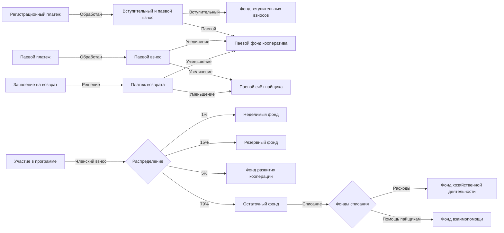

Фонды - это счета кооператива в [кошельке](/documentation/wallet) для учёта движения паевых, членских и вступительных взносов пайщиков.

Фонды бывают: `возвратные` и `невозвратные`. 

Единственным возвратным фондом является паевой фонд. При поступлении средств на него у кооператива возникает обязательство по возврату средств пайщику. Все прочие фонды являются невозвратными, т.е. при поступлении средств в эти фонды у кооператива уже нет обязательств по их возврату пайщикам.  

Фонды бывают: `накопительные` и `списания`. 

Накопительные фонды накапливают финансовые средства в себя с каждого [членского взноса](/documentation/payments) пайщиков согласно распределению в процентах между всеми накопительными фондами. Фонды списания подобны статьям, по которым кооператив может списывать доступные, ранее накопленные финансовые средства. 

<!-- Фонды бывают: `обязательные` и `не обязательные`.  -->

В Кошельке фондов кооператива есть следующие обязательные счета, использование которых регулируется смарт-контрактами [Кооперативной Экономики](https://coopenomics.world):

- __Паевой__ - учитывает все паевые взносы пайщиков, увеличивается при взносах и уменьшается при их возврате пайщикам. Является возвратным фондом. Всё что вносится в паевой фонд - подлежит возврату, и должно использоваться кооперативом только для удовлетворения потребности пайщика по его поручению. 

- __Неделимый__ - обязательный накопительный фонд членских взносов пайщиков, который передаётся какому-либо кооперативу при ликвидации кооператива. 

- __Резервный__ - обязательный накопительный фонд членских взносов пайщиков, который формирует резерв для погашения финансовых обязательств кооператива, которые могут возникнуть в процессе его операционной деятельности. 

- __Развития кооперации__ - обязательный накопительный фонд членских взносов пайщиков, который используется для финансирования образовательных, консультационных, инфраструктурных и иных программ, направленных на развитие и укрепление кооператива.

- __Вступительный__ - обязательный накопительный фонд вступительных взносов пайщиков, которые по закону должны использоваться только для списания через счет хозяйственной деятельности. 

- __Остаточный__ - обязательный накопительный фонд членских взносов пайщиков, которые остались после распределения по всем фондам накопления кооператива и будут использоваться для дальнейшего списания в будущем. 

- __Хозяйственной деятельности__ - обязательный фонд списания расходов, через который проходят все расходы кооператива с `остаточного` счёта. 

- __Взаимопомощи__ - обязательный фонд списания на нужды помощи пайщикам, который использует `остаточный` счет как источник средств. 

## Как это работает

Первые взносы, которые оплачивает пайщик одним [Регистрационным Платежом](/documentation/payments) - это вступительный и минимальный паевый взносы. Вступительные взнос фиксируется в фонде вступительных взносов кооператива, а минимальный паевый взнос - в паевом фонде. 

В кошельке пайщике отображается сумма минимально-паевого взноса, которая будет возвращена при выходе пайщика из кооператива. При возврате минимального паевого взноса - паевой фонд будет уменьшен на эту сумму. 

Следующий взнос, который может совершить пайщик - паевой, который будет зафиксирован в [Кошельке](documentation/wallet) пайщика и паевом фонде. Кошелёк позволяет пополнять себя платежами и использовать себя как "буфер" для взносов в целевые потребительские программы кооператива и дальнейших возвратов из них. 

Платежи, которые поступают в Кошелёк на паевой счёт - безусловно возвратные. Пайщик может сформировать заявление на возврат и получить платежом возврата свой паевой взнос обратно на банковский счёт. При совершении платежа возврата паевой фонд будет уменьшен на сумму возврата. 

Когда пайщик принимает решение участвовать в какой-либо [целевой потребительской программе](/documentation/programs) кооператива, то он принимает её условия. В её условиях описан принцип взымания членских взносов, или их отсутствие. Членские взносы взымаются по условиям программы и отправляются для распределения по невозвратным фондам. 

Членский взнос пайщика распределяется среди всех фондов накопления в их процентном соотношении, которое всегда составляет 100% от суммы взноса. Обычно, при старте `MONO` в кооперативе 4 фонда накопления со следующим распределением:

- Неделимый фонд - 1%

- Резервный фонд - 15%

- Фонд развития кооперации - 5%

- Остаточный фонд - 79%

Кооператив может создавать дополнительные фонды накопления из числа средств остаточного фонда, всего до 12 штук. Редактировать наименования и процентные распределения между обязательными фондами кооператив не может. Все добавляемые кооперативом фонды накопления будут уменьшать остаточный фонд, но не будут влиять на процентное соотношение распределений неделимого, резервного фонда и фонда развития кооперации. 

Остаточный фонд может использоваться кооперативом для списания по любому фонду списания. Среди них два обязательных фонда: `хозяйственной деятельности` и `взаимопомощи` и любое количество не обязательных, которые может добавить кооператив. 

Использование средств любого фонда регулируется смарт-контрактами на основании требуемых для этого документов и процессов. Так, остаточный фонд списывается на расходы по служебным запискам и решениям совета, а неделимый, резервный и фонд развития кооперации могут использоваться только по решениям общего собрания пайщиков. 

## Текущие API по фондам

В актуальной версии SDK/GraphQL отдельные методы `Funds.*` отсутствуют. Управление фондами реализуется через бизнес-процессы кошелька и платежей, см. разделы:

- [Платежи](/documentation/payments) — создание и обработка платежей.
- [Кошелёк](/documentation/wallet) — операции с кошельком пайщика/кооператива.

Отдельные SDK/GraphQL-методы для прямой работы с фондами появятся после их повторной публикации в схеме.

