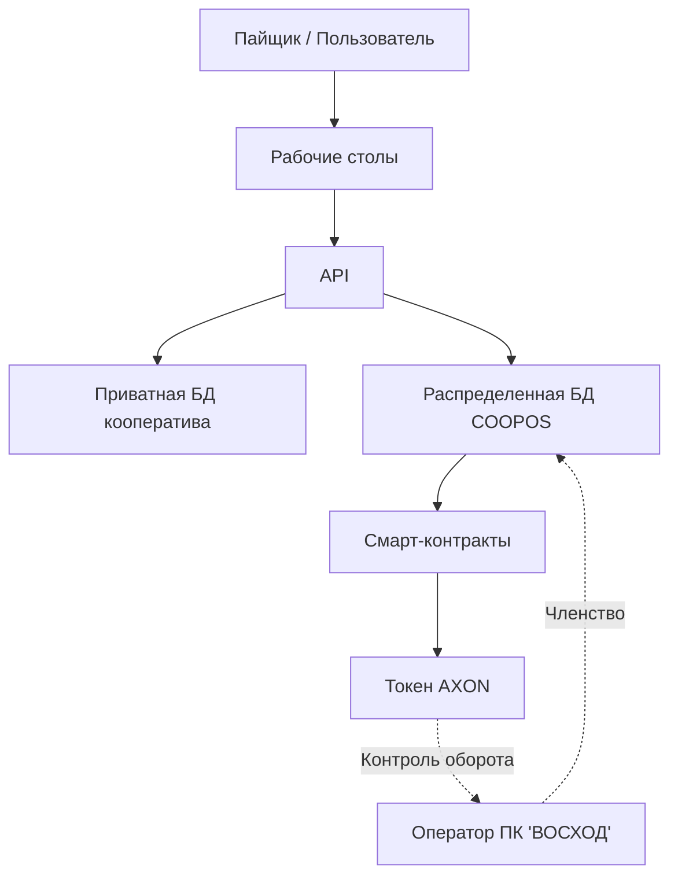

__`MONO`__ - это программное обеспечение для управления взаимоотношениями с пайщиками. 

`MONO` запускается в выделенных копиях и ведёт реестры пайщиков, взносов и документов. Все данные кооперативов в MONO - выделены в отдельные базы, что позволяет легко переносить их между облаками и собственными серверами, в случае возникновения такой необходимости. 

Вся основная бизнес-логика, отвечающая за процессы кооперации, хранится в блокчейне ["Кооперативной Экономики"](https://coopenomics.world), который называется COOPOS - операционная система для кооперации. В COOPOS исполняются кооперативные смарт-контракты, реализующие сценарии кооперации согласно методологии [союза потребительских обществ "РУСЬ"](https://союз-русь.рф).

Чтобы иметь возможность подключить `MONO` или другой экземпляр программного продукта к платформе ["Кооперативной Экономики"](https://coopenomics.world) к блокчейну COOPOS, кооперативу необходимо стать пайщиком операта платформы ("ПК ВОСХОД") и заключить с ним соглашение о подключении к Платформе.  

Однако, поскольку блокчейн и смарт-контракты платформы ["Кооперативной Экономики"](https://coopenomics.world) распространяются по открытой лицензии и исходный код опубликован на ["Github"](https://https://github.com/coopenomics), то любой кооператив имеет техническую возможность запустить альтернативную платформу COOPOS и быть оператором на ней - в этом наша децентрализация. 

!!! note "Подключение без оператора"
    Подключение к платформе без членства в кооперативе-операторе невозможно по той причине, что в рамках цифровой среды блокчейна ["Кооперативной Экономики"](https://coopenomics.world) используются утилити-токен AXON для учёта количества хранимой, обрабатываемой и передаваемой информации в каждом конкретном кооперативе, и оборот этих токенов легально допустим только в рамках ограниченного круга лиц кооперативного контура. 

`MONO` предоставляет API и пользовательские интерфейсы (рабочие столы), которые осуществляют подключение конечного пользователя к платформе ["Кооперативной Экономики"](https://coopenomics.world). При нажатии на кнопи интерфейса, сигнал поступает на бэкенд `MONO` по `API`, где в зависимисти от команды, производится проверка контроля прав доступа, и затем вызывается API платформы ["Кооперативной Экономики"](https://coopenomics.world), если это необходимо. Также, если необходимо, производится модификация приватной базы данных кооператива - сохранение документов, информации о пайщиках, платежах, и т.д. и т.п. 

Таким образом, `MONO` является клиентом для подключения к блокчейн-платформе ["Кооперативной Экономики"](https://coopenomics.world), обеспечивая реализацию кнопок в интерфейсе и набор API, чтобы все эти кнопки работали на создание кооперативной выгоды для пайщиков, а совет кооператива - обладал всей полнотой необходимой информацией для принятия решений и дальнейшей отчетности по операциям перед контролирующими органами. 

