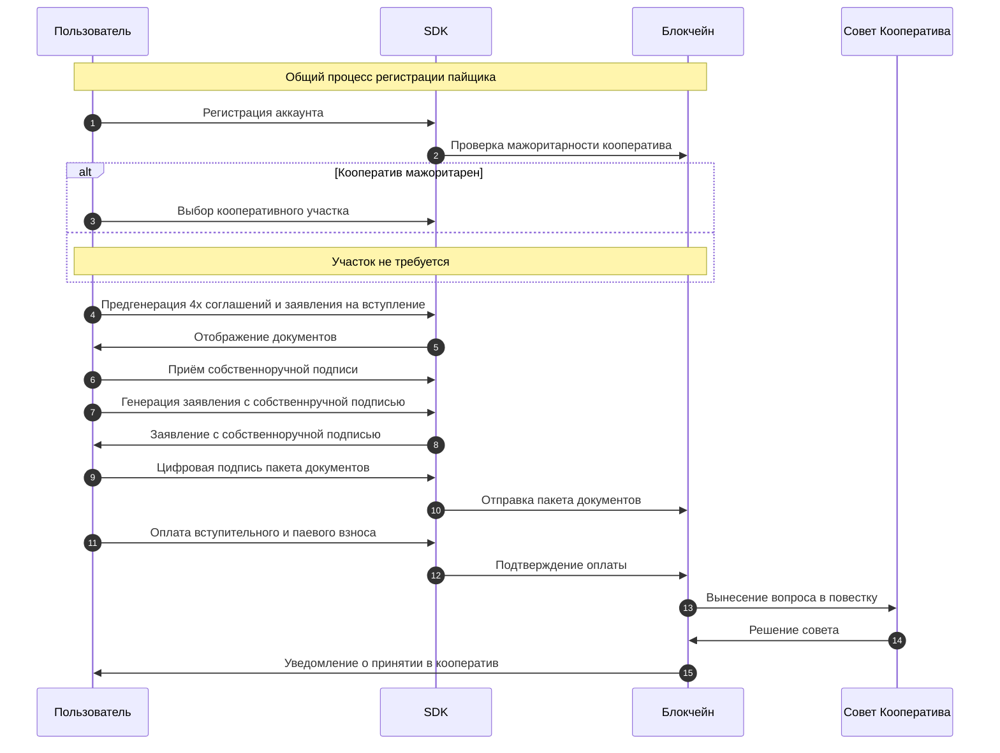

Пайщик - это пользователь, у которого есть принадлежащий ему объект аккаунта пайщика {{ get_graphql_definition("ParticipantAccount") }}, содержащий информацию о его членстве в кооперативе. Аккаунт пайщика выдаётся кооперативом, при прохождении полной процедуры регистрации пайщика, или при добавлении ранее зарегистрированного пайщика в систему. 


<!-- Для генерации заявления должна использоваться собственноручная подпись пайщика в формате png, закодированная в base64. В мета-данных заявления должны присутствовать ссылки на хэши 4 подписанных соглашений. После генерации заявления с ссылками на соглашения и валидной собственноручной подписью, на заявление накладывается цифровая подпись пайщика.  -->


## Регистрация пайщика

Аккаунт пайщика {{ get_graphql_definition("ParticipantAccount") }} выдаётся пользователю смарт-контрактом при прохождении полной процедуры регистрации пайщика. После завершения процедуры аккаунт пайщика будет доступен в объекте {{ get_graphql_definition("Account") }} -> {{ get_graphql_definition("ParticipantAccount") }} при [получении аккаунта пользователя](/documentation/accounts/#get-account). 




### 1. Регистрация аккаунта

Пользователь заполняет форму и регистрирует аккаунт провайдера, как это описано в разделе [Регистрация Аккаунта](/documentation/accounts/#register-account). 

### 2. Выбор кооперативного участка

Пользователю необходимо выбрать кооперативный участок в том случае, если кооператив перешёл на мажоритарную систему управления, организовав `>= 3` кооперативных участков в своём кооперативе. В случае, если кооператив - мажоритарен, пользователю потребуется предоставить выбор идентификатора кооперативного участка, председателю которого он делегирует свой голос на общих собраниях. 

Для того, чтобы выяснить, является ли кооператив мажоритарным, необходимо [извлечь объект системной информации SystemInfo](/documentation/system), обратиться в нём к {{ get_graphql_definition("CooperativeOperatorAccount") }}, и извлечь булево свойство `is_branched`. 

Значение `true` в `is_branched` означает, что кооператив - мажоритарный, и пайщику при регистрации будет необходимо предоставить идентификатор имени кооперативного участка, иначе, регистрация пайщика будет отклонена. Извлечение списка кооперативных участков описано в разделе [Получить Кооперативные Участки](/documentation/branches). Для отправки последующей отправки документов на регистрацию пайщика, потребуется выбрать из списка параметр `braname` - имя аккаунта кооперативного участка, при котором регистрируется пайщик.

<!-- TODO подправить ссылку выше после добавления раздела -->

### 3. Предгенерация документов
Для того, чтобы сгенерировать пайщику персональное заявление на вступление и все сопутствующие соглашения, и показать их ему в том виде, в котором он будет подписывать, необходимо произвести предгенерацию пакета документов. 

<a id="pregeneration-applicaion"></a>
#### Заявление на вступление
{{ get_sdk_doc("Mutations", "Participants", "GenerateParticipantApplication") }} | {{ get_graphql_doc("Mutation.generateParticipantApplication") }}

Мутация для генерации заявления на вступление пайщика в кооператив вызывается с параметром signature, который может быть пустым для пред-генерации, или содержать png изображение подписи в кодировке base64 для основной генерации. Массив links будет пустым для пред-генерации, но обязательно должен содержать хэши 4-х соглашений для основной генерации.

{{ get_typedoc_input("Mutations.Participants.GenerateParticipantApplication") }}


#### Соглашение о ЦПП "Цифровой Кошелёк"
{{ get_sdk_doc("Mutations", "Agreements", "GenerateWalletAgreement") }} | {{ get_graphql_doc("Mutation.generateWalletAgreement") }}

{{ get_typedoc_input("Mutations.Agreements.GenerateWalletAgreement") }}

#### Соглашение о простой электронной подписи
{{ get_sdk_doc("Mutations", "Agreements", "GenerateSignatureAgreement") }} | {{ get_graphql_doc("Mutation.generateSignatureAgreement") }}

{{ get_typedoc_input("Mutations.Agreements.GenerateSignatureAgreement") }}

#### Пользовательское соглашение
{{ get_sdk_doc("Mutations", "Agreements", "GenerateUserAgreement") }} | {{ get_graphql_doc("Mutation.generateUserAgreement") }}

{{ get_typedoc_input("Mutations.Agreements.GenerateUserAgreement") }}

#### Согласие с политикой конфиденциальности
{{ get_sdk_doc("Mutations", "Agreements", "GeneratePrivacyAgreement") }} | {{ get_graphql_doc("Mutation.generatePrivacyAgreement") }}

{{ get_typedoc_input("Mutations.Agreements.GeneratePrivacyAgreement") }}

В результате предгенерации будет получены объекты с документами, которые могут быть продемонстрированы пользователю перед запросом его собственноручной подписи. Кроме того, предгенерация необходима, чтобы криптографически связать заявление на вступление с соглашениями на этапе основной генерации после получения собственноручной подписи. 


### 4. Собственноручная подпись
Для получения собственноручной подписи пользователя используется вспомогательный набор методов {{ get_sdk_doc("Methods", "Canvas") }}. Для начала процесса получения собственноручной подписи необходимо создать область для подписи с помощью `Canvas.createCanvas()`, передав `id` элемента `div`, в котором будет размещен `canvas`. 

```ts
import { Classes } from '@coopenomics/sdk'

// Указываем контейнер, где будет размещён холст
const container = document.getElementById('signature-container') as HTMLElement

// Создаём экземпляр Canvas для работы с подписью
const signatureCanvas = new Classes.Canvas(container, {
  lineWidth: 5,
  strokeStyle: '#000',
})

```

После завершения процесса собственноручной подписи, необходимо извлечь её и, при необходимости, очистить область:

```ts
// Извлечение подписи в формате base64
const signature = signatureCanvas.getSignature()
console.log('Подпись в формате base64:', signature)

// Очистка холста при необходимости
signatureCanvas.clearCanvas()

// Освобождение ресурсов, если холст больше не нужен
signatureCanvas.destroy()
```

В результате, у вас будет строковое представление изображения собственноручной подписи пользователя, которое теперь необходимо использовать на основной генерации заявления на вступление в кооператив. 

### 5. Генерация заявления
{{ get_sdk_doc("Mutations", "Participants", "GenerateParticipantApplication") }} | {{ get_graphql_doc("Mutation.generateParticipantApplication") }}

Основная генерация заявления производится аналогично [предгенерации](/documentation/participants/pregeneration-applicaion), однако, в `signature` необходимо передать полученную ранее собственноручную подпись, а в массиве `links` указать хэши всех ранее сгенерированных соглашений. 

```typescript
const variables: Mutations.Participants.GenerateParticipantApplication.IInput = {
    data: {
      singature: <полученная ранее строка с изображением подписи в png/base64>,
      links: [participantApplication.hash, signatureAgreement.hash, userAgreement.hash, privacyAgreement.hash]
      username: <имя аккаунта пользователя>,
      coopname: <имя аккаунта кооператива>
  }

const { [Mutations.Participants.GenerateParticipantApplication.name]: participantApplication2 } = await client.Mutation(
  Mutations.Participants.GenerateParticipantApplication.mutation,
  {
    variables,
  }
);


```

В результате исполнения мутации будет возвращён объект заявления, который сгенерирован с применением его собственноручной подписи. Все документы будут сохранены в MONO и криптографически связаны с пользователем, между собой, и его собственноручной подписью. 


### 5. Подпись документов

Теперь у нас есть полный пакет документов: 4 соглашения с этапа пред-генерации и 1 заявление с предыдущего этапа, которое включает собственноручную подпись пользователя и хэш-ссылки на соглашения. 

Теперь необходимо подписать все эти 5 документов. Цифровая подпись осуществляется методом класса {{ get_class_doc("Document", "sign") }}, активный инстанс которого есть в SDK-клиенте. Вы можете использовать `client.Document.sign(doc)` на действующем экземпляре клиента или создать новый экземпляр класса Document, импортировав его из SDK:

```ts

const wif = <приватный ключ>

//устанавливаем ключ в клиента, если необходимо
client.Document.setWif(wif)

//последовательно подписываем все документы:
const signedSignatureAgreement = client.Document.sign(signatureAgreement)
const signedUserAgreement = client.Document.sign(userAgreement)
const signedWalletAgreement = client.Document.sign(walletAgreement)
const signedPrivacyAgreement = client.Document.sign(privacyAgreement)
const signedParticipantApplication = client.Document.sign(participantApplication2)
```

Для успешной подписи документов в SDK-клиенте должен быть [установлен](/documentation/auth/#about-auth) приватный ключ. В результате, каждый документ будет подписан подготовлен к отправке приведением к необходимому формату. 


### 6. Отправка документов
{{ get_sdk_doc("Mutations", "Participants", "RegisterParticipant") }} | {{ get_graphql_doc("Mutation.registerParticipant") }}

Регистрация пайщика производится мутацией RegisterParticipant с передачей подписанного заявления и соглашений. Отправленный пакет документов сохраняется в MONO для пользователя и ожидает поступления оплаты взносов перед отправкой в совет на голосование.
 
{{ get_typedoc_input("Mutations.Participants.RegisterParticipant") }}


### 7. Оплата взносов

{{ get_sdk_doc("Mutations", "Participants", "CreateInitialPayment") }} | {{ get_graphql_doc("Mutation.createInitialPayment") }}

Перед тем, как принятые документы будут отправлены в повестку совета на голосование, новому пайщику необходимо оплатить вступительный и минимальный паевый взносы (одним платежом). 

{{ get_typedoc_input("Mutations.Participants.CreateInitialPayment") }}

Результат:

{{ get_typedoc_definition("Mutations.Payments.CreateInitialPayment", "IOutput") }}

Подробнее о доступных платежных провайдерах и управлении платежами смотри раздел [Платежи](/documentation/payments). После получения подтверждения о поступлении платежа (статус платежа `PAID`), пользователю будет зарегистрирован аккаунт в блокчейне, а пакет документов пайщика поставлен в повестку голосования совета кооператива.

### 8. Получение решения совета

После поступления платежа вопрос добавляется в повестку голосования совета, где каждый член совета голосует за решение о приёме нового пайщика, а председатель - утверждает это решение. Процесс принятия решения советом описан в разделе [Решения](/documentation/decisions). 

После того, как совет примет решение, оно будет автоматически исполнено: обновятся все реестры, будут созданы счета, открыты кошельки и т.д., а пользователь получит уведомление на электронную почту о том, что он принят в кооператив. С этого момента он является пайщиком, обладает объектом {{ get_graphql_definition("ParticipantAccount") }} в {{ get_graphql_definition("Account") }}, и может участвовать во всех целевых потребительских программах кооператива.


## Добавление пайщика
{{ get_sdk_doc("Mutations", "Participants", "AddParticipant") }} | {{ get_graphql_doc("Mutation.addParticipant") }}

Иногда необходимо добавить в цифровую систему уже действующего пайщика кооператива. В таком случае, нам не нужно проводить регистрацию пайщика по полному процессу, а достаточно сразу добавить его в систему. 


!!!danger ""
    Данная мутация должна использоваться `ТОГДА И ТОЛЬКО ТОГДА`, когда решение совета кооператива уже принято и оформлено в `бумажном` протоколе, а пайщик фактически совершил взносы в кооператив. Т.е. юридически пользователь уже является пайщиком кооператива и его необходимо только добавить в систему, переведя взаимоотношения с ним в цифровую форму. 
    <!-- Использование данной мутации без наличия `бумажного` протокола решения собрания совета и оплаченных взносов пайщика, может привести к аннулированию им всех операций на платформе через суд.  -->

{{ get_typedoc_input("Mutations.Participants.AddParticipant") }}

Результат:

{{ get_typedoc_definition("Mutations.Participants.AddParticipant", "IOutput") }}


В результате исполнения мутации, пайщик будет добавлен в кооператив, а ему на электронную почту выслано приглашение на получение приватного ключа доступа к системе. Воспользовавшись им, он сможет войти в систему. 

Однако, для получения полной функциональности, ему необходимо предоставить 4 базовых подписанных соглашения, как это описано в разделе [Соглашения](/documentation/agreements). Без наличия подписанных соглашений, функционал платформы для него может быть ограничен. 

