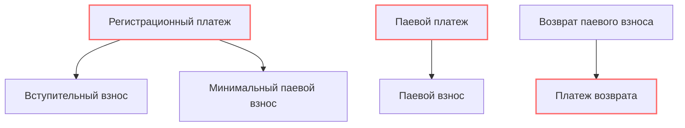

## Типы взносов

[Кошельки](/documentation/wallet) управляют учётом взносов пайщиков на их лицевых счетах и фондах кооператива. Когда пайщик совершает взнос - это фиксируются на счетах в [кошельке](/documentation/wallet) пайщика и [фондах](/documentation/funds) кооператива. 

Взносы бывают: `вступительные`, `паевые`, `членские`. 

Вступительный взнос оплачивается пайщиком однократно при вступлении в кооператив. 

Паевые взносы совершают пайщики, чтобы затем получить возврат паевого взноса с выгодой в качестве удовлетворения потребности. 

Членские взносы берутся при участии в целевых потребительских программах в фиксированной сумме или как % от суммы паевого взноса, и используются для пополнения [невозвратных фондов](/documentation/funds) кооператива. Подробнее о членских взносах смотри разделы [Фондов](/documentation/funds) и [Программ](/documentation/programs).

`Вступительные` и `Паевые` взносы принимаются через совершение `Платежа`. Приём паевых взносов не ограничивается только платежами, и может осуществляться любым имуществом, но это выходит за описание данного раздела. 

## Платежи

`Платеж` - это информационное сообщение, которое порождается, обрабатывается и преобразуется платежным провайдером и советом во взнос. Платеж создаётся и обрабатывается провайдером платежей на основании поручения пользователя, а взносы принимаются и обрабатываются смарт-контрактами после успешного получения платежа.  

Платежи обладают суммой и типом. В системе предусмотрено два типа платежей: регистрационные и паевые. Регистрационные платежи порождают одновременно два типа взносов: вступительный и минимальный паевый взносы, которые требуются совершить при регистрации нового пайщика. 

Вступительный взнос направляется в фонд кооператива для дальнейшего списания на расходы и хранится там до принятия советом соответствующего решения на списание. Минимальный паевый взнос помещается в кошелёк пайщика и паевый фонд кооператива. Причина же, почему эти взносы вообще появились - это успешный `регистрационный платеж`. 

Кроме `регистрационного платежа`, который порождает вступительный и минимальные паевые взносы для регистрации пайщика, в системе существуют `паевые платежи`, которые после успешной обработки добавляются в кошелёк пайщика и увеличивают паевый фонд кооператива. 

Паевые взносы отображаются в [Кошельке](/documentation/wallet) и могут быть использованы в [Целевых Программах](/documentation/programs) для удовлетворения потребностей пайщиков кооператива. При использовании паевых средств в [Целевых Программах](/documentation/programs) могут взыматься членские взносы, размер которых определяется условиями программы. 

Все паевые взносы безусловно возвратные и должны быть возвращены кооперативом по требованию пайщика в границах баланса его паевого счёта. Минимальный паевый взнос, при этом, возвращается при выходе пайщика из кооператива. Управление возвратами паевых взносов производится смарт-контрактами, на основе которых бэкенд MONO создаёт `платежи возврата`, которые обрабатываются администрацией кооператива.

Подробнее о методологии кооперации смотри на сайте платформы "[Кооперативная Экономика](https://coopenomics.world). Здесь же нам важен принцип - платежи порождают взносы. Платежи обрабатываются платежными провайдерами, а взносы - смарт-контрактами.

## Платежные провайдеры

Подключение платежных провайдеров производится через установку и конфигурацию [расширений](/documentation/extensions). Получить список подключенных провайдеров с их идентификаторами возможно с помощью запроса [getPaymentProviders](/documentation/payments/get-payment-providers)
<!-- 
__Дефолтный провайдер__: `qrpay` - оплата по QR-коду. 

__Опциональный провайдер__: `yookassa` - оплата через сервис виджета [Yookassa](https://yookassa.ru)
 -->

Каждый провайдер умеет по-своему создавать платежи и обрабатывать платежи. Количество платежных провайдеров в системе не ограничено. Какие конкретно провайдеры подключены в конкретном кооперативе - определяет сам кооператив с помощью установки [расширений](/documentation/extensions).

Например, провайдер `qrpay` возвращает в `result.data` строку с реквизитами в формате, который при пребразовании в QR-код и его сканировании банковским приложением, распознаётся им и приводит к автоматическому заполнению полей реквизитов и суммы для оплаты. Обработка платежа производится "вручную" через изменение администратором статуса платежа. 

Провайдер `yookassa` (если подключен и настроен) возвращает токен платежа `confirmation_token` в `result.data`, который может быть пребразован в [платежный виджет](https://yookassa.ru/developers/payment-acceptance/integration-scenarios/widget/quick-start#preparation-pages) и встроен в сайт для приёма платежей. Обработка происходит автоматически при поступлении оповещения от Yookassa на бэкенд MONO. 

## Список активных провайдеров
{{ get_sdk_doc("Queries", "Payments", "GetPaymentProviders") }} | {{ get_graphql_doc("Query.getPaymentProviders") }}

Запрос по извлечению списка провайдеров возвращает идентификаторы провайдеров и схемы их данных.

## Вступительный и минимальный паевой взносы
{{ get_sdk_doc("Mutations", "Payments", "CreateInitialPayment") }} | {{ get_graphql_doc("Mutation.createInitialPayment") }}

В процессе [регистрации пайщика](/documentation/participants) необходимо совершить вступительный и минимальный паевый взносы, выполнив регистрационный платеж. Для создания регистрационного платежа необходимо вызвать мутацию CreateInitialPayment. 

{{ get_typedoc_desc("Mutations.Payments.CreateInitialPayment") }}

{{ get_typedoc_input("Mutations.Payments.CreateInitialPayment") }}

## Паевый взнос
{{ get_sdk_doc("Mutations", "Payments", "CreateDepositPayment") }} | {{ get_graphql_doc("Mutation.createDepositPayment") }}

{{ get_typedoc_desc("Mutations.Payments.CreateDepositPayment") }}

{{ get_typedoc_input("Mutations.Payments.CreateDepositPayment") }}

## Список платежей
{{ get_sdk_doc("Queries", "Payments", "GetPayments") }} | {{ get_graphql_doc("Query.getPayments") }}

{{ get_typedoc_desc("Queries.Payments.GetPayments") }}

{{ get_typedoc_input("Queries.Payments.GetPayments") }}

## Платеж возврата
{{ get_sdk_doc("Mutations", "Payments", "CreateWithdraw") }} | {{ get_graphql_doc("Mutation.createWithdraw") }}

{{ get_typedoc_desc("Mutations.Payments.CreateWithdraw") }}

{{ get_typedoc_input("Mutations.Payments.CreateWithdraw") }}

## Управление платежами
{{ get_sdk_doc("Mutations", "Payments", "SetPaymentStatus") }} | {{ get_graphql_doc("Mutation.setPaymentStatus") }}

{{ get_typedoc_desc("Mutations.Payments.SetPaymentStatus") }}

{{ get_typedoc_input("Mutations.Payments.SetPaymentStatus") }}

