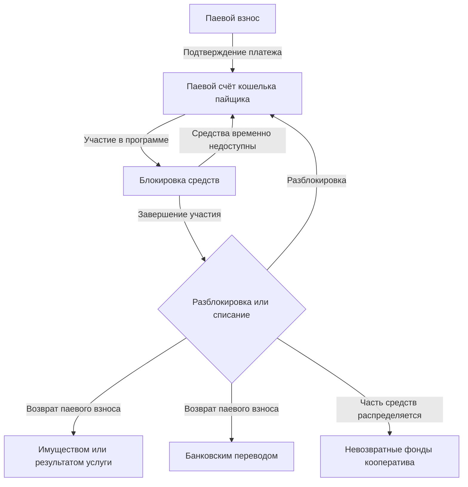

Кошелёк — это средство учёта взносов пайщика. 

Он создаётся автоматически при регистрации пайщика и фиксирует его баланс, участие в программах и движение средств. Кооператив принимает программу кошелька при подключении к [Кооперативной Экономике](https://coopenomics.world), обеспечивая единые правила учёта и управления средствами пайщиков.

Кошельки управляют учётом взносов пайщиков на их лицевых счетах и фондах кооператива. 

Кошелёк позволяет пайщику пополнять паевой счёт без заявления, по факту участия в целевой потребительской программе простым [платежом](/documentation/payments). Средства на паевой счёт пайщика зачисляются после того, как платежных провайдер и/или член совета/администрации кооператива подтвердит факт поступления средств на банковский счёт. Сразу после этого паевой счёт будет пополнен и доступен пайщику для использования в [целевых потребительских программах](/documentation/programs) на [витринах](/documentation/extensions). 

С паевого счёта кошелька производятся списания при участии в целевых потребительских программах. Возвраты средств из целевых потребительских программ также производятся на паевой счёт кошелька. Возвраты средств с паевого счета кошелька на банковский счёт пайщика производится по цифровому заявлению пайщика [платежом возврата](/documentation/payments). 

Все взносы в целевые потребительские программы совершаются с паевого счёта кошелька. Средства на паевом счёте кошелька, при этом, блокируются на период участия в программе. Т.е. паевый счёт кошелька не уменьшается, но увеличивается его заблокированная часть. 

После окончания периода участия в целевой потребительской программы по какому-либо её условию, производится возврат заблокированных средств на паевой счёт или окончательное их списание, в случае возврата имуществом. 

В случае взносов имуществом по какому-либо смарт-контракту, который это предусматривает, заблокированный паевый счёт кошелька также будет увеличен на сумму взноса на период участия. В дальнейшем, эта сумма может быть разблокирована на паевом счёте по условиям участия в целевой потребительской программе, например, при поставках имущества через контракт кооплейса. 

!!!note "Фонды"
    Подобно тому, как у каждого пайщика есть персональный кошелёк для учёта взносов, у кооператива есть общие кошельки для учёта всех паевых и членских взносов пайщиков, они называются - [Фонды](/documentation/funds).

Обязательное условие для использования кошелька является наличие подписанного соглашения о [ЦПП "Цифровой Кошелёк"](/documentation/agreements).

## Извлечь кошелёк
{{ get_sdk_doc("Queries", "Wallets", "GetWallet") }} | {{ get_graphql_doc("Query.getWallet") }}

{{ get_typedoc_input("Queries.Wallets.GetWallet") }}

Результат:

{{ get_typedoc_definition("Queries.Wallets.GetWallet", "IOutput") }}

## Совершить паевой взнос
Для совершения паевого взноса необходимо создать [Платеж](/documentation/payments) паевого взноса и успешно провести его. Сразу после подтверждения поступления платежа - сумма платежа будет зачислена на паевой счёт. 

## Сгенерировать заявление на возврат паевого взноса
{{ get_sdk_doc("Mutations", "Wallets", "GenerateWithdrawRequest") }} | {{ get_graphql_doc("Mutation.generateWithdrawRequest") }}

Для получения возврата паевого взноса необходимо сгенерировать заявление на возврат, которое будет основанием для проведения собрания совета. 

{{ get_typedoc_input("Mutations.Wallets.GenerateWithdrawRequest") }}

Результат:

{{ get_typedoc_definition("Mutations.Wallets.GenerateWithdrawRequest", "IOutput") }}

## Получить возврат паевого взноса
{{ get_sdk_doc("Mutations", "Wallets", "CreateWithdrawRequest") }} | {{ get_graphql_doc("Mutation.сreateWithdrawRequest") }}

Публикация ранее сгенерированного заявления на возврат паевого взноса немедленно заблокирует средства на паевом счёте кошелька пайщика и создаст вопрос на повестке дня для голосования совета. 

После проведения собрания совета и принятия советом решения о возврате паевого взноса, будет сформирован объект [платежа возврата](/documentation/payments), который необходимо обработать члену администрации кооператива. Финально, обработка платежа возврата спишет заблокированные средства со счёта кошелька пайщика. 

{{ get_typedoc_input("Mutations.Wallets.CreateWithdrawRequest") }}

Результат:

{{ get_typedoc_definition("Mutations.Wallets.CreateWithdrawRequest", "IOutput") }}

