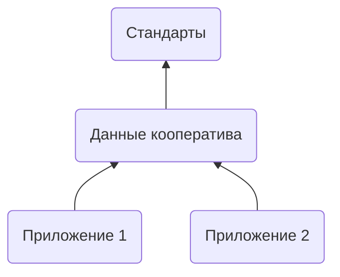

---
tags:
  - Председатель
  - Член совета
  - Разработчик
  - Пайщик  
---

# Добро пожаловать

Данное руководство предназначено для председателей, пайщиков и разработчиков цифровых потребительских кооперативов и описывает процессы автоматизации документооборота с пайщиками в цифровых кооперативах на платформе "Кооперативная Экономика". 

## Что это такое
Цифровой Кооператив (ЦК) - это федеративная экосистема кооперативных приложений, которая устанавливается на выделенном сервере кооператива, подключается к блочейну Кооперативной Экономики и обеспечивает автоматизацию производства первичного документооборота и бухгалтерского учёта по общим стандартам. 

## Стандарты
Стандарты - это стандартизированный свод правил, методов, алгоритмов и норм кооперативной экономики, описанных на языке программирования C/C++, которые хранятся и исполняются в распределенной базе данных блокчейна. 

Технологически, стандарты - это смарт-контракты, которые описывают методологию кооперации, а также целевые потребительские программы и алгоритмы действий пайщиков при участии в них с контролем прав доступа и логических (строго-математических) условий кооперации. 

Таким образом, стандарты - это программное ядро цифрового кооператива, которое объединяет систему в единое целое. За счет использования общих стандартов, подключенные к системе кооперативы получают возможность прозрачно и предсказуемо взаимодействовать между собой. 

**Первичным источником стандартов является их открытый программный код.** 

## Магазин приложений

При подключении кооператив получает доступ к магазину кооперативных приложений. Устанавливая приложения, кооператив расширяет свою функциональность пайщиков новыми рабочими столами и страницами. 

Рабочие столы и страницы реализуют стандарты в виде форм и кнопок, которые ведут пользователя по пути кооперации. Если со стандартами напрямую взаимодействовать могут только разработчики, ввиду того, что они написаны на их языке, то рабочие столы и их страницы доступны к использованию всем пайщикам. 

Так, за счёт единых стандартов, у одной и той же целевой потребительской программы может быть несколько приложений от разных разработчиков, которые предоставляют доступ к её использованию. Данные о пользователях, при этом, доступны одновременно в обоих приложениях. Таким образом, становится возможным переход от одного приложения к другому без потери данных - они изначально находятся в едином информационном пространстве блокчейна.

## Кооперативы 
На текущий момент к платформе подключаются организации в правовой форме "Потребительский Кооператив", действующие по закону 3085-1 "О Потребительской Кооперации". 

Кооперативы становятся цифровыми при подключении к системе за счёт выпуска электронных цифровых подпистей для своих пайщиков и перевода документооборота с ними в электронную форму. 

Приложения из магазина, функционируя на основе стандартов, генерируют электронные документы и подписывают в момент нажатия кнопок пайщиками. Таким образом, весь первичный документооборот автоматически генерируется приложениями на основе стандартной методологии стандартов. 

Первичный документооборот может быть использован для автоматического формирования бухгалтерской отчетности и соответствующих проводок по счетам во внешних бухгалтерских программах. Для этого также требуется установленные и настроенные приложения из магазина. 

Таким образом, деятельность кооперативов при подключении к платформе становится автоматизированной до нажатия кнопок.

## Союзы

Союзы обеспечивают юридическое соответствие кооперативов стандартизированной методологии, в разработке которой они принимают непосредственное участие. Союзы являются модераторами подключаемых кооперативов, обеспечивая внесение необходимых правок в их уставные документы, и как следствие, юридическую защиту на основе своей практики. 

Так, для подключения к платформе на территории РФ, кооперативам необходимо стать членами союза потребительских обществ <a href="https://союз-русь.рф">"Русь"</a>.

## Подсети

Платформа Цифрового Кооператива распределена по подсетями. Каждая подсеть - это выделенная копия блокчейна и стандартов, которые обеспечивают:

- Полную правовую, валютную и технологическую изоляцию кооперативных контуров;

- Устойчивость к внешним воздействиям;

- Гибкость к внутренним требованиям;

Таким образом, в каждой подсети может быть свой, адаптированный  вариант стандартов, со своими союзами и кооперативами, действующих с учетом особенностей внутреннего законодательства и на основе своей государственной валюты. 

## Федерации

Федерации - это платформы, которые объединяют подсети, кооперативы и их пайщиков по общему признаку целевой потребительской программы и/или локации. Они организуют и реализуют надсистемные процессы и правила кооперации с учетом региональных особенностей и собственных целей. 

Так, федерация «Соседи» объединяет пайщиков России и Беларуси на столе заказов. А федерация "Мусульманский кошелек" объединяет пайщиков всех кооперативов всех подсетей в одном интерфейсе для халяльных инвестиций по нормам шариата. 

Федерации по организационно-правовой форме являются потребительскими кооперативами и обеспечивают среду взаимного членства в своём правовом поле. Федерации обеспечивают интернациональные коммуникационные связи между подсетями и странами, являются шлюзами для передачи информации/имущества. 

С помощью федераций и на основе общих стандартов, становятся возможным создавать кооперативные цепочки удовлетворения потребностей большой длины, когда потребности пайщиков кооперативов удовлетворяются нелинейно через организацию живой, саморазвивающейся сети взаимопомощи, где целое становится больше суммы своих частей.

## Про что документация

Данная документация описывает программный комплекс федерации "Цифровой Кооператив" и приложения, которые поставляются в рамках этой федерации. На основе предоставленной информации пайщики узнают как использовать цифровой кооператив, председатели и члены советов - как управлять им, а разработчики - как создавать для него новые приложения или использовать существующие возможности для создания новых федераций на его основе. 

## Как пользоваться этой документацией

Все разделы документации тегированы: "Председатель", "Член совета", "Пайщик", "Разработчик". Теги расположены на каждой странице на самом верху. 

Страницы, помеченные тегами "Разработчик" предназначены для разработчиков и содержат техническую информацию о принципах работы или способах достижения описанных результатов. Если вы не разработчик и не интересуетесь техническими нюансами - пропускайте эти разделы. 

Страницы, помеченные тегами "Председатель", "Член совета" и "Пайщик" описывают принципы работы системы или способы взаимодействия с системой на достаточном уровне погружения в детали для каждой роли. Так, пайщику нет необходимости знать как работает модуль общего собрания для председателя совета, однако председателю и членам совета точно нужно знать как будет работать тот же модуль для пайщика. 

Потому, если вы пайщик, и ищите только то, что касается ваших возможностей на платформе, то воспользуйтесь поиском в шапке сайта, введя "Пайщик". Поиск отобразит все страницы, помеченные вашим тегом, что упростит исследование только нужных вам деталей. Аналогично для председателей, членов совета и разработчиков. 

Альтернативно, обращайте внимание на заголовки страниц, на каждой из которых есть соответствующие теги. Это поможет не погружаться в то, что вам на текущий момент не нужно.