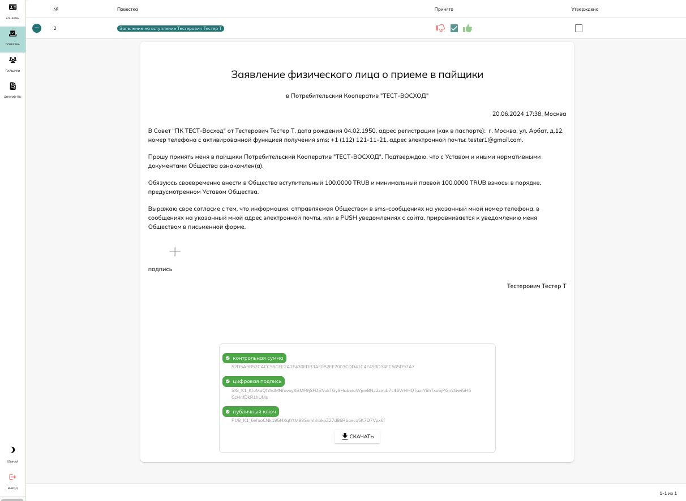
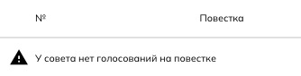
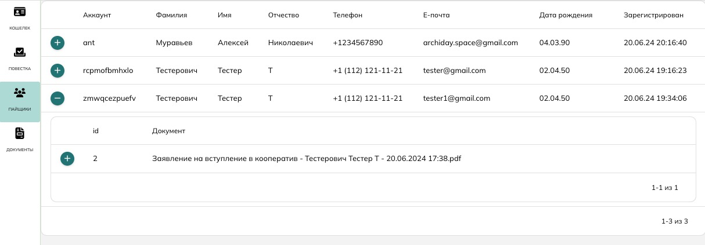

# Справка

Данная справка предназначена для руководителей потребительских кооперативов. Справка описывает процесс удаленной регистрации пайщиков в потребительском кооперативе с выпуском цифрового удостоверения (карты) пайщика, позволяющей перевести документооборот в электронную форму. 

Процесс удаленной регистрации в кооперативе для ознакомления можно пройти самостоятельно на [https://testnet.copenomics.world](https://testnet.copenomics.world). 

???+ note "Ключ доступа"
    Для входа в качестве члена совета воспользуйтесь следующими данными:
    
    - Идентификатор пользователя: vtdwpiojgfpl 
    
    - Ключ доступа: 5J3NoZNQZQxEV7auYUoWG76PW5E9eMbjA1wGVdJSBjBjS7BqVuj

Удаленная регистрация пайщика начинается с того, что он переходит на страницу регистрации в Вашем кооперативе. 

## Решение совета

Членам совета для принятия любого решения, необходимо войти в свои кабинеты и произвести голосование по автоматически-сформированной повестке. 

Голосование осуществляется с помощью нажатия кнопок - За (зеленый палец вверх) или Против (красный палец вниз). Член совета автоматически считается воздержавшимся, если не принимает участия в голосовании. 

Детали каждого заявления перед голосованием можно (и нужно) развернуть, нажав на зеленый плюсик слева от повестки перед голосованием. 

Каждое заявление можно скачать в PDF формате и использовать как юридически-значимый документ. Контрольная сумма документа рассчитывается в момент заполнения заявления с использованием собственноручной подписи на нём. За счёт чего устанавливается алгоритмическая связь между человеком, оставившим свою собственноручную подпись, и простой электронной подписью, которую он получил. 

И с этого момента все документы, которые подписывает пайщик своей электронной подписью, считаются легитимными в кооперативе, ровно такими же, как и заполненные ручкой на бумаге. Любой контролирующий орган, которому предоставлен этот документ с электронной подписью, Вы, члены Совета, или сам пайщик, могут проверить документ и убедиться в том, что именно этот документ был подписан с помощью ключа, который принадлежит именно этому пайщику. Проверка осуществляется с помощью выполнения расчета хэш-суммы из скаченного документа и восстановления публичного ключа из цифровой подписи. Публичный ключ соответствует приватному ключу пайщика и хранится в блокчейне с момента его регистрации. 

После того, как решение советом принято, председателю необходимо утвердить его. Для утверждения решения, ему необходимо нажать в квадратик для галочки под заголовком “утверждено”:

Сразу после утверждения решения председателем, оно будет исполнено - новому пайщику будет создан лицевой счёт в Вашем кооперативе, он получит удостоверение пайщика и доступ в кошелёк. 

## Реестр документов

После того, как решение принято, соответствующая пачка документов появятся в разделе “Документы”. Каждая пачка включает в себя: заявление, решение, и в некоторых случаях - акты. 

Каждая пачка документов может быть развернута нажатием на зеленый плюсик слева. При развороте все документы с соответствующими цифровыми подписями действующих лиц будут представлены для просмотра, скачивания и проверки. 

## Реестр пайщиков

Раздел “Пайщики” позволяет детально просмотреть пайщиков кооператива и пачки документы каждого из них. Каждая пачка также может быть развернута в заявление, решение и акты, доступные к скачиванию и проверке.  

## Дополнительно

Программное обеспечение поставляется Потребительским Кооперативам по WHITE LABEL - сайт запускается на вашем домене, все наименования и названия сменяются на Ваши. Каждый сайт работает как PWA-приложение, устанавливающееся на рабочий стол мобильного телефона. 

Данное программное обеспечение формирует программную среду кооперативной экономики и является системообразующей платформой. В основе платформы лежит технология блокчейн и кооперативные смарт-контракты для: регистрации пайщиков, поставки-приобретения имущества, коллективного и розничного пользования имуществом, кооперативного инвестирования и спонсирования в имущество. 

Основные дополнительные (планируемые) возможности платформы:

- Быстрая регистрация/вход пайщиков в кооперативы с помощью цифрового удостоверения.
- Бесшовная передача документов от кооператива к кооперативу.
- Формирование бухгалтерской отчетности для передачи в контролирующие органы.
- Голосование совета по произвольным повесткам.
- Образование кооперативных участков и управление ими.
- Общие собрания пайщиков / уполномоченных онлайн, по графику и внеочередные.
- Стандартизированная методология кооперации в кооперативных смарт-контрактах.
- Документация, SDK и API для интеграции действующих и создания новых интерфейсов для кооперации.