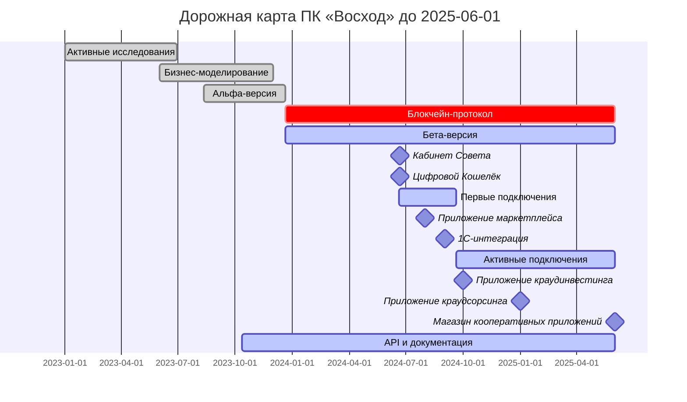
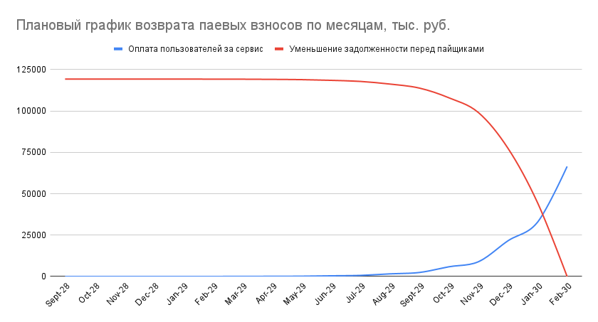

# ИНВЕСТИЦИОННОЕ ПРЕДЛОЖЕНИЕ

Кооперативы – это народные организации, в которых нет частной прибыли, но есть общая и личная выгода. Кооперативы существуют для удовлетворения потребностей их участников. В кооперативах нет продаж, но есть вклады и возвраты вкладов в виде денег и имущества. Это приводит к снижению налоговой нагрузки, стоимости товаров и услуг, и увеличению их качества.

ПК «Восход» разрабатывает цифровую платформу автоматизации документооборота для потребительских, производственных и сельхозяйственных кооперативов, которая включает:

  - Блокчейн-среду для кооперативных смарт-контрактов под управлением участников;

  - Стандартизированный пакет юридических документов для кооперации, которые автоматически заполняются при выполнении действий участниками в смарт-контрактах;

  - Цифровой кошелёк и Удостоверение Пайщика для авторизации участников между кооперативами; 
  
  - Магазин приложений для поставки-приобретения, аренды и инвестиций в результаты деятельности кооперативов платформы;
  
  - API для подключения действующих кооперативов к платформе;
 

Что позволит кооперативам:

- Дистанционно принимать и исключать пайщиков, вести реестры пайщиков и их документов с возможностью выгрузки;

- Автоматически формировать бухгалтерскую отчетность в 1C для отправки в контролирующие органы;

- Проводить удаленные голосования пайщиков и членов Совета с автоматическим созданием Протоколов и исполнением решений.

- Вести учет вступительных, членских и паевых взносов, их целевого использования и возврата.

- Выбирать и подключать сайты/приложения для удовлетворения потребностей пайщиков в потреблении качественных продуктов локальных производителей (__маркетплейсы__), в привлечении инвестиций (__краудинвестинг__ и __краудфандинг__) в локальных производителей, и совместной деятельности по производству продуктов (__краудсорсинг__). 

- Разрабатывать кооперативные приложения, основанные на стандартизированных кооперативных смарт-контрактах и поставлять их кооперативам платформы с получением выгоды в виде членских взносов участников (__маркетплейс кооперативных приложений__);  

- Автоматически подключаться во все новые приложения, которые применяют стандартизированные кооперативные смарт-контракты.

ПК «Восход» получает членские взносы за пользование сервисом документооборота:

- Регистрация нового пайщика – 10 рублей;

- Проведение одной операции целевого кооперативного контракта – 20 рублей.

В настоящее время в разработку платформы пайщиками ПК "Восход" вложено 25 млн. рублей – денежными средствами и результатами интеллектуальной деятельности в паевой фонд (складочный капитал). Для дальнейшей разработки последующих этапов платформы требуется 18 млн. руб.: 

- для подготовки, запуска и тестирования Бета-версии Цифровой Платформы с минимально необходимым набором сервисов; 

- организации деятельности выбранных для Бета-тестирования кооперативов и доработки Цифровой Платформы до рабочей версии масштабирования согласно экономической модели.

## Механизм возврата

(на примере 100 тыс. руб.)

Пайщик-инвестор вносит в ПК "Восход"»" денежные средства и становится совладельцем Цифровой платформы. 100 т.р. - минимальный паевой взнос.

ПК "Восход" использует денежные средства для разработки цифровой платформы. По мере разработки цифровой платформы возникают дополнительные результаты интеллектуальной деятельности (РИД), которые капитализируются у всех пайщиков, в том числе и у пайщиков-инвесторов, в зависимости от времени инвестирования:

| Внесение инвестиций (паевого взноса) деньгами | Сумма, тыс. руб | Расчетная капитализация | Расчет паевого взноса к возврату, тыс. руб |
| --------------------------------------------- | --------------- | ----------------------- | --------------------------------------- |
| В июне 2024                                   | 100             | 239%                    | 239                                     |
| В июле 2024                                   | 100             | 205%                    | 205                                     |
| В августе 2024                                | 100             | 182%                    | 182                                     |
| В сентябре 2024                               | 100             | 166%                    | 166                                     |
| В октябре 2024                                | 100             | 153%                    | 153                                     |
| В ноябре 2024                                 | 100             | 142%                    | 142                                     |

Таким образом, на 18 млн. рублей складочного капитала, который требуется для создания минимальной рабочей бета-версии платформы, будет добавлено дополнительных паевых взносов РИД – 14.6 млн. рублей, таким образом, создав для пайщиков-инвесторов общую сумму для возвратов 32.6 млн рублей. И, кроме этого, будет создано и внесено РИД пайщиками-разработчиками на сумму 86.6 млн. рублей. Всего складочный капитал, включая пайщиков-разработчиков, составит 119.2 млн. рублей. 

В сентябре 2024 года мы планируем активное подключение кооперативов и кооперативных участков к платформе. Всего за 1 год планируется подключить 2000 кооперативов с общей численностью 2 млн. пайщиков. По мере поступления оплаты от кооперативов за пользование сервисами платформы, всем пайщикам будут производиться выплаты - возвраты паевых взносов. Все возвраты будут произведены до конца февраля 2026 года в общей сумме 119.248 млн. рублей.

График расчета поступления оплаты за сервис и возвратов паевых взносов представлен на Рис. 1. 

<figure markdown="span">
  
  <figcaption>Рис. 1</figcaption>
</figure>

## Как совершить вклад
По вопросу совершения вкладов свяжитесь с нами через [контакты](/contacts).
