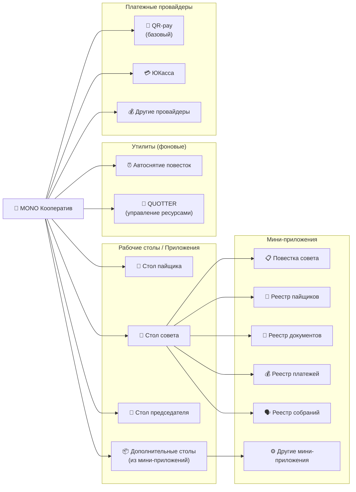
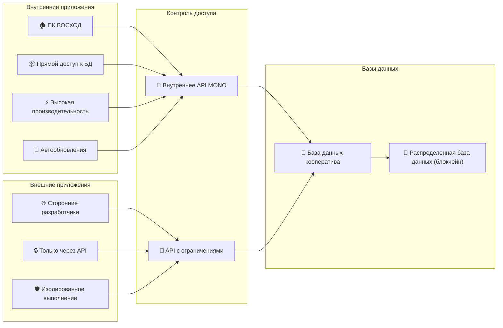

# Архитектура приложений

Система MONO построена на модульной архитектуре, где функциональность может гибко расширяться через различные типы приложений. Понимание этой архитектуры поможет эффективно использовать возможности платформы.

## Компоненты системы

### Рабочие столы

**Рабочий стол** — это композитное приложение, представляющее собой специализированный интерфейс для выполнения определённых задач. Каждый рабочий стол состоит из одного или нескольких мини-приложений, организованных в единую рабочую среду.

Примеры рабочих столов:

- **Стол пайщика** — базовый интерфейс для всех участников кооператива

- **Стол совета** — специализированный интерфейс для управленческих задач

- **Стол председателя** — административный интерфейс с максимальными правами

### Мини-приложения

**Мини-приложения** — это специализированные модули, которые обеспечивают конкретную функциональность внутри рабочих столов. В текущей версии MONO мини-приложения встроены в рабочие столы и представлены как отдельные разделы меню.

Примеры мини-приложений в столе совета:

- Повестка совета

- Реестр пайщиков  

- Реестр документов

- Реестр платежей

- Реестр собраний

### Виджеты

**Виджеты** — это элементы интерфейса, из которых состоят мини-приложения. В настоящее время виджеты не выделены как отдельные компоненты, но архитектурно они составляют базовые строительные блоки пользовательского интерфейса.

### Утилиты

**Утилиты** — это специальный тип мини-приложений, которые работают в фоновом режиме без собственного пользовательского интерфейса. Управление утилитами осуществляется только через конфигурацию, а их функциональность исполняется автоматически.

Примеры утилит:

**Автоматическое снятие вопроса с повестки**
Утилита автоматически снимает вопросы с повестки собраний совета через 3 дня после их создания, если решение по вопросу не принято. Это помогает поддерживать актуальность повесток и предотвращает накопление неактуальных вопросов. Срок, через который вопрос снимается с повестки, можно настроить в настройках утилиты.

**QUOTTER — робот управления ресурсами**
Автоматизированная система тонкой настройки членских взносов за электронный документооборот. QUOTTER выполняет следующие функции:

- Мониторинг динамики расходов вычислительных ресурсов аккаунта кооператива

- Автоматическое пополнение ресурсов при необходимости

- Ежедневное пополнение минимум на 5 AXON для обеспечения бесперебойной работы

- Дополнительные пополнения при снижении уровня доступных ресурсов ниже указанного минимума

### Платежные провайдеры

**Платежные провайдеры** — это специализированные сервисы, которые интегрируются в логику управления входящими платежами. Они предоставляют возможность генерировать платежные ордера и автоматически обрабатывать поступающие платежи.

Доступные платежные провайдеры:

**ЮКасса**
Интеграция с сервисом ЮКасса позволяет:

- Автоматизированно принимать входящие платежи

- Автоматически увеличивать стоимость взноса на сумму комиссий

- Генерировать безопасные платежные ссылки

- Обрабатывать возвраты средств

**QR-pay (базовое приложение)**
Базовый платежный провайдер, который включён в MONO по умолчанию:

- Генерация QR-кодов для оплаты через банковские приложения

- Поддержка Системы быстрых платежей (СБП)

- Автоматическое распознавание входящих платежей

- Интеграция с основными банками России

## Типы приложений

### Внутренние приложения

**Внутренние приложения** поставляются в тесной интеграции с MONO от ПК "ВОСХОД". Они имеют прямой доступ к внутренним API и данным системы, что обеспечивает максимальную производительность и функциональность.

Характеристики внутренних приложений:

- Глубокая интеграция с ядром MONO

- Прямой доступ к базе данных кооператива

- Высокая производительность

- Автоматические обновления вместе с основной системой

- Техническая поддержка от ПК "ВОСХОД"

### Внешние приложения

**Внешние приложения** работают из внешних источников через единый центр аутентификации по API, без прямого доступа к внутренним данным MONO-кооператива. Это обеспечивает дополнительный уровень безопасности и позволяет интегрировать решения от сторонних разработчиков.

**Важно:** На текущий момент внешние приложения недоступны, но функциональность для разработчиков планируется к реализации в будущих версиях MONO.

Планируемые возможности внешних приложений:

- Изолированное выполнение в безопасной среде

- Доступ только к авторизованным данным через API

- Возможность разработки сторонними компаниями

---

**Связанные разделы:**

- [Витрина приложений](showcase.md) — интерфейс управления приложениями
