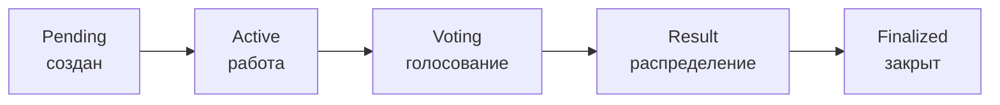
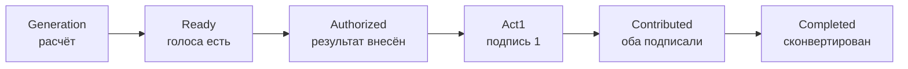

---
tags:
  - Пайщик
  - Мастер
  - Председатель
generated_by: manual
---

# Жизненный цикл Компонента

Каждый Компонент Благороста проходит фиксированную последовательность статусов — от создания до получения долей в Объекте авторских прав. Эта страница — карта этого пути: какие статусы у Компонента и сегментов внутри него, какие действия возможны на каждом шаге и кто их совершает.

## Обзор статусов Компонента

| Статус | Что означает | Кто переводит дальше |
|---|---|---|
| **Pending** | Компонент создан мастером, ещё не активирован. Нет плана, нельзя коммитить. | Мастер — устанавливает мастера и план (`setmaster`, `setplan`); затем `startproject` переводит в Active. |
| **Active** | Идёт работа: исполнители коммитят часы, мастер принимает; авторы заполняют артефакты; инвесторы вкладываются. Открыт приём инвестиций (`openproject`). | Мастер — нажимает «Начать голосование» (`startvoting`), когда работа считается завершённой. |
| **Voting** | Голосование участников по методу Водянова: каждый распределяет свою голосующую сумму между остальными. | Закрытие — автоматическое: все проголосовали или истёк срок (по умолчанию 7 дней). |
| **Result** | Голоса рассчитаны, у каждого участника-сегмента есть доля. Идёт внесение результата (`pushresult`), подписание Акта приёма-передачи РИД (signact1 + signact2) и конвертация долей в Главный кошелёк / Складочный капитал ЦПП «Благорост». | Когда все сегменты сконвертированы — мастер удаляет Компонент из Мастерской (`removeproject`), статус → Finalized. |
| **Finalized** | Все доли распределены и получены. Компонент остаётся в реестре как часть истории Проекта, но в Мастерской его не видно. | — |

## Жизненный цикл сегмента

Сегмент — личная часть пайщика в Компоненте. Внутри одного Компонента у каждого участника свой сегмент со своим статусом — статусы могут идти не синхронно между участниками.

| Статус | Что значит | Действие |
|---|---|---|
| **Generation** | Только что вошёл в этап «Результат», цифры предварительные. | «Пересчитать» (мастер или участник) — `refreshsegment`. Идемпотентно. |
| **Ready** | Цифры зафиксированы расчётом голосов. У сегмента есть голоса от других участников и они рассчитаны (`calcvotes`). | «Внести результат» (пайщик-владелец сегмента) — `pushresult`. |
| **Authorized** | `pushresult` отправил сегмент в фонд. Ждём первой подписи пайщика на Акте. | «Подписать акт» (пайщик) — `signact1`. |
| **Act1** | Первая подпись поставлена, ждём подписи Председателя — это формальное принятие РИД от лица кооператива. | «Подписать акт» (Председатель) — `signact2`. |
| **Contributed** | Обе подписи на Акте. Сегмент стал имущественным паевым взносом. У пайщика появляется кнопка «Получить долю в ОАП». | «Получить долю» (пайщик) — `convertsegm`. Распределяет долю между Главным кошельком и Складочным капиталом ЦПП «Благорост». |
| **Completed** | Сегмент сконвертирован. Доля учтена в Кошельке пайщика — больше с этим сегментом ничего не сделать. | — |

!!!info "Сегменты идут не синхронно"
    Один пайщик уже может быть в Completed (быстро подписал и сконвертировал), а другой — ещё в Authorized (не успел подписать акт). Это нормально: каждый сегмент отвечает за судьбу личной доли своего пайщика, не за общую судьбу Компонента.

## Карта переходов: кто что нажимает

| Шаг | Кто | Что нажимает | Действие контракта | Статус после |
|---|---|---|---|---|
| Создать Компонент | Мастер | «+ Компонент» в Мастерской | `addproject` | Компонент: Pending |
| Назначить мастера | Председатель | «Назначить мастером» в карточке | `setmaster` | (без изменения статуса) |
| Установить план | Мастер | «Установить план» (FAB F) | `setplan` | (без изменения статуса) |
| Открыть на работу | Мастер | «Начать проект» | `startproject` | Компонент: Active |
| Открыть инвестиции | Мастер | переключатель «Принимает инвестиции» | `openproject` | (без изменения статуса) |
| Зафиксировать коммит | Исполнитель | «Коммит» в «Моё время» | `createcmmt` | (без изменения статуса) |
| Принять коммит | Мастер | «Одобрить» в «Коммитах» | `approvecmmt` | (без изменения статуса) |
| Завершить работу | Мастер | «Начать голосование» | `startvoting` | Компонент: Voting |
| Голосовать | Участник | «Проголосовать» | `vote` | (без изменения статуса; статус Voting закроется автоматически) |
| Расчёт голосов | Любой | «Пересчитать» в строке сегмента | `refreshsegment` | Сегмент: Generation → Ready |
| Внести результат | Участник | «Внести результат» в строке своего сегмента | `pushresult` | Сегмент: Ready → Authorized |
| Подписать акт (1) | Участник | «Подписать акт» в строке своего сегмента | `signact1` | Сегмент: Authorized → Act1 |
| Подписать акт (2) | Председатель | «Подписать акт» в строке сегмента | `signact2` | Сегмент: Act1 → Contributed |
| Получить долю | Участник | «Получить долю в ОАП» + слайдер | `convertsegm` | Сегмент: Contributed → Completed |
| Удалить Компонент | Мастер | «Удалить» в карточке (когда все сегменты Completed) | `removeproject` | Компонент: Result → Finalized |

## Что важно помнить

- **Допуск нужен везде.** Любое действие, кроме просмотра, требует одобренного Советом приложения к УХД (clearance) — отдельно к Проекту и отдельно к Компоненту. См. *Получение допуска*.
- **Голос нельзя отозвать.** После `vote` распределение зафиксировано в блокчейне.
- **Статусы сегмента двигаются индивидуально.** То, что один пайщик уже в Completed, не значит что Компонент закрыт — для этого нужно чтобы все сегменты дошли до Completed.
- **Складочный капитал ЦПП «Благорост»** растёт у пайщика только через долю в ОАП в каждом Компоненте. Чем раньше пайщик начал участвовать, тем больше у него доля ЦПП «Благорост» — она наполняется на 0.618 × генерации каждого нового Компонента.

Подробности по каждому шагу — в соответствующих страницах: *Голосование*, *Результат и получение доли*, *Получение допуска*, *Моё время и коммиты*.
