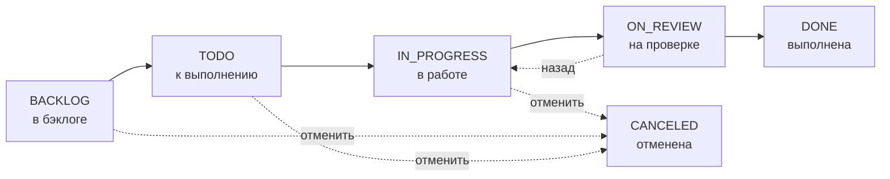

---
tags:
  - Пайщик
  - Мастер
generated_by: docs-harness
scenario: blagorost/tasks
---

# Задачи и процесс производства

Внутри Компонента работа разрезана на **задачи** — это единицы плана, которые мастер выдаёт исполнителям, а исполнители их выполняют. Доска задач — Agile-подобная: каждая задача проходит фиксированный жизненный цикл по статусам, кто-то её начинает, кто-то проверяет, кто-то закрывает. Декомпозиция уровня выше уже задана через Проекты и Компоненты — задачи живут **внутри Компонента**.

## Где это и когда вы это видите

Меню Благороста → конкретный Компонент → вкладка **Задачи**. Здесь видны все задачи Компонента, в каждой строке — номер id, оценка часов, иконка приоритета, название, статус и аватарки исполнителей.

## Создание задачи

Создавать задачи может **только мастер компонента** (или член совета как страховка). Кнопка «Создать задачу» в шапке доски открывает диалог.

В диалоге задаётся:

- **Название** — обязательно.
- **Описание** — расширенный текст с подробностями.
- **Приоритет** — `Срочный`, `Высокий`, `Средний`, `Низкий`. Визуальная иконка и сортировка, на расчёты не влияет.
- **Статус** — стартовый статус, обычно оставляют `BACKLOG`.
- **Оценка (часы)** — необязательна, может быть `0`. О том, что это значит для расчёта времени, ниже.

Исполнители на этом этапе **не задаются** — их назначают позже на самой задаче через её sidebar (см. ниже). Это позволяет мастеру быстро накидать бэклог из заголовков, а уже потом, при планировании, разнести между людьми.

!!!info "Только мастер ставит оценку и приоритет"
    Поля `estimate` и `priority` редактирует только мастер компонента (или член совета). Исполнители их видят, но изменять не могут.

## Роли на задаче

| Роль | Кто это | Что может |
|---|---|---|
| **Мастер** | Один на компонент, назначен председателем (см. *Назначение мастера и план*) | Всё: создавать, редактировать, ставить оценку и приоритет, переводить через любые статусы, удалять, отменять |
| **Ответственный (submaster)** | По умолчанию — **первый** из списка исполнителей; на стороне UI отдельного слота нет, разделение чисто на уровне прав | Двигать задачу `↔ TODO/IN_PROGRESS/ON_REVIEW`, редактировать описание; **не может** перевести в DONE и не может отменить из работы |
| **Исполнитель (creator)** | Любой кроме первого из списка исполнителей задачи | Двигать в начале (`BACKLOG ↔ TODO ↔ IN_PROGRESS`); **не может** отправить в ON_REVIEW, в DONE и в CANCELED |
| **Член совета** | Любой из членов совета кооператива | Всё, как у мастера — страховочная роль |

## Жизненный цикл задачи

Каждая задача проходит фиксированную последовательность статусов.

| Статус | Значение |
|---|---|
| **BACKLOG** | Задача создана, но в работу ещё не запущена. Накапливается в бэклоге компонента. |
| **TODO** | К выполнению — мастер взял задачу из бэклога и поставил в очередь на исполнение. |
| **IN_PROGRESS** | В работе — исполнитель (или ответственный) начал делать. **С этого момента идёт почасовое начисление времени** для задач без estimate. |
| **ON_REVIEW** | На проверке — исполнитель отправил результат мастеру. Только мастер может теперь закрыть в DONE или вернуть назад. |
| **DONE** | Выполнена — мастер принял результат. Если у задачи есть estimate, билеты времени распределяются между исполнителями. |
| **CANCELED** | Отменена — задача в работу не пошла или была остановлена. Поперёк жизненного цикла. |

## Разрешённые переходы — кто куда вправе

Главная таблица. По вертикали — текущий статус, по горизонтали — целевой. В клетке — какие роли могут совершить переход. Роли: **М** (Мастер), **О** (Ответственный, submaster), **И** (Исполнитель, creator), **С** (Совет).

| Из ↓ В → | BACKLOG | TODO | IN_PROGRESS | ON_REVIEW | DONE | CANCELED |
|---|:---:|:---:|:---:|:---:|:---:|:---:|
| **BACKLOG**     | —          | М, О, И, С | М, О, И, С | М, О, С    | М, С | М, И, С |
| **TODO**        | М, И, С    | —          | М, О, И, С | М, О, С    | М, С | М, И, С |
| **IN_PROGRESS** | М, С       | М, О, И, С | —          | М, О, С    | М, С | М, И, С |
| **ON_REVIEW**   | М, С       | М, С       | М, О, С    | —          | М, С | М, С    |
| **DONE**        | М, С       | М, С       | М, С       | М, С       | —    | М, С    |
| **CANCELED**    | М, С       | М, С       | М, С       | М, С       | М, С | —       |

Главные практические следствия:

- **Только Мастер (или Совет) может перевести задачу в DONE.** Ни ответственный, ни исполнитель этого сделать не могут.
- **Из IN_PROGRESS задачу в ON_REVIEW могут отправить Мастер и Ответственный**, но не рядовой исполнитель. Это приём принципа единоначалия — за результат отвечает один человек.
- **Отменить задачу в работе (IN_PROGRESS → CANCELED)** могут Мастер, Исполнитель или Совет — но **не Ответственный**. Если человек взялся за задачу как submaster, он не может «выйти» отменив её; это право у мастера и собственно исполнителей.

В UI это видно так: `q-select` статуса показывает только те значения, которые доступны текущей роли по матрице. Если переход недоступен — пункта в списке просто нет.

## Sidebar задачи

При клике на задачу открывается её страница со всеми параметрами слева и описанием/историей справа. Действия в правой панели зависят от роли.

=== "Глазами Мастера"

    

    Мастер видит и редактирует всё: статус, исполнителей, приоритет, оценку, метки. Доступны действия «Переместить» (в другой компонент) и «Удалить».

=== "Глазами Исполнителя"

    

    Исполнитель видит ту же страницу, но кнопки `SET_ESTIMATE`, `SET_PRIORITY`, `ASSIGN_CREATOR` для него заблокированы. Кнопка «Удалить» отсутствует. У «Переместить» появляется подсказка «нет прав мастера на задачи». В селекторе статуса при `IN_PROGRESS` доступен только переход в `ON_REVIEW`.

## Estimate и расчёт времени

Estimate определяет, **как** в задаче появляются часы исполнителей.

### Без estimate — почасовое начисление по факту

Если у задачи `estimate = 0` (поле «Оценка» оставлено пустым) и задача в статусе `IN_PROGRESS`, **каждый час** контроллер запускает фоновую задачу учёта времени и автоматически добавляет **1 час** контрибьютору, разделяя его поровну между всеми его активными задачами без estimate.

Пример: у `ekaterina` в IN_PROGRESS две задачи без estimate. Каждый час обоим начисляется по `0.5 ч`. Через 8 часов реального времени каждая задача накопит 4 ч. Но если у `ekaterina` `hours_per_day = 6 ч/день`, после исчерпания дневного лимита тики до конца дня пропускаются.

!!!info "Почему именно так"
    Этот режим — для задач, где **нельзя предсказать оценку** (исследование, эксперимент, разбор сложного бага). Часы фиксируются ровно столько, сколько фактически было затрачено: пока задача в работе — тикают, перевели в ON_REVIEW или DONE — остановились.

### С estimate — единоразовое начисление при DONE

Если оценка задана (`estimate > 0`), **в IN_PROGRESS почасового тика нет**. Билеты времени появляются только в момент перевода задачи в `DONE`: контроллер записывает `estimate / N исполнителей` каждому исполнителю как `entry_type='estimate'`.

Пример: задача «Виджет балансов и истории операций», estimate=20 ч, исполнители — `ivanpetrov` и `ekaterina`. При переводе в DONE мастер фактически распределяет 10 ч каждому. Если потом мастер изменит исполнителей или оценку, контроллер пересчитает незакоммиченные `estimate`-билеты, чтобы общее распределение оставалось `estimate / N`.

!!!info "Логика «оценили — значит контракт"
    Задача с estimate — это договорённость: «делаем за столько-то часов». Часы тут не зависят от того, сколько человек физически просидел над задачей; они зависят от того, что мастер принял результат как соответствующий ожиданию. Поэтому начисление при DONE.

### Что коммитится — общее у обоих режимов

Оба режима пишут записи в один и тот же реестр времени контрибьютора. Дальше исполнитель идёт на страницу **Моё время**, нажимает «Коммит» в строке проекта и выбирает, сколько часов отправить в коммит — суммарно по всем своим задачам этого компонента (см. *Моё время и коммиты*). Принятый мастером коммит превращает часы в сумму на Кошельке Генерации.

## Что вы здесь делаете

- **Мастер** — создаёт задачи, ставит оценку и приоритет, назначает исполнителей и ответственного, переводит задачи через статусы (включая финальный DONE), отменяет ненужное.
- **Ответственный** — следит чтобы задача дошла до конца, отправляет на проверку (`→ ON_REVIEW`), может вернуть в работу из ON_REVIEW.
- **Исполнитель** — берёт задачу в работу (`TODO → IN_PROGRESS`), доделывает, фиксирует часы коммитом (см. *Моё время и коммиты*).

Жизненный цикл всего Компонента (статус самого Компонента: Pending → Active → Voting → Result → Finalized) — отдельная история, см. *Жизненный цикл компонента*. Задачи живут только пока Компонент в `Active`.
