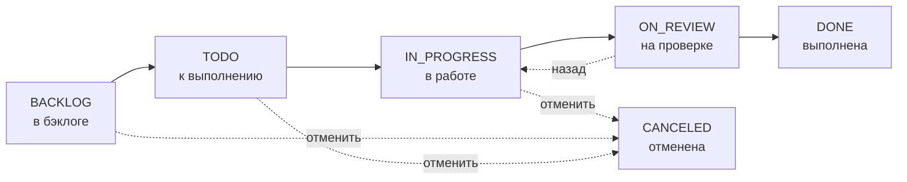

---
tags:
  - Пайщик
  - Мастер
generated_by: docs-harness
scenario: blagorost/tasks
---

# Задачи и процесс производства

Внутри Компонента работа складывается из **задач** — это небольшие шаги плана, которые мастер выдаёт исполнителям, а исполнители выполняют. Каждая задача проходит фиксированный жизненный цикл по статусам: кто-то её начинает, кто-то проверяет, кто-то закрывает.

## Где это и когда вы это видите

Откройте нужный Компонент в Благоросте и перейдите на вкладку **Задачи**. В каждой строке вы видите слева приоритет (стрелка вверх — высокий, минус — средний), id задачи (например, `C96-3`), компактный чип времени (факт/план, например `4ч/4ч` или `2.5д/2.5д`), название с метками, а справа — статус и аватарки исполнителей.

Многое прямо со строки и редактируется — без захода на страницу задачи. Кликните по чипу статуса — выпадет меню с теми статусами, в которые вы вправе перевести задачу. Кликните по чипу времени — откроется поле оценки (если у вас есть права мастера). Кликните по аватаркам исполнителей или по «+» — откроется выбор пайщиков.

## Создание задачи

Создавать задачи может **только мастер компонента** (или член совета как страховка). Чтобы открыть диалог, нажмите плавающую кнопку **«+»** в правом нижнем углу или клавишу `T`.

В диалоге вы заполняете:

- **Название** — обязательно.
- **Описание** — расширенный текст с подробностями.
- **Приоритет** — `Срочный`, `Высокий`, `Средний`, `Низкий`. Влияет только на иконку и сортировку, на расчёты — нет.
- **Статус** — стартовый статус, обычно `Бэклог`.
- **Оценка (часы)** — можно оставить пустой (`0`). От этого зависит, как пойдёт начисление времени — см. ниже.

Исполнителей в этом диалоге не выбирают — назначите их потом, прямо со строки задачи или со страницы задачи. Так удобнее: сначала набрасываете бэклог из заголовков, потом, при планировании, распределяете между людьми.

!!!info "Оценку и приоритет ставит только мастер"
    Эти два поля редактирует мастер компонента или член совета. Остальные участники видят их, но изменить не могут.

## Роли на задаче

| Роль | Кто это | Что может |
|---|---|---|
| **Мастер** | Один на компонент, назначен председателем (см. *Назначение мастера и план*) | Всё: создавать, редактировать, ставить оценку и приоритет, переводить через любые статусы, удалять, отменять |
| **Исполнитель** | Все, кто указан в составе исполнителей задачи | Двигать задачу по статусам в работе; **не может** перевести в DONE — это право мастера |
| **Член совета** | Любой из членов совета кооператива | Всё, как у мастера — страховочная роль |

## Жизненный цикл задачи

Каждая задача проходит фиксированную последовательность статусов.

| Статус | Значение |
|---|---|
| **BACKLOG** | Задача создана, но в работу ещё не запущена. Накапливается в бэклоге компонента. |
| **TODO** | К выполнению — мастер взял задачу из бэклога и поставил в очередь на исполнение. |
| **IN_PROGRESS** | В работе — исполнитель начал делать. **С этого момента идёт почасовое начисление времени** для задач без оценки. |
| **ON_REVIEW** | На проверке — исполнитель отправил результат мастеру. Только мастер может теперь закрыть в DONE или вернуть назад. |
| **DONE** | Выполнена — мастер принял результат. Если у задачи есть оценка, часы распределяются между исполнителями. |
| **CANCELED** | Отменена — задача в работу не пошла или была остановлена. Поперёк жизненного цикла. |

Главное на практике:

- **В DONE задачу переводит только мастер** (или член совета). Исполнитель этого сделать не может.
- **Отправить задачу на проверку** (ON_REVIEW) и **отменить** её исполнитель тоже может — но дальше только мастер решает: принять или вернуть в работу.
- В выпадашке статуса (в строке задачи на доске или на её странице) вы видите только те статусы, в которые вы вправе её перевести. Если нужного перехода в списке нет — значит, прямо сейчас он вам недоступен.

## Страница задачи

Кликните по названию задачи — откроется её страница: слева параметры (статус, исполнители, приоритет, оценка, факт, метки), справа описание и история изменений. Что вы здесь можете — зависит от роли.

=== "Глазами Мастера"

    

    Мастер видит и редактирует всё: статус, исполнителей, приоритет, оценку, метки. Доступны действия «Переместить» (в другой компонент) и «Удалить».

=== "Глазами Исполнителя"

    

    Исполнитель видит ту же страницу, но менять оценку, приоритет и состав исполнителей не может — поля показаны как есть. Кнопка «Удалить» скрыта; «Переместить» неактивна с подсказкой «нет прав мастера на задачи». В выпадашке статуса доступны только те переходы, которые разрешены его роли.

## Оценка и начисление времени

Поле **Оценка (часы)** определяет, **как** у исполнителей появляются часы.

### Без оценки — часы тикают по факту

Если оценка пустая (`0`) и задача в статусе IN_PROGRESS, каждый час начисляется **1 час**, разделённый поровну между всеми вашими активными задачами без оценки.

Пример: у Екатерины в работе две такие задачи. Каждый час обеим записывается по `0.5 ч`. За 8 рабочих часов каждая накопит 4 ч. Если у Екатерины настроен лимит `6 ч/день`, после его исчерпания тики до конца дня пропускаются.

На странице **Моё время** вы видите по каждому проекту три счётчика:

- **Доступно** — часы, которые уже можно отправить в коммит.
- **В ожидании** — часы, которые ещё тикают по задачам без оценки в работе.
- **Подтверждено** — часы из коммитов, которые мастер уже принял.

!!!info "Когда применять"
    Режим без оценки — для задач, где **нельзя предсказать длительность**: исследование, эксперимент, разбор сложного бага. Часы фиксируются ровно столько, сколько фактически было затрачено: пока задача в работе — тикают, перевели в ON_REVIEW или DONE — остановились.

### С оценкой — часы записываются при DONE

Если оценка задана, в IN_PROGRESS ничего не тикает. Часы появляются только в момент перевода задачи в DONE: каждому исполнителю записывается `оценка / число исполнителей`.

Пример: задача «Виджет балансов» с оценкой 20 ч и двумя исполнителями. При переводе в DONE мастер раздаёт по 10 ч каждому. Если потом мастер поменяет состав исполнителей или саму оценку, ещё незакоммиченные часы пересчитаются автоматически.

!!!info "Оценили — значит договорились"
    Задача с оценкой — это договорённость: «делаем за столько-то часов». Сколько человек реально просидел — не важно; важно, что мастер принял результат. Поэтому часы записываются именно при переводе в DONE.

### Дальше: коммит часов

Оба режима пишут в один и тот же счёт времени. Со страницы **Моё время** вы нажимаете «Коммит» в строке проекта и отправляете часы — суммарно по всем своим задачам этого компонента — мастеру на принятие (см. *Моё время и коммиты*). Принятый коммит превращает часы в сумму на Кошельке Генерации.

## Что вы здесь делаете

- **Мастер** — создаёт задачи, ставит оценку и приоритет, назначает исполнителей и ответственного, переводит задачи через статусы (включая финальный DONE), отменяет ненужное.
- **Ответственный** — следит, чтобы задача дошла до конца. Отправляет на проверку (`→ ON_REVIEW`), может вернуть в работу.
- **Исполнитель** — берёт задачу в работу (`TODO → IN_PROGRESS`), доделывает, фиксирует часы коммитом (см. *Моё время и коммиты*).

Жизненный цикл самого Компонента (Pending → Active → Voting → Result → Finalized) — отдельная история, см. *Жизненный цикл компонента*. Задачи живут только пока Компонент в `Active`.
