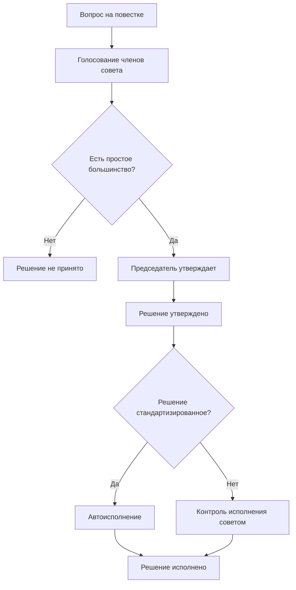

---
tags:
  - Член совета
  - Председатель
---

## Типы решений 

Страница "Повестка совета" отображает все вопросы, вынесенные на рассмотрение, по которым совету предстоит принять решения. Решения бывают: **стандартизированными** и **произвольными**. 

Стандартизированные решения ведут к автоматизированному их исполнению согласно стандартам смарт-контрактов и обычно являются частью какого-либо бизнес-процесса. Например, при решении о приёме пайщика в кооператив - пайщик автоматически добавляется в реестр и ему открывается главный кошелек, а при решении о приеме имущественного паевого взноса, пайщик и председатель кооперативного участка получают возможность подписать акт приема-передачи. Стандартизированные решения обычно являются промежуточными в цепочке действий бизнес-процесса, которая продолжит свое исполнение, как только решение совета по вопросу будет принято. 

Произвольные решения не исполняются автоматически, т.к. у них для этого нет правил стандартов. Произвольные решения позволяют членам совета предлагать вопросы на повестку и проекты решений по ним. Система автоматически сформирует документ предложения повестки и предложит совету проголосовать. При утверждении решения председателем совета, система сформирует протокол решения и сохранит его в реестре документов. Контроль исполнения принятого произвольного решения ложится на членов совета. 

!!!danger "Если решение не принято?"
    Если решение по вопросу не принято, то председатель не получит возможность утвердить протокол и следовательно он не попадет в реестр документов. Так, в реестр документов попадают только принятые и утвержденные решения совета. Что же касается стандартизированного бизнес-процесса, который прерывается, то у него на случай отказа в принятии решения всегда есть сценарий отмены, по ходу которого пайщик получает оповещение, и обратное движение средств по [кошелькам](../participant/wallet.md).

Для того, чтобы принять решение по любому вопросу необходимо выполнить условие достижения простого большинства голосов всех членов совета, и после чего, утвердить решение электронной подписью председателя совета. 

!!!note "Форма собрания и кворум"
    Форма проведения собрания - заочная, на основе технологических средств цифровой подписи членов совета. Все члены совета всегда считаются присутствующими на заседании. При отсутствии голосов ЗА или ПРОТИВ по пункту повестки, мы считаем, что член совета присутствовал на собрании, но ВОЗДЕРЖАЛСЯ от голосования. 
  
  
## Голосование по решению
Голосование по решению, как мы ранее рассматривали в разделе [Прием пайщика](../registration/accept.md), осуществляется с помощью модуля голосований. Он содержит в себе кнопки-индикаторы голосов, а также индикатор статуса решения. 

Каждый член совета может однократно проголосовать по каждому вопросу. Отозвать голос, после того, как он был отдан - невозможно. Как только количество голосов ЗА превысит 50% от общего количества членов совета, система изменит статус индикатора принятого решения. 

!!!note "На заметку"
    Действие подачи голоса по вопросу фиксируется цифровой подписью члена совета, которую он оставляет на идентификаторе протокола решения. Таким образом, все голоса по всем решениям могут быть криптографически проверены.

## Утверждение и исполнение решения

После того, как решение принято, председатель может утвердить его, нажатием на соответствующую кнопку напротив пункта повестки. Действие утверждения сформирует протокол собрания собрания совета и наполнит его данными в соответствии с содержанием стандартизированного или произвольного пункта повестки. 

Если утверждается стандартизированное решение, то оно автоматически в этот же момент и исполняется на уровне стандартов смарт-контрактов. Произвольные решения, как было отмечено ранее, автоматически не исполняются, а только фиксируются в реестре документов. 

## Предложить пункт повестки

Для предложения произвольного пункта повестки на голосование совета, необходимо нажать на кнопку "ПРЕДЛОЖИТЬ". Будет показана форма для ввода вопроса на повестке и проекта решения по нему:

На основании которых, будет сформирован документ предложения повестки и протокол решения совета:
 

