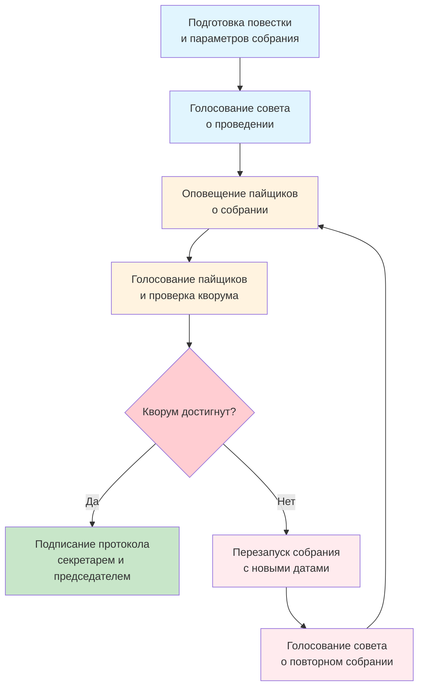

---
tags:
  - Председатель
  - Член совета
  - Пайщик
---

Платформа предоставляет функционал проведения заочных общих собраний пайщиков на основе простой электронной подписи. На общих собраниях пайщиков принимаются решения, которые влияют на жизнь в кооперативе. 

Процедура проведения общих собраний регламентируется законом "О Потребительской Кооперации" и методологией союза потребительских обществ "Русь". 

## Типы собраний

Общие собрания бывают **очередные** и **внеочередные**. 

Очередные общие собрания проводятся раз в год и утверждают итоги хозяйственной деятельности кооператива. Повестка очередного общего собрания предлагается председателем совета и выносится им на голосование совета. 

Внеочередные общие собрания проводятся без регламентированной периодичности. Повестка внеочередного общего собрания предлагается членами совета и может содержать любые произвольные вопросы. 

## Алгоритм собраний

### Подготовить предложение

Для проведения общего собрания членами совета должна быть предложена и утверждена повестка. Для начала, председатель или член совета указывает массив пунктов:

- Вопрос. Формулировка вопроса на общее собрание. Например: "О вступлении в члены Союза... "

- Проект решения. Формулировка решения поставленного вопроса, за который пайщикам будет предложено проголосовать "ЗА", "ПРОТИВ" или "ВОЗДЕРЖАЛСЯ". Например: "Утвердить предложение о вступлении в члены Союза..."

- Приложение. Дополнительная информация, которая прикладывается к вопросу как контекст для принятия решения. Может содержать ссылки и прочую информацию, которая может потребоваться для принятия пайщиками обдуманного решения.

!!!note "На текущий момент функционал внесения изменений в повестку общего собрания на основе предложений пайщиков ещё не реализован."

Кроме определения вопросов на повестке, для объявления общего собрания необходимо определить дату и время проведения общего собрания, и его продолжительность, указав дату завершения. 

!!!note "Ограничения"
    По дате начала общего собрания есть ограничение - собрание не должно проводиться ранее, чем через 15 дней с момента принятия решения о нём. А по продолжительности собрания ограничений нет. 

Кроме повестки и дат проведения общего собрания необходимо предложить председателя и секретаря общего собрания из числа пайщиков кооператива. 

!!!note "Зачем председатель собрания и секретарь"
    Председатель и секретарь общего собрания - это требование закона о потребительской кооперации. Это не обязательно члены совета, в этих ролях может находиться любой пайщик кооператива. Их задача - утвердить результаты в протоколе общего собрания, и тем самым, соблюсти регламентированную процедуру проведения общего собрания пайщиков. 

Следует сказать о месте проведения общего собрания - технически оно проводится в заочной форме, а место проведения - личный кабинет. В протоколах же фиксируется место проведения - юридический адрес кооператива. 

На сегодняшний день доступ на страницу общих собраний для пайщиков осуществляется с рабочего стола пайщика, а для членов совета - с рабочего стола совета. 

### Решение о проведении

После того, как повестка подготовлена, даты и ведущие определены, член совета выносит предложение о проведении общего собрания на повестку совета для голосования. Совет голосует по предложению о проведении общего собрания и утверждает решение протоколом собрания совета также, как и по любому другому вопросу на [странице повестки рабочего стола совета](../council/agenda.md).

### Уведомление о собрании

Принятое решение о проведении общего собрания пайщиков автоматически запускает его исполнение - все пайщики получают оповещение о предстоящем общем собрании с предложением подписать Уведомление.. 

!!!note "Зачем подписывать уведомление?"
    Уведомление - это часть юридической процедуры, которую мы должны соблюдать. Каждый пайщик оповещается на электронную почту и через push-оповещения мобильного приложения с предложением подписать электронный документ Уведомления, перейдя в личный кабинет. 

Уведомление находится на странице общего собрания и содержит полный список вопросов повестки общего собрания, по которым будет предложено принять решение "ЗА", "ПРОТИВ" или "ВОЗДЕРЖАЛСЯ", когда собрание начнется. 
      

### Кворум и явка
Кворум и явка - это ключевые показатели общего собрания, которые определяют, когда собрание будет завершено, а когда - потребует повторного проведения.  

**Явка** - это количество пайщиков, которые приняли участие в общем собрании по отношению к общему количеству пайщиков в кооперативе, выраженное в процентах.

**Кворум** - это процент явки, при котором собрание состоится. 

Каждый раз, когда пайщик отдает свой голос на общем собрании - он увеличивает процент явки. Для того, чтобы собрание состоялось, необходимо, чтобы процент явки превысил кворум. 

На общем собрании, которое проводится по одним и тем же вопросам впервые, кворум составляет 75%. Для первого повторного собрания кворум будет уменьшен до 50%, для второго - до 25%, для третьего - до 12.5%, и так далее кворум продолжит своё уменьшение вдвое на каждом последующем повторном собрании, гарантируя, что рано или поздно решение по всем поставленным вопросам повестки будут приняты. 

### Ход собрания

Перед началом общего собрания все пайщики получат дополнительные уведомления с напоминанием о проведении общего собрания и предложением зайти в личный кабинет и оставить свою подпись на заявлении о голосовании. 

!!!note "Голос - это заявление"
    Формально, каждый голос на общем собрании - это юридический документ заявления, подписанный простой электронной подписью пайщика. 

Заявление формируется и подписывается автоматически при нажатии на кнопку "Голосовать", при условии, что выбор "ЗА", "ПРОТИВ" или "ВОЗДЕРЖАЛСЯ" сделан по всем пунктам без исключений. Каждый раз, когда голос пайщика принимается системой, явка - увеличивается. 

### Повторное собрание

В случае, если кворум не собран, председатель или члены совета могут получают возможность перезапустить собрание. 

При нажатии на кнопку перезапуска на странице собрания появится форма выбора дат проведения повторного общего собрания пайщиков. Дата открытия собрания должно отстоять в будущее на 15 дней от момента принятия решения совета (выбирайте даты с запасом)

Повестка повторного собрания не подлежит изменению. Все пункты вопросов в ней остаются как были. Однако, председатель и секретарь собрания могут быть изменены. 

После того, как даты и ведущие определены, совет кооператива, как и прежде, получает вопрос на повестку для создания протокола решения о проведении повторного общего собрания. Сразу после чего все пайщики получают оповещения с предложением подписать Уведомления, и процесс повторяется. И повторяется столько раз, сколько потребуется, пока кворум общего собрания не будет достигнут. 

### Завершение собрания

Когда кворум общего собрания достигнут, и время проведения общего собрания вышло - то секретарь первым получает предложение подписать протокол нажатием кнопки на странице собрания:

Следом за ним точно такое же действие предлагается совершить председателю общего собрания. 

Как только председатель собрания оставит свою подпись на протоколе все пайщики получат возможность ознакомиться с результатами общего собрания в личных кабинетах, о чем они будут дополнительно оповещены. 

Подписанный протокол общего собрания доступен публично на странице собрания всем пайщикам:

На этом общее собрание пайщиков считается закрытым. 

## Диаграмма хода собраний

Для визуально-воспринимающих прикладываем обобщенную диаграмму алгоритма общего собрания:

