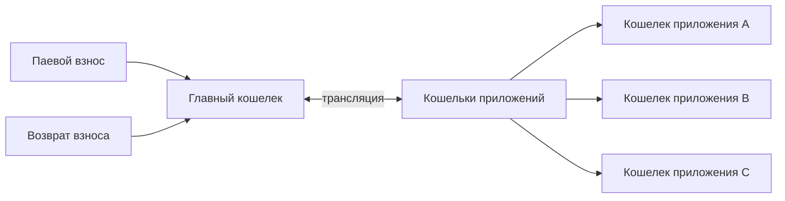

---
tags:
  - Пайщик
---

Страница "Кошелек" со стола пайщика отображает баланс лицевого счета пайщика по всем целевым потребительским программам и договорам, для которых у пайщика заведены кошельки.

Главный кошелек обеспечивает учёт взносов на лицевом счете пайщика по целевой потребительской програме "Цифровой Кошелек". Он же является центральным входом и выходом денег из цифрового кооператива для пайщиков, обеспечивая приём паевых взносов банковскими переводами и их возврат банковскими переводами.

Для участия в любых кооперативных приложениях на платформе пайщику необходимо сперва пополнить главный кошелек, потому как именно его баланс транслируется приложением по заявлению пайщика в кошелек договора участия в хозяйственной деятельности или кошелек целевой потребительской программы. Такие кошельки называются "кошельками проложений". 

Возврат средств из кошельков приложений осуществляется в обратном порядке - трансляция в главный кошелек, и затем возврат паевого взноса банковским переводом по заявлению пайщика. 

 

## Главный кошелёк. 

Является центральным входом и выходом паевых взносов из системы. Чтобы начать участвовать в любом кооперативном приложении (целевой потребительской программе), необходимо пополнить главный кошелек.

Принимая участие в любом приложении, где ожидаются взносы (например, стол заказов) - они взносы будут производиться с главному кошелька по цифровому заявлению на зачёт средств паевого взноса с одной целевой потребительской программы в счет средств другой. 

Главный кошелек показывает два состояния паевых взносов по целевой потребительской программе "Цифровой Кошелек": доступные средства и заблокированные средства. 

Доступные средства доступны к возврату или участию в любых кооперативных приложениях. Заблокированные средства в случае главного кошелька, это средства, которые недоступны к возврату прямо сейчас. Такими средствами является, например, минимальный паевой взнос который возвращается пайщику при выходе из кооператива. Также, средства переходят из доступного - в заблокированное на период оплаты возврата паевого взноса до момента фактической оплаты кассиром. 

## Кошельки приложений

Когда средства с главного кошелька пайщика по заявлению пайщика  отправляются принимать участие в приложениях, то баланс средств в главном кошельке уменьшается, а баланс в кошельке приложения - увеличивается. Т.е. средства передается (транслируются) с главного кошелька - в кошелек конкретного приложения по заявлению пайщика. 

Кошельки приложений связаны с целевыми потребительскими программами и/или договорами участия в хозяйственной деятельности, и открываются пайщику тогда, когда он подписывает соответствующий документ или публичную оферту в приложении. Приложение, например, "Благорост" или "Стол заказов" самостоятельно обеспечивают подпись необходимых соглашений и договоров, тем самым, открывая кошельки приложений пайщикам. 

У кошельков приложений, аналогично главному кошельку, есть доступные и заблокированные средства паевых взносов. Доступные средства приложения могут быть использованы для трансляции в главный кошелек или задействованы внутри приложения согласно его бизнес-процессу.

Кошельками приложений управляют кооперативные смарт-контракты согласно принятым стандартам. Один смарт-контракт может управлять одновременно несколькими кошельками приложений согласно своей бизнес-логике. Например, смарт-контракт "Благорост" открывает пайщикам одновременно два кошелька приложений: по договору участия в хозяйственной деятельности и по условиям публичной оферты целевой потребительской программы. 

Следует сказать, что смарт-контракты обычно автоматически возвращают средства из доступных средств кошелька приложения в главный кошелек по мере достижения условий завершения своего исполнения. Именно поэтому у кошельков приложений нет специализированных кнопок управления, вроде взносов и возвратов в и из кошельков приложений, т.к. все управление ими производится непосредственно на столах и страницах самих приложения. Здесь же, на странице кошелька пайщика, кошельки приложений представлены пайщику для мониторинга - где, сколько и в каком состоянии у него находится. 

## Микро-кошелек

Микро-кошелек отображает баланс главного кошелька и кнопки управления взносами в всегда доступном месте главного меню. 

Находясь в любом приложении цифрового кооператива пайщику всегда доступен его баланс, которым он может принимать участие. При необходимости, он может как пополнить свой главный кошелек, совершив паевой взнос, так и запросить возврат паевого взноса, нажав соответствующие кнопки в микро-кошельке. 

