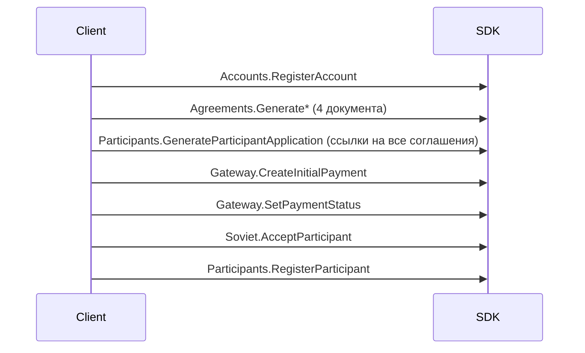

---
tags:
  - Разработчик
---

## 1. Создать аккаунт
Заводим учётную запись будущего пайщика и получаем ключи/токены для дальнейших подписей.

{{ get_sdk_doc("Mutations", "Accounts", "RegisterAccount") }} | {{ get_graphql_doc("Mutation.registerAccount") }}

{{ get_typedoc_input("Mutations.Accounts.RegisterAccount") }}

Результат

{{ get_typedoc_definition("Mutations.Accounts.RegisterAccount", "IOutput") }}

## 2. Подготовить пакет документов и заявление
Выпускаем обязательные соглашения, подписываем их и прикладываем к заявлению на вступление. Сгенерировать заявление:
{{ get_sdk_doc("Mutations", "Participants", "GenerateParticipantApplication") }} | {{ get_graphql_doc("Mutation.generateParticipantApplication") }}

{{ get_typedoc_input("Mutations.Participants.GenerateParticipantApplication") }}

И аналогично сопутствующие документы соглашений:
Сгенерировать и подписать обязательные соглашения (каждое — отдельный документ):

1. Соглашение о ЦПП "Цифровой Кошелек"
{{ get_sdk_doc("Mutations", "Agreements", "GenerateWalletAgreement") }} | {{ get_graphql_doc("Mutation.generateWalletAgreement") }}

2. Политика конфиденциальности 
{{ get_sdk_doc("Mutations", "Agreements", "GeneratePrivacyAgreement") }} | {{ get_graphql_doc("Mutation.generatePrivacyAgreement") }}

3. Соглашение о порядке и правилах использования простой электронной подписи
{{ get_sdk_doc("Mutations", "Agreements", "GenerateSignatureAgreement") }} | {{ get_graphql_doc("Mutation.generateSignatureAgreement") }}

4. Пользовательское соглашение
{{ get_sdk_doc("Mutations", "Agreements", "GenerateUserAgreement") }} | {{ get_graphql_doc("Mutation.generateUserAgreement") }}

## 3. Создать регистрационный платёж
Выпускаем платёж на вступительный и минимальный паевой взносы и отмечаем его поступление.
{{ get_sdk_doc("Mutations", "Gateway", "CreateInitialPayment") }} | {{ get_graphql_doc("Mutation.createInitialPayment") }}

{{ get_typedoc_input("Mutations.Gateway.CreateInitialPayment") }}

Результат

{{ get_typedoc_definition("Mutations.Gateway.CreateInitialPayment", "IOutput") }}

## 4. Подтвердить приём платежа

После фактического поступления средств отметить статус:

{{ get_sdk_doc("Mutations", "Gateway", "SetPaymentStatus") }} | {{ get_graphql_doc("Mutation.setPaymentStatus") }}

{{ get_typedoc_input("Mutations.Gateway.SetPaymentStatus") }}

Результат

{{ get_typedoc_definition("Mutations.Gateway.SetPaymentStatus", "IOutput") }}

## 4. Провести голосование и утвердить решение
Фиксируем решение совета. Сейчас фронтенд отправляет транзакцию и протокол напрямую в блокчейн, используя класс голосования {{ get_class_doc("Classes.Vote", "voteFor") }}. Планируемая SDK-обёртка (без макроса, чтобы не ломать сборку): `Mutations.Soviet.AcceptParticipant` — для передачи результата голосования и протокола.

## 5. Завершить регистрацию
Фиксируем принятого пайщика, выдаём доступы/роли и открываем доступ к рабочему месту.
{{ get_sdk_doc("Mutations", "Participants", "RegisterParticipant") }} | {{ get_graphql_doc("Mutation.registerParticipant") }}

{{ get_typedoc_input("Mutations.Participants.RegisterParticipant") }}

Результат

{{ get_typedoc_definition("Mutations.Participants.RegisterParticipant", "IOutput") }}

