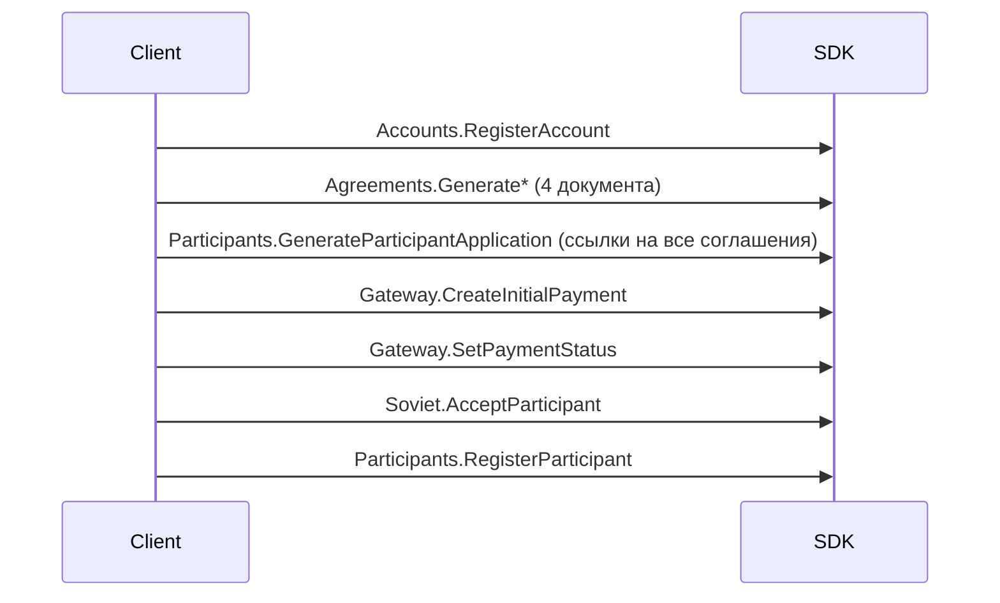

---
tags:
  - Разработчик
---

```mermaid
sequenceDiagram
  participant Client
  participant SDK

  Client->>SDK: Accounts.RegisterAccount
  Client->>SDK: Agreements.Generate* (4 документа)
  Client->>SDK: Participants.GenerateParticipantApplication (ссылки на все соглашения)
  Client->>SDK: Gateway.CreateInitialPayment
  Client->>SDK: Gateway.SetPaymentStatus
  Client->>SDK: Soviet.AcceptParticipant
  Client->>SDK: Participants.RegisterParticipant
```

## 1. Создать аккаунт
Заводим учётную запись будущего пайщика и получаем ключи/токены для дальнейших подписей.

{{ get_sdk_doc("Mutations", "Accounts", "RegisterAccount") }} | {{ get_graphql_doc("Mutation.registerAccount") }}

{{ get_typedoc_desc("Mutations.Accounts.RegisterAccount") }}

{{ get_typedoc_input("Mutations.Accounts.RegisterAccount") }}

Результат:

{{ get_typedoc_definition("Mutations.Accounts.RegisterAccount", "IOutput") }}

## 2. Подготовить пакет документов и заявление
Выпускаем обязательные соглашения, подписываем их и прикладываем к заявлению на вступление.

### Заявление на вступление

{{ get_sdk_doc("Mutations", "Participants", "GenerateParticipantApplication") }} | {{ get_graphql_doc("Mutation.generateParticipantApplication") }}

{{ get_typedoc_desc("Mutations.Participants.GenerateParticipantApplication") }}

{{ get_typedoc_input("Mutations.Participants.GenerateParticipantApplication") }}

Результат:

{{ get_typedoc_definition("Mutations.Participants.GenerateParticipantApplication", "IOutput") }}

### Соглашение о ЦПП «Цифровой кошелёк»

{{ get_sdk_doc("Mutations", "Agreements", "GenerateWalletAgreement") }} | {{ get_graphql_doc("Mutation.generateWalletAgreement") }}

{{ get_typedoc_desc("Mutations.Agreements.GenerateWalletAgreement") }}

{{ get_typedoc_input("Mutations.Agreements.GenerateWalletAgreement") }}

Результат:

{{ get_typedoc_definition("Mutations.Agreements.GenerateWalletAgreement", "IOutput") }}

### Политика конфиденциальности

{{ get_sdk_doc("Mutations", "Agreements", "GeneratePrivacyAgreement") }} | {{ get_graphql_doc("Mutation.generatePrivacyAgreement") }}

{{ get_typedoc_desc("Mutations.Agreements.GeneratePrivacyAgreement") }}

{{ get_typedoc_input("Mutations.Agreements.GeneratePrivacyAgreement") }}

Результат:

{{ get_typedoc_definition("Mutations.Agreements.GeneratePrivacyAgreement", "IOutput") }}

### Соглашение об электронной подписи

{{ get_sdk_doc("Mutations", "Agreements", "GenerateSignatureAgreement") }} | {{ get_graphql_doc("Mutation.generateSignatureAgreement") }}

{{ get_typedoc_desc("Mutations.Agreements.GenerateSignatureAgreement") }}

{{ get_typedoc_input("Mutations.Agreements.GenerateSignatureAgreement") }}

Результат:

{{ get_typedoc_definition("Mutations.Agreements.GenerateSignatureAgreement", "IOutput") }}

### Пользовательское соглашение

{{ get_sdk_doc("Mutations", "Agreements", "GenerateUserAgreement") }} | {{ get_graphql_doc("Mutation.generateUserAgreement") }}

{{ get_typedoc_desc("Mutations.Agreements.GenerateUserAgreement") }}

{{ get_typedoc_input("Mutations.Agreements.GenerateUserAgreement") }}

Результат:

{{ get_typedoc_definition("Mutations.Agreements.GenerateUserAgreement", "IOutput") }}

## 3. Создать регистрационный платёж
Выпускаем платёж на вступительный и минимальный паевой взносы и отмечаем его поступление.

{{ get_sdk_doc("Mutations", "Gateway", "CreateInitialPayment") }} | {{ get_graphql_doc("Mutation.createInitialPayment") }}

{{ get_typedoc_desc("Mutations.Gateway.CreateInitialPayment") }}

{{ get_typedoc_input("Mutations.Gateway.CreateInitialPayment") }}

Результат:

{{ get_typedoc_definition("Mutations.Gateway.CreateInitialPayment", "IOutput") }}

## 4. Подтвердить приём платежа

После фактического поступления средств отметить статус:

{{ get_sdk_doc("Mutations", "Gateway", "SetPaymentStatus") }} | {{ get_graphql_doc("Mutation.setPaymentStatus") }}

{{ get_typedoc_desc("Mutations.Gateway.SetPaymentStatus") }}

{{ get_typedoc_input("Mutations.Gateway.SetPaymentStatus") }}

Результат:

{{ get_typedoc_definition("Mutations.Gateway.SetPaymentStatus", "IOutput") }}

## 5. Провести голосование и утвердить решение
Фиксируем решение совета. Сейчас фронтенд отправляет транзакцию и протокол напрямую в блокчейн, используя класс голосования {{ get_class_doc("Classes.Vote", "voteFor") }}. Планируемая SDK-обёртка (без макроса, чтобы не ломать сборку): `Mutations.Soviet.AcceptParticipant` — для передачи результата голосования и протокола.

## 6. Завершить регистрацию
Фиксируем принятого пайщика, выдаём доступы/роли и открываем доступ к рабочему месту.

{{ get_sdk_doc("Mutations", "Participants", "RegisterParticipant") }} | {{ get_graphql_doc("Mutation.registerParticipant") }}

{{ get_typedoc_desc("Mutations.Participants.RegisterParticipant") }}

{{ get_typedoc_input("Mutations.Participants.RegisterParticipant") }}

Результат:

{{ get_typedoc_definition("Mutations.Participants.RegisterParticipant", "IOutput") }}
