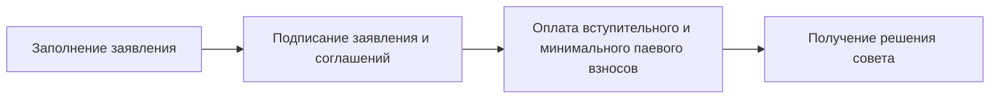
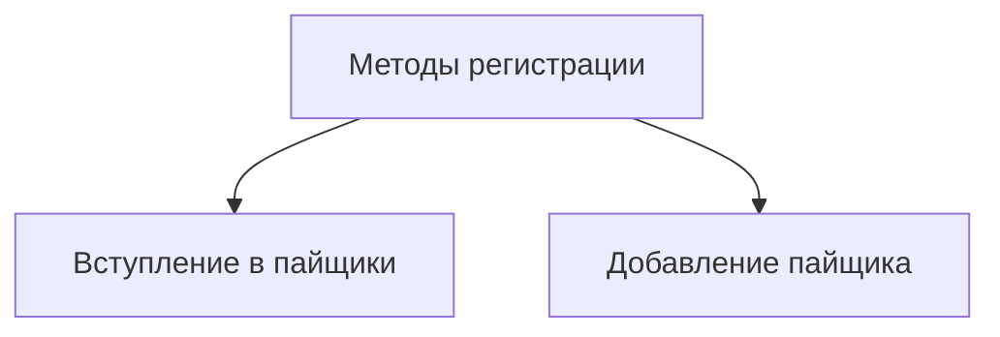

---
tags:
  - Председатель
  - Член совета
  - Разработчик
---

Регистрация пайщика в кооперативе требует соблюдения строгой процедуры: заполнение заявления, подписание заявления и соглашений, оплата вступительного и минимального паевого взносов, получение решения совета. Цифровой кооператив автоматизирует эту процедуру до нажатия кнопок.

Прежде, чем мы перейдем непосредственно к рассмотрению того, как же пайщик регистрируется в кооперативе, необходимо сказать о двух методах регистрации пайщиков, которые доступны на текущий момент. 

Первый метод - это вступление в пайщики, которое мы будем рассматривать далее. Согласно ей формируются и подписываются все необходимые документы по пути выше, система при этом все пополняет кооперативные кошельки и совершает бухгалтерские проводки. 

Второй метод - это упрощенная регистрация пайщика, или, правильнее сказать - добавление пайщика. Метод добавления пайщика рассматривается и применяется на странице реестра пайщиков стола совета. Согласно ему, пайщик получает приглашение на электронную почту для выпуска цифровой подписи и дальнейшего входа в цифровую систему. Этот метод применяется в том случае, когда пайщики уже являются действующими, они вступили в кооператив вне цифровой среды и сейчас им необходимо предоставить доступ и выпустить цифровую подпись. 

В этой документации мы рассмотрим оба подхода. Начнем с первого - вступление в пайщики. 

