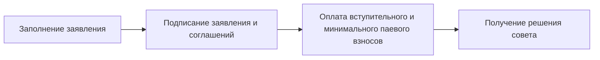
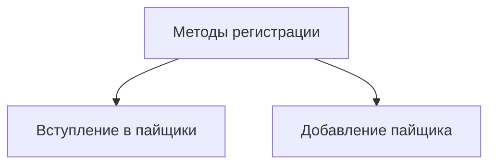

---
tags:
  - Председатель
  - Член совета
  - Разработчик
---

Регистрация пайщика в кооперативе требует соблюдения строгой процедуры: заполнение заявления, подписание заявления и соглашений, оплата вступительного и минимального паевого взносов, получение решения совета. Цифровой кооператив автоматизирует эту процедуру до нажатия кнопок.

```mermaid
flowchart LR
    A[Заполнение заявления] --> B[Подписание заявления и соглашений]
    B --> C[Оплата вступительного и минимального паевого взносов]
    C --> D[Получение решения совета]
``` 

Прежде, чем мы перейдем непосредственно к рассмотрению того, как же пайщик регистрируется в кооперативе, необходимо сказать о двух методах регистрации пайщиков, которые доступны на текущий момент. 

```mermaid
flowchart TD
    A[Методы регистрации] --> B[Вступление в пайщики]
    A --> C[Добавление пайщика]
```

Первый метод - это вступление в пайщики, которое мы будем рассматривать далее. Согласно ей формируются и подписываются все необходимые документы по пути выше, система при этом все пополняет кооперативные кошельки и совершает бухгалтерские проводки. 

Второй метод - это упрощенная регистрация пайщика, или, правильнее сказать - добавление пайщика. Метод добавления пайщика рассматривается и применяется на странице реестра пайщиков стола совета. Согласно ему, пайщик получает приглашение на электронную почту для выпуска цифровой подписи и дальнейшего входа в цифровую систему. Этот метод применяется в том случае, когда пайщики уже являются действующими, они вступили в кооператив вне цифровой среды и сейчас им необходимо предоставить доступ и выпустить цифровую подпись. 

В этой документации мы рассмотрим оба подхода. Начнем с первого - вступление в пайщики. 

## Разработчикам

{{ dev_schema_source() }}

Подробные цепочки вызовов см. в свёрнутых блоках на страницах [Вступить в пайщики](join.md) и [Принять пайщика](accept.md).

### Конфигурация регистрации

{{ get_sdk_doc("Queries", "System", "GetRegistrationConfig") }} | {{ get_graphql_doc("query.getRegistrationConfig") }}

{{ get_typedoc_desc("Queries.System.GetRegistrationConfig") }}

{{ get_typedoc_input("Queries.System.GetRegistrationConfig") }}

Результат:

{{ get_typedoc_definition("Queries.System.GetRegistrationConfig", "IOutput") }}

### Завершить вступление (регистрация пайщика)

{{ get_sdk_doc("Mutations", "Participants", "RegisterParticipant") }} | {{ get_graphql_doc("Mutation.registerParticipant") }}

{{ get_typedoc_desc("Mutations.Participants.RegisterParticipant") }}

{{ get_typedoc_input("Mutations.Participants.RegisterParticipant") }}

Результат:

{{ get_typedoc_definition("Mutations.Participants.RegisterParticipant", "IOutput") }}

### Добавить пайщика (упрощённый сценарий)

{{ get_sdk_doc("Mutations", "Participants", "AddParticipant") }} | {{ get_graphql_doc("Mutation.addParticipant") }}

{{ get_typedoc_desc("Mutations.Participants.AddParticipant") }}

{{ get_typedoc_input("Mutations.Participants.AddParticipant") }}

Результат:

{{ get_typedoc_definition("Mutations.Participants.AddParticipant", "IOutput") }}

### Кандидаты на вступление

{{ get_graphql_doc("query.candidates") }}

В SDK запрос оформлен в `src/queries/registration/getCandidates.ts` (экспорт `getCandidatesQuery`); отдельной записи в TypeDoc под стандартным путём `Queries.*` для этой операции нет.

### Повестка совета

{{ get_sdk_doc("Queries", "Agenda", "GetAgenda") }} | {{ get_graphql_doc("query.getAgenda") }}

{{ get_typedoc_desc("Queries.Agenda.GetAgenda") }}

{{ get_typedoc_input("Queries.Agenda.GetAgenda") }}

Результат:

{{ get_typedoc_definition("Queries.Agenda.GetAgenda", "IOutput") }}

